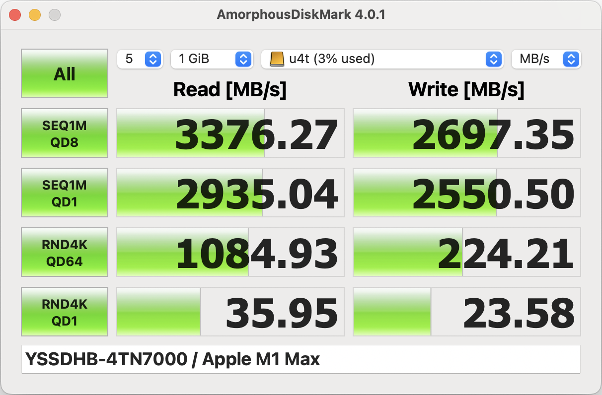
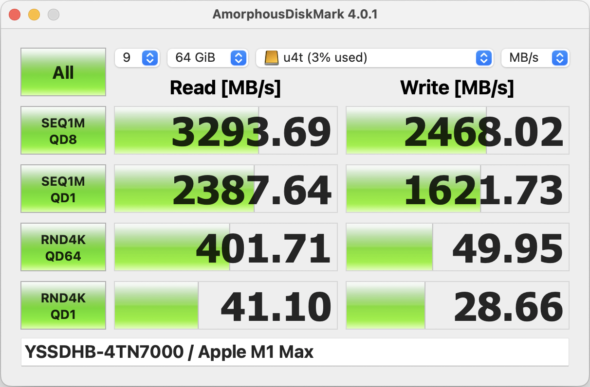

## 背景

- 硬盘盒：ITGZ USB4 40g M.2 nvme 移动硬盘盒
- 硬盘：隐速4TN7000 pcie4.0 4T ssd
- 笔记本：macbook pro m1 max
- 数据线：hagibis 海备思双typec全功能usb4数据线，13厘米长度

## 测试

### AmorphousDiskMark 测试

5次每次1GB设置下的速度测试情况：

9次每次64GB设置下的速度测试情况：

