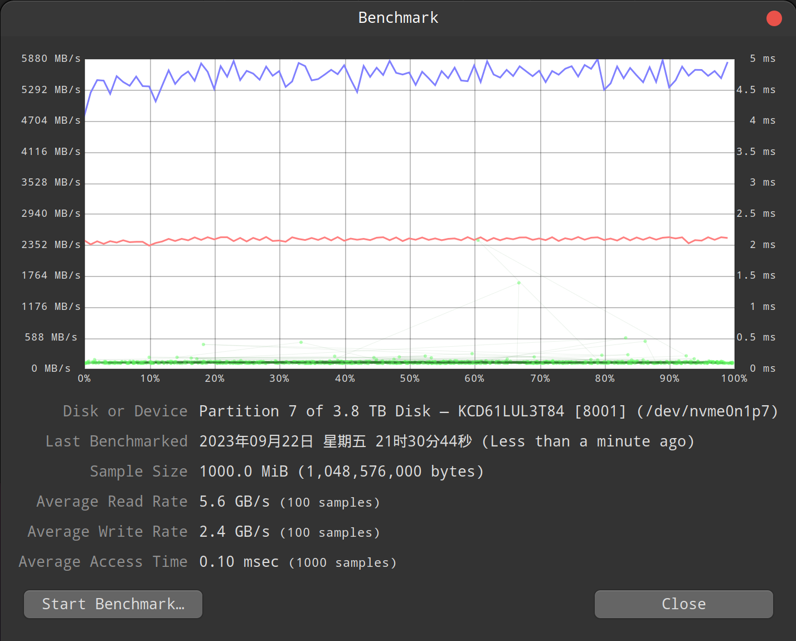
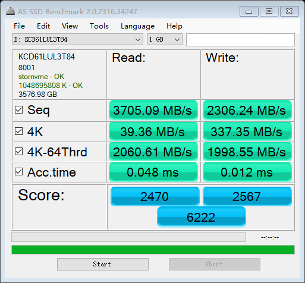
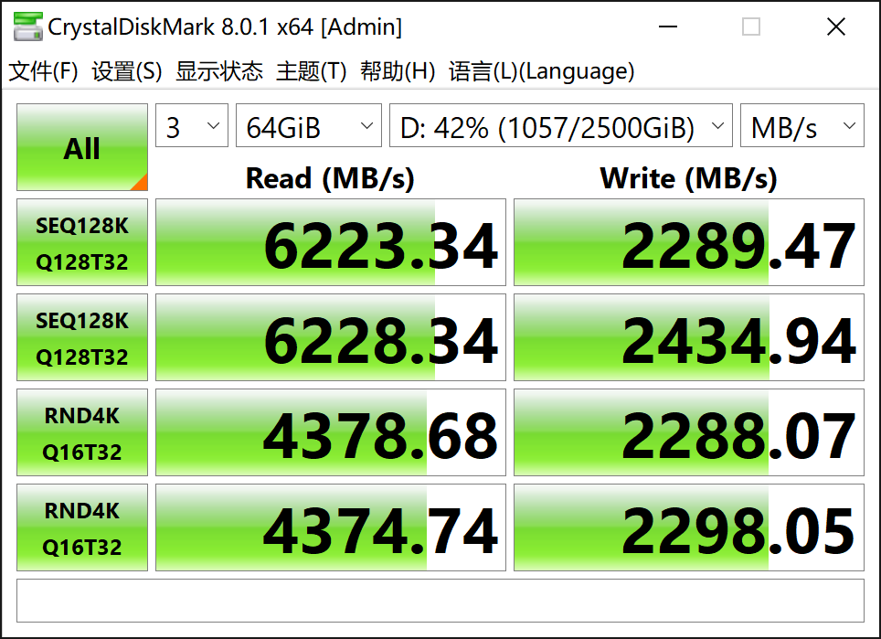

硬盘型号 凯侠cd6，容量 3.84T , u2 接口 nvme 协议， pcie 4.0 x4。

## 华硕z690 + linux mint

主板为华硕z690 ddr4, pcie 4.0 x4。

安装 linux mint系统，5.15 内核, ext4 格式。

### 基本信息

```bash
$ lspci | grep Volatile

02:00.0 Non-Volatile memory controller: KIOXIA Corporation NVMe SSD Controller Cx6 (rev 01)
```

磁盘数据：

```bash
$ sudo fdisk -l

Disk /dev/nvme0n1: 3.49 TiB, 3840755982336 bytes, 7501476528 sectors
Disk model: KCD61LUL3T84                            
Units: sectors of 1 * 512 = 512 bytes
Sector size (logical/physical): 512 bytes / 4096 bytes
I/O size (minimum/optimal): 4096 bytes / 4096 bytes
Disklabel type: gpt
Disk identifier: FBEFBE02-9843-4FEC-8B2C-C50B5EAD8069

Device              Start        End    Sectors   Size Type
/dev/nvme0n1p1       2048     206847     204800   100M EFI System
/dev/nvme0n1p2     206848     239615      32768    16M Microsoft reserved
/dev/nvme0n1p3     239616 1047643943 1047404328 499.4G Microsoft basic data
/dev/nvme0n1p4 1047644160 1048813567    1169408   571M Windows recovery environment
/dev/nvme0n1p5 1048815616 2097391615 1048576000   500G Microsoft basic data
/dev/nvme0n1p6 2097391616 7340271615 5242880000   2.4T Microsoft basic data
/dev/nvme0n1p7 7340271616 7501475839  161204224  76.9G Microsoft basic data
```

测试分区为 nvme0n1p3，分区信息：

```bash
$ sudo hdparm /dev/nvme0n1p3

/dev/nvme0n1p3:
 readonly      =  0 (off)
 readahead     = 256 (on)
 geometry      = 511427/64/32, sectors = 1047404328, start = 239616
```

### DD命令速度测试

写入1G文件的速度：

```bash
$ sudo dd if=/dev/zero of=/data/temp/test-1g.img bs=1G count=1 oflag=dsync
1+0 records in
1+0 records out
1073741824 bytes (1.1 GB, 1.0 GiB) copied, 0.903675 s, 1.2 GB/s
```

读取1G文件的速度为 15GB/S，这应该是缓存的原因：

```bash
$ dd if=/data/temp/test-1g.img of=/dev/null bs=8M
128+0 records in
128+0 records out
1073741824 bytes (1.1 GB, 1.0 GiB) copied, 0.0711245 s, 15.1 GB/s
```

写入10G文件的速度：

```bash
$ sudo dd if=/dev/zero of=/data/temp/test-10g.img bs=1G count=10 oflag=dsync
10+0 records in
10+0 records out
10737418240 bytes (11 GB, 10 GiB) copied, 7.30757 s, 1.5 GB/s
```

速度10G文件的速度为 18GB/S，这应该还是缓存的原因：

```bash
$ dd if=/data/temp/test-10g.img of=/dev/null bs=8M
1280+0 records in
1280+0 records out
10737418240 bytes (11 GB, 10 GiB) copied, 0.577161 s, 18.6 GB/s
```

写入100G文件的速度：

```bash
$ sudo dd if=/dev/zero of=/data/temp/test-100g.img bs=1G count=100 oflag=dsync
100+0 records in
100+0 records out
107374182400 bytes (107 GB, 100 GiB) copied, 72.0129 s, 1.5 GB/s
```

读取100G文件的速度为 4.0 GB/s，这终于不是缓存速度了：

```bash
$ dd if=/data/temp/test-100g.img of=/dev/null bs=8M
12800+0 records in
12800+0 records out
107374182400 bytes (107 GB, 100 GiB) copied, 26.902 s, 4.0 GB/s
```

小结： 用 dd 命令测试出来的速度大概是读取 4GB/s，写入 1.5GB/s。这个速度尤其是写入速度和宣称的读取6500M写入2300M差距很多。

### disk工具

linux mint 自带的 disk 工具，选择硬盘后，可以进行 disk benchmark。



这里测试出来的速度是读取 5.6GB/s，写入 2.4GB/s，就非常接近宣称的读取6500M/写入2300M。

## 华硕z690 + windows10

主板为华硕z690 ddr4, pcie 4.0 x4。

### AS SSD Benchmark 测试数据



### CrystalDiskMark 测试数据




## 附录：linux ntfs格式的速度问题

> 结论：ntfs格式的硬盘在 linux 下性能会下降的非常严重，大概只有正常的10%

nvme0n1p6 这个分区是 ntfs 格式。

nvme0n1p6 硬盘写入速度：

```bash
$ dd if=/dev/zero of=/media/d/temp/test1.img bs=1G count=10 oflag=dsync

10+0 records in
10+0 records out
10737418240 bytes (11 GB, 10 GiB) copied, 29.3955 s, 365 MB/s
```

> 只有 365 兆，低的有点出乎意外，应该是 linux 读写 ntfs 格式有速度问题。

nvme0n1p6 硬盘读取速度：

```bash
$ dd if=/media/d/temp/test1.img of=/dev/null bs=8k

1310720+0 records in
1310720+0 records out
10737418240 bytes (11 GB, 10 GiB) copied, 1.91374 s, 5.6 GB/s
```

5.6GB 的速度有点偏高，估计还是缓存。尝试读取 100 GB大小的文件：

```bash
$ dd if=/dev/zero of=/media/d/temp/test1.img bs=1G count=100 oflag=dsync

100+0 records in
100+0 records out
107374182400 bytes (107 GB, 100 GiB) copied, 242.065 s, 444 MB/s
```

444 MB/s 每秒的速度和前面 ext4 下的 4.3 GB/s 相比，nfts 格式会让磁盘性能下降到 10% ，实在恐怖。所以还是要避免在 linux 下使用 ntfs 格式。
