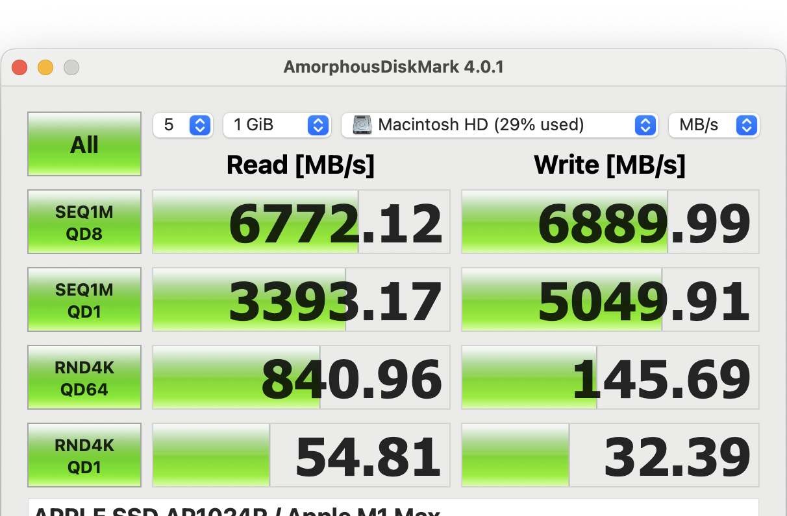
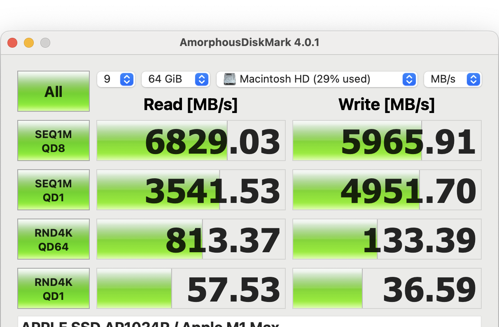
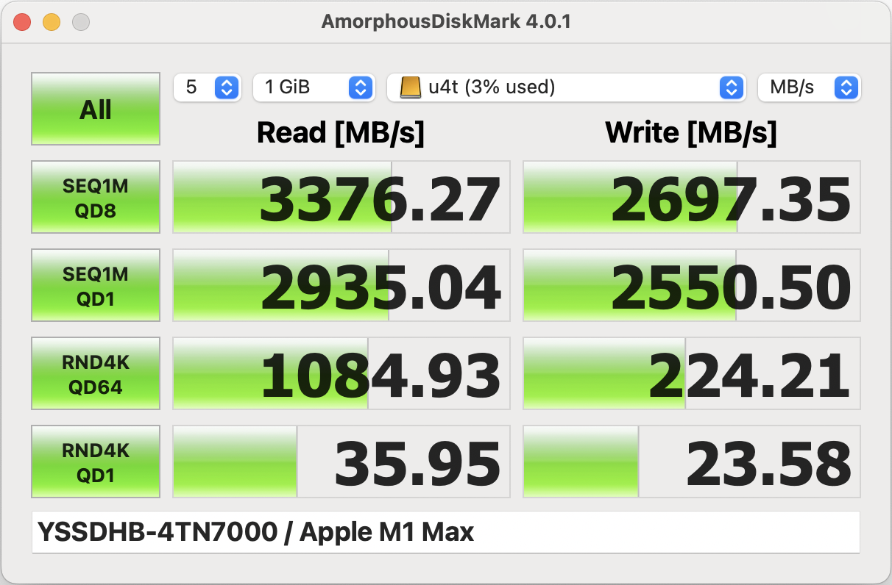

## 下载地址

通过 apple store 下载安装：

https://apps.apple.com/us/app/amorphousdiskmark/id1168254295?mt=12

## 介绍

以 MB/s 和 IOPS 为单位衡量存储读/写性能。

AmorphousDiskMark 以 MB/s 和 IOPS 为单位测量存储读/写性能。

- 顺序 1 MiB 块读/写测量，队列深度=1、2、4、8、16、32、64、128、256、512 或 1024

- 随机序列 4 KiB 块读/写测量，队列

- 深度=1、2、4、8、16、32、64、128、256、512 或 1024

- 顺序 1 MiB 块读/写测量

- 随机序列 4 KiB 块读/写测量值

- 主窗口中的读/写 MB/s 或 IOPS 分数

- 工具提示中的读/写 MB/s 和 IOPS 分数

- 测量数据值：随机或零

- 测量大小：16MB、32MB、64MB、128MB、256MB、512MB、1GiB、2GiB、4GiB、8GiB、16GiB、32GiB 或 64GiB

- 测量间隔：0 秒、...、10 分钟

- 测量持续时间限制：无、5 秒、......、1 分钟。

CrystalDiskMark 的作者允许在本应用程序中使用相同或类似的用户界面。

## 典型测试结果

### m1 max 内置硬盘

5次每次1GB设置下的速度测试情况：

9次每次64GB设置下的速度测试情况：

### 外置硬盘盒接pcie4.0 ssd

- 硬盘盒：ITGZ USB4 40g M.2 nvme 移动硬盘盒
- 硬盘：移速4TN7000 pcie4.0 4T ssd
- 笔记本：macbook pro m1 max
- 数据线：hagibis 海备思双typec全功能usb4数据线，13厘米长度

5次每次1GB设置下的速度测试情况：

9次每次64GB设置下的速度测试情况：

