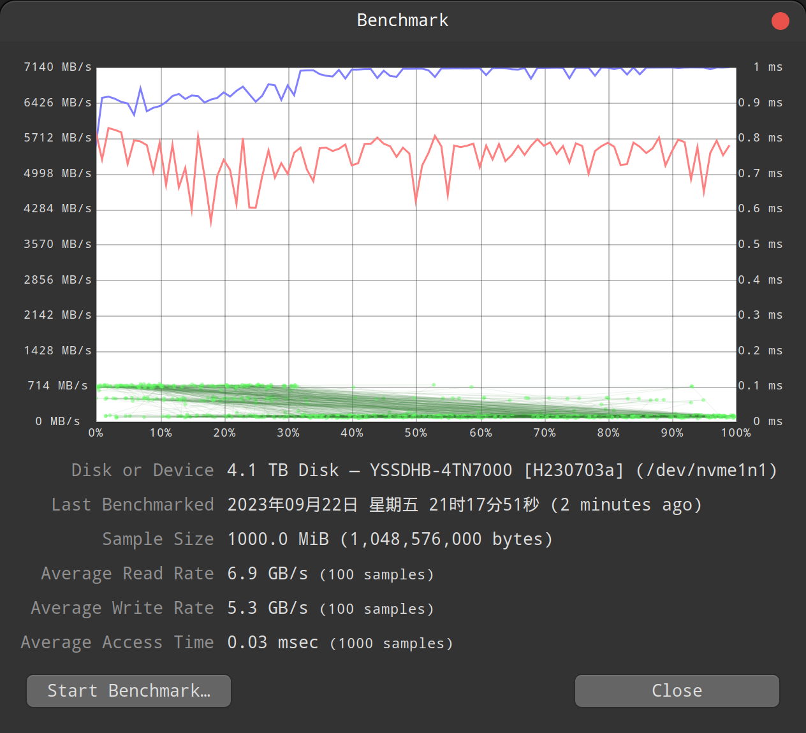

硬盘型号 隐速4TN7000，容量 4T , m2 接口 nvme 协议， pcie 4.0 x4， 规格为 2280。

## 华硕z690 + linux mint

主板为华硕z690 ddr4, pcie 4.0 x4。

安装 linux mint系统，5.15 内核, ext4 格式。

### 基本信息

```bash
$ lspci | grep Volatile

08:00.0 Non-Volatile memory controller: MAXIO Technology (Hangzhou) Ltd. Device 1602 (rev 01)
```

磁盘数据：

```bash
$ sudo fdisk -l

Disk /dev/nvme1n1: 3.73 TiB, 4096805658624 bytes, 8001573552 sectors
Disk model: YSSDHB-4TN7000                          
Units: sectors of 1 * 512 = 512 bytes
Sector size (logical/physical): 512 bytes / 512 bytes
I/O size (minimum/optimal): 512 bytes / 512 bytes
Disklabel type: gpt
Disk identifier: DA503D82-D785-4A47-A701-504DB1ED256C

Device         Start        End    Sectors  Size Type
/dev/nvme1n1p1  2048 8001573518 8001571471  3.7T Linux filesystem
```

测试分区为 nvme1n1p1，分区信息：

```bash
$ sudo hdparm /dev/nvme1n1p1

/dev/nvme1n1p1:
 readonly      =  0 (off)
 readahead     = 256 (on)
 geometry      = 3907017/64/32, sectors = 8001571471, start = 2048
```

### DD命令速度测试

写入1G文件的速度：

```bash
$ sudo dd if=/dev/zero of=/data/temp/test-1g.img bs=1G count=1 oflag=dsync
1+0 records in
1+0 records out
1073741824 bytes (1.1 GB, 1.0 GiB) copied, 0.651223 s, 1.6 GB/s
```

读取1G文件的速度为 20GB/S，这应该是缓存的原因：

```bash
$ dd if=/data/temp/test-1g.img of=/dev/null bs=8M
1280+0 records in
1280+0 records out
10737418240 bytes (11 GB, 10 GiB) copied, 0.518808 s, 20.7 GB/s
```

写入10G文件的速度：

```bash
$ sudo dd if=/dev/zero of=/data/temp/test-10g.img bs=1G count=10 oflag=dsync
10+0 records in
10+0 records out
10737418240 bytes (11 GB, 10 GiB) copied, 5.1595 s, 2.1 GB/s
```

速度10G文件的速度为 20GB/S，这应该还是缓存的原因：

```bash
$ dd if=/data/temp/test-10g.img of=/dev/null bs=8M
1280+0 records in
1280+0 records out
10737418240 bytes (11 GB, 10 GiB) copied, 0.518808 s, 20.7 GB/s
```

写入100G文件的速度：

```bash
$ sudo dd if=/dev/zero of=/data/temp/test-100g.img bs=1G count=100 oflag=dsync
100+0 records in
100+0 records out
107374182400 bytes (107 GB, 100 GiB) copied, 53.9242 s, 2.0 GB/s
```

读取100G文件的速度为 5.0 GB/s，这终于不是缓存速度了：

```bash
$ dd if=/data/temp/test-100g.img of=/dev/null bs=8M
12800+0 records in
12800+0 records out
107374182400 bytes (107 GB, 100 GiB) copied, 21.2991 s, 5.0 GB/s
```

写入1T文件的速度：

```bash
$ sudo dd if=/dev/zero of=/data/temp/test-1t.img bs=1G count=1024 oflag=dsync
1024+0 records in
1024+0 records out
1099511627776 bytes (1.1 TB, 1.0 TiB) copied, 566.778 s, 1.9 GB/s
```

读取1T文件的速度为 5.0 GB/s：

```bash
$ dd if=/data/temp/test-1t.img of=/dev/null bs=8M
131072+0 records in
131072+0 records out
1099511627776 bytes (1.1 TB, 1.0 TiB) copied, 215.191 s, 5.1 GB/s
```

小结： 用 dd 命令测试出来的速度大概是读取 5GB/s，写入 1.9-2.0GB/s。这个速度尤其是写入速度和宣称的读取7000M写入6000M差距很多。

### disk工具

linux mint 自带的 disk 工具，选择硬盘后，可以进行 disk benchmark。



这里测试出来的速度是读取 6.9GB/s，写入 5.3GB/s，就非常接近宣称的读取7000M/写入6000M。
