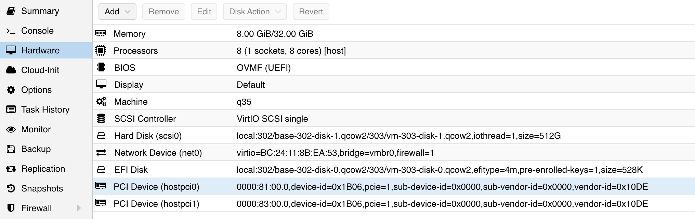

## 准备工作

在 pve8 下查看两块 p102 显卡的信息：

```bash
lspci |  grep 3D
81:00.0 3D controller: NVIDIA Corporation GP102 [P102-100] (rev a1)
83:00.0 3D controller: NVIDIA Corporation GP102 [P102-100] (rev a1)
```

要直通这两块卡给 debian12 虚拟机，需要准备：

- 开启 pcie 直通
- 安装 debian 12 虚拟机

## 修改 device ID

直通显卡时，需要修改显卡的设备ID，仿冒 1080 TI 显卡。

- Vendor ID:  0x10DE
- Device ID: 0x1B06
- Sub-Vendor ID:  0x0000
- Sub-Device ID: 0x0000


## 直通给 debian12

之后将两块卡都直通给 debian12 虚拟机：



启动 debian12 之后，查看显卡信息：

```bash
$ lspci | grep 3D
01:00.0 3D controller: NVIDIA Corporation GP102 [GeForce GTX 1080 Ti] (rev a1)
02:00.0 3D controller: NVIDIA Corporation GP102 [GeForce GTX 1080 Ti] (rev a1)

$ lspci -nn | egrep -i "3d|display|vga"
00:01.0 VGA compatible controller [0300]: Device [1234:1111] (rev 02)
01:00.0 3D controller [0302]: NVIDIA Corporation GP102 [GeForce GTX 1080 Ti] [10de:1b06] (rev a1)
02:00.0 3D controller [0302]: NVIDIA Corporation GP102 [GeForce GTX 1080 Ti] [10de:1b06] (rev a1)
```

## 安装 nvidia 驱动

### 更新系统

安装驱动前先更新一下

```bash
sudo apt update
sudo apt upgrade
sudo reboot
```

重启之后，如果有内核更新，可以先删除不用的旧内核：

```bash
$ sudo apt upgrade
The following package was automatically installed and is no longer required:
  linux-image-6.1.0-15-amd64
Use 'sudo apt autoremove' to remove it.
0 upgraded, 0 newly installed, 0 to remove and 0 not upgraded.
$ sudo apt autoremove
Reading package lists... Done
Building dependency tree... Done
Reading state information... Done
The following packages will be REMOVED:
  linux-image-6.1.0-15-amd64
```

### 添加 non-free 仓库

```bash
/etc/apt/sources.list
```

在最后加入一行：

```bash
deb http://deb.debian.org/debian/ bullseye main contrib non-free
```

执行更新：

```bash
sudo apt update
```

### 安装 linux-headers

```bash
sudo apt install linux-headers-$(uname -r)
```

### 安装 nvidia-detect

```bash
sudo apt -y install nvidia-detect
```

不知道为什么版本是 470.223.02-1：

```bash
sudo apt -y install nvidia-detect
Reading package lists... Done
Building dependency tree... Done
Reading state information... Done
The following NEW packages will be installed:
  nvidia-detect
0 upgraded, 1 newly installed, 0 to remove and 0 not upgraded.
Need to get 251 kB of archives.
After this operation, 332 kB of additional disk space will be used.
Get:1 http://deb.debian.org/debian bullseye/non-free amd64 nvidia-detect amd64 470.223.02-1 [251 kB]
Fetched 251 kB in 0s (1,279 kB/s) 
Selecting previously unselected package nvidia-detect.
(Reading database ... 85839 files and directories currently installed.)
Preparing to unpack .../nvidia-detect_470.223.02-1_amd64.deb ...
Unpacking nvidia-detect (470.223.02-1) ...
Setting up nvidia-detect (470.223.02-1) ...
```


安装完成之后执行：

```bash
sudo nvidia-detect 
```

能看到输出如下：

```bash
sudo nvidia-detect               
Detected NVIDIA GPUs:
01:00.0 3D controller [0302]: NVIDIA Corporation GP102 [GeForce GTX 1080 Ti] [10de:1b06] (rev a1)
02:00.0 3D controller [0302]: NVIDIA Corporation GP102 [GeForce GTX 1080 Ti] [10de:1b06] (rev a1)

Checking card:  NVIDIA Corporation GP102 [GeForce GTX 1080 Ti] (rev a1)
Your card is supported by all driver versions.
Your card is also supported by the Tesla 470 drivers series.
Your card is also supported by the Tesla 450 drivers series.
Your card is also supported by the Tesla 418 drivers series.
It is recommended to install the
    nvidia-driver
package.

Checking card:  NVIDIA Corporation GP102 [GeForce GTX 1080 Ti] (rev a1)
Your card is supported by all driver versions.
Your card is also supported by the Tesla 470 drivers series.
Your card is also supported by the Tesla 450 drivers series.
Your card is also supported by the Tesla 418 drivers series.
It is recommended to install the
    nvidia-driver
package.
```

### 安装 nvidia-driver

```bash
sudo apt install nvidia-driver
```

报错：

```bash
Setting up nvidia-egl-icd:amd64 (470.223.02-1) ...
Setting up libnvidia-encode1:amd64 (470.223.02-1) ...
Setting up nvidia-driver-libs:amd64 (470.223.02-1) ...
Processing triggers for nvidia-alternative (470.223.02-1) ...
update-alternatives: updating alternative /usr/lib/nvidia/current because link group nvidia has changed slave links
Setting up nvidia-kernel-dkms (470.223.02-1) ...
Loading new nvidia-current-470.223.02 DKMS files...
Building for 6.1.0-18-amd64
Building initial module for 6.1.0-18-amd64
Error! Bad return status for module build on kernel: 6.1.0-18-amd64 (x86_64)
Consult /var/lib/dkms/nvidia-current/470.223.02/build/make.log for more information.
dpkg: error processing package nvidia-kernel-dkms (--configure):
 installed nvidia-kernel-dkms package post-installation script subprocess returned error exit status 10
dpkg: dependency problems prevent configuration of nvidia-driver:
 nvidia-driver depends on nvidia-kernel-dkms (= 470.223.02-1) | nvidia-kernel-470.223.02; however:
  Package nvidia-kernel-dkms is not configured yet.
  Package nvidia-kernel-470.223.02 is not installed.
  Package nvidia-kernel-dkms which provides nvidia-kernel-470.223.02 is not configured yet.

dpkg: error processing package nvidia-driver (--configure):
 dependency problems - leaving unconfigured
Processing triggers for libc-bin (2.36-9+deb12u4) ...
Processing triggers for initramfs-tools (0.142) ...
update-initramfs: Generating /boot/initrd.img-6.1.0-18-amd64
Processing triggers for update-glx (1.2.1~deb11u1) ...
Processing triggers for glx-alternative-nvidia (1.2.1~deb11u1) ...
update-alternatives: using /usr/lib/nvidia to provide /usr/lib/glx (glx) in auto mode
Processing triggers for glx-alternative-mesa (1.2.1~deb11u1) ...
Processing triggers for libc-bin (2.36-9+deb12u4) ...
Processing triggers for initramfs-tools (0.142) ...
update-initramfs: Generating /boot/initrd.img-6.1.0-18-amd64
Errors were encountered while processing:
 nvidia-kernel-dkms
 nvidia-driver
E: Sub-process /usr/bin/dpkg returned an error code (1)
```

怀疑是不是 debian12 的 6.1 内核太新了，这个 nvidia 470 驱动应该比较旧。

TBD：换 ubuntu server 用 5.4 / 5.15 内核试试。


## 参考资料

- [适用于 Debian 12 的 NVIDIA 驱动程序](https://www.reddit.com/r/linux4noobs/comments/18n34c3/nvidia_drivers_for_debian_12_step_by_step/)
- [How to install Nvidia driver on Debian 12 Bookworm Linux](https://linuxconfig.org/how-to-install-nvidia-driver-on-debian-12-bookworm-linux)
