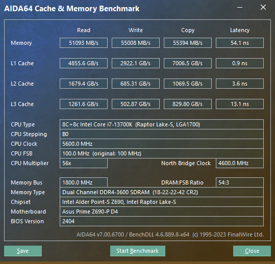

全称：阿斯加特（Asgard）32GB2666频率DDR4台式机内存条洛极51℃灰


## 参数设置

### 华硕 pro x299 ws + 7960x

32g x 4，跑ddr4 3600, 参数如下：

```properties
DRAM CAS# Latency [18]
DRAM RAS# to CAS# Delay [22]
DRAM RAS# PRE Time [22]
DRAM RAS# ACT Time [43]
DRAM Command Rate [Timing 2T]
DRAM REF Cycle Time [1000]

DRAM Voltage(CHA, CHB) [1.3500]
DRAM Voltage(CHC, CHD) [1.3500]
```

bios设置备份：

- [x299_7960x_4.5g_3600.CMO](images/x299_7960x_4.5g_3600.CMO) 
- [x299_7960x_4.5g_3600_setting.txt](images/x299_7960x_4.5g_3600_setting.txt) 

备注：这个内存设置在z690上不稳

### 华硕z690-p d4 + 13700k

同样是 32g x 4，跑ddr4 3600, 参数如下：

```properties
XMP [XMP DDR4-2667 19-19-19-43-1.20V]
BCLK Frequency : DRAM Frequency Ratio [Auto]
Memory Controller : DRAM Frequency Ratio [1:1]
DRAM Frequency [DDR4-3600MHz]

DRAM CAS# Latency [18]
DRAM RAS# to CAS# Delay [22]
DRAM RAS# PRE Time [22]
DRAM RAS# ACT Time [42]
DRAM Command Rate [2N]
DRAM RAS# to RAS# Delay L [9]
DRAM RAS# to RAS# Delay S [7]
DRAM REF Cycle Time [660]
DRAM REF Cycle Time 2 [660]
DRAM REF Cycle Time 4 [660]
DRAM Refresh Interval [65535]
DRAM WRITE Recovery Time [26]
DRAM READ to PRE Time [12]
DRAM FOUR ACT WIN Time [38]
DRAM WRITE to READ Delay [5]
DRAM WRITE to READ Delay L [14]
DRAM WRITE to READ Delay S [5]
DRAM CAS to CAS Delay L [8]
DRAM CKE Minimum Pulse Width [9]
DRAM Write Latency [18]

DRAM Voltage(CHA, CHB) [1.3500]
DRAM Voltage(CHC, CHD) [1.3500]
```

bios设置备份：

- [z690_5.6g_3600_128g.CMO](images/z690_5.6g_3600_128g.CMO) 
-  [z690_5.6g_3600_128g_setting.txt](images/z690_5.6g_3600_128g_setting.txt) 

aida64 内存测试结果：




## 资料介绍

- [128GB（32G*4）阿斯加特真香条超频3800mhz的深度解析！颗粒为D9XPF 时序18-25-25-58](https://www.bilibili.com/read/cv6717434/) 
- [超频潜力惊人：阿斯加特 T2 32G DDR4 2666](https://post.smzdm.com/p/a783ww4l/)
