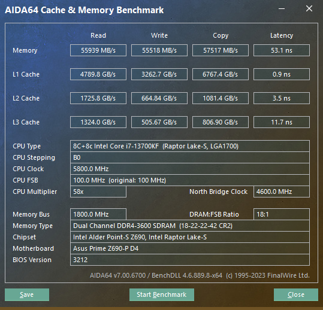

### 华硕z690-p d4 + 13700k

同样是 32g x 4，跑ddr4 3600, 参数如下：

```properties
BCLK Frequency : DRAM Frequency Ratio [100:100]
Memory Controller : DRAM Frequency Ratio [1:1]
DRAM Frequency [DDR4-3600MHz]
......
CPU System Agent Voltage: Manual Mode
  - CPU System Agent Voltage Override: 1.350
DRAM Voltage[1.3500]
```

DRAM Timing Control:18


```properties
DRAM CAS# Latency [18]
DRAM RAS# to CAS# Delay [22]
DRAM RAS# PRE Time [22]
DRAM RAS# ACT Time [42]
DRAM Command Rate [2N]
DRAM RAS# to RAS# Delay L [9]
DRAM RAS# to RAS# Delay S [7]
DRAM REF Cycle Time [660]
DRAM REF Cycle Time 2 [660]
DRAM REF Cycle Time 4 [660]
DRAM Refresh Interval [65535]
DRAM WRITE Recovery Time [26]
DRAM READ to PRE Time [12]
DRAM FOUR ACT WIN Time [38]
DRAM WRITE to READ Delay [5]
DRAM WRITE to READ Delay L [14]
DRAM WRITE to READ Delay S [5]
DRAM CAS to CAS Delay L [8]
DRAM CKE Minimum Pulse Width [9]
DRAM Write Latency [18]
```

bios设置备份：

- [asgard32g-3600.CMO](images/asgard32g-3600.CMO) 
-  [asgard32g-3600_setting.txt](images/asgard32g-3600_setting.txt) 

aida64 内存测试结果：



