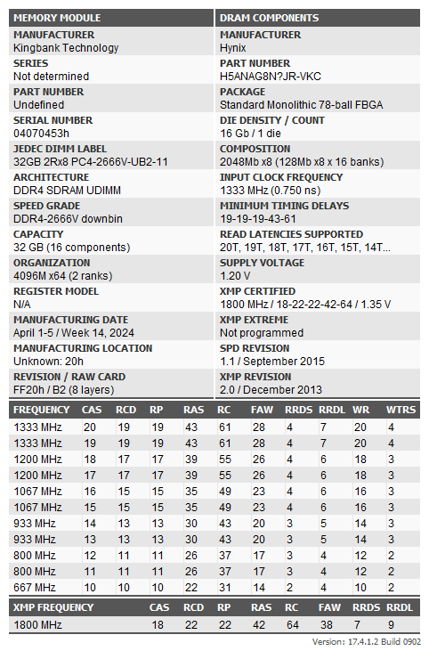

从京东自营处买了一对金百达银爵32G内存，频率3600 c18。

https://item.jd.com/10081657664778.html

## 介绍资料

- [内存超频作业 金百达DDR4新CJR颗粒 64G(2*32G)超频4000G1 低压低温可日常使用](https://bbs.nga.cn/read.php?tid=35803922&rand=587): 这个非常详尽
- [双面CJR 64G（32*2）4200G1 C18，附带小参和电压](https://www.chiphell.com/thread-2476893-1-1.html): 适合华硕主板抄作业

## 内存信息

### 内存颗粒信息

thaiphoon-burner 读取到的内存颗粒信息，第一条：

第二条：

