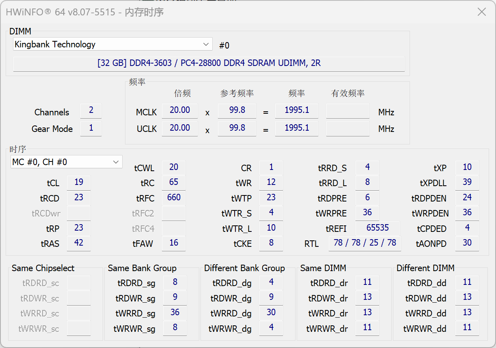
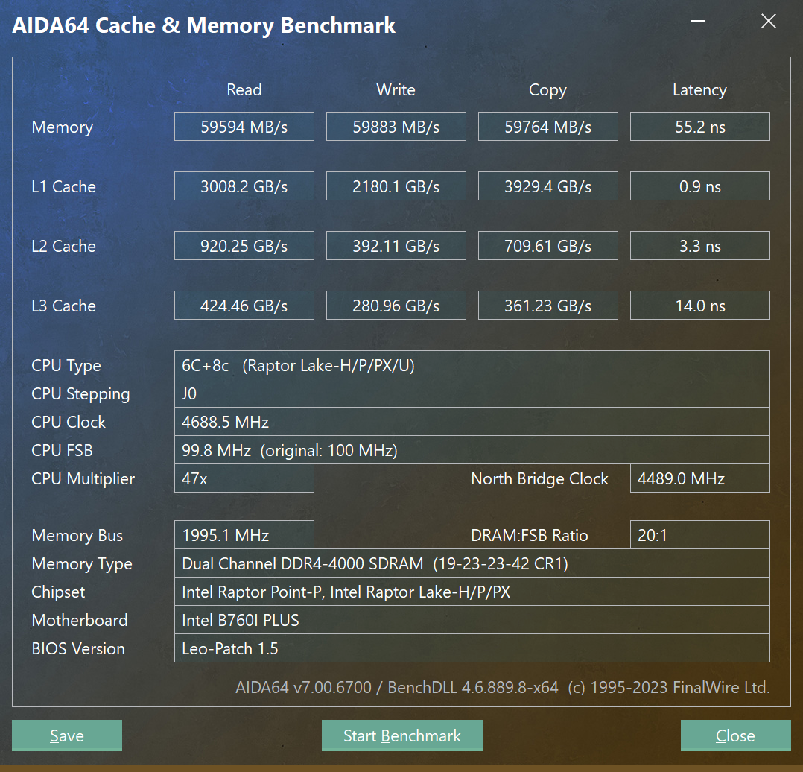
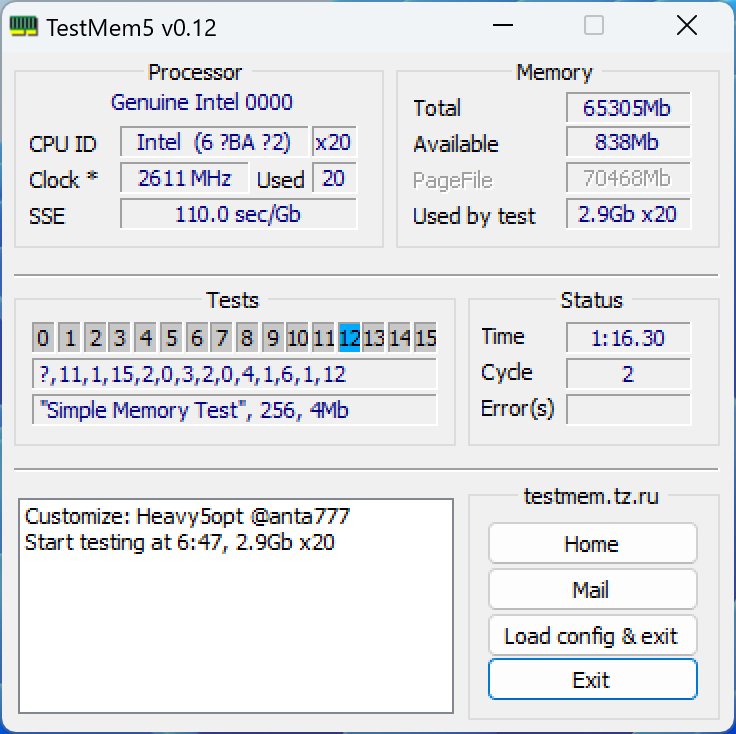

主板天邦 q1hy，itx主板，32g x 2。

> 备注：由于主板限制，内存电压最高只能设置到 1.35v，因此频率和小参都会比在 z690+13700k 平台上低。

## 超频参数设置

1.35v 跑 ddr4 4000, q1hy 主板 bios 设置内存参数如下：

"Turbo"：

- memory profile: custom profile
- maximum memory frequency: 4000
- memory voltage vddq: 1.35v
- memory reference closk: 100
- gear mode: gear1

"Turbo" -> "memory custom profiles control"：

| 参数     | 4000  |
| -------- | ----- |
| tCL      | 19    |
| tRCD/tRP | 23    |
| tRAS     | 42    |
| tCWL     | 23    |
| tFAW     | 16    |
| tREFI    | 65535 |
| tRFC     | 660   |
| TRRD     | 4     |
| TRTP     | 6     |
| TWR      | 12    |
| TWTR     | 0     |
| tRFCpb   | 0     |
| TRFC2    | 400   |
| TRFC4    | 250   |
| TRRD_L   | 8     |
| TRRD_S   | 4     |
| TWTR_L   | 10    |
| TCCD_L   | 8     |
| TWTR_S   | 4     |
| NMODE    | 1     |

用 HWiNFO 看到的内存时序为：

## 性能测试

aida64 内存测试结果：

## 稳定性测试

### TestMem5

TestMem5 过测76分钟没报错：

