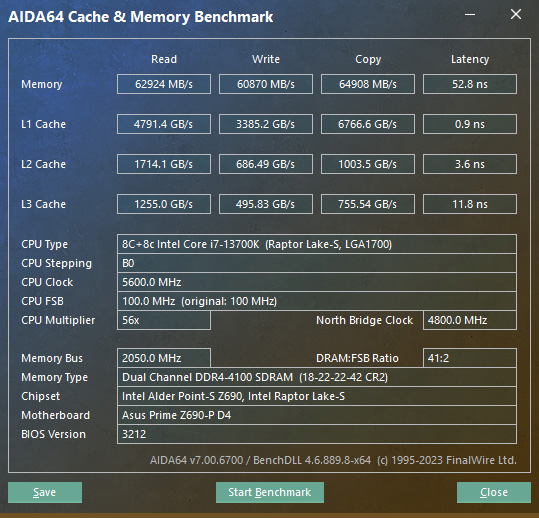

主板华硕z690-p d4，cpu是13700k。

32g x 2，跑ddr4 4100, 参数如下：

```properties
BCLK Frequency : DRAM Frequency Ratio [100:100]
Memory Controller : DRAM Frequency Ratio [1:1]
DRAM Frequency [DDR4-4100MHz]
......
CPU System Agent Voltage: Manual Mode
  - CPU System Agent Voltage Override: 1.400
DRAM Voltage[1.3750]
IVR Transmitter VDDQ Voltage: 1.43
```

DRAM Timing Control:


```properties
DRAM CAS# Latency [18]
DRAM RAS# to CAS# Delay [22]
DRAM RAS# PRE Time [22]
DRAM RAS# ACT Time [42]
DRAM Command Rate [2N]
DRAM RAS# to RAS# Delay L [9]
DRAM RAS# to RAS# Delay S [7]
DRAM REF Cycle Time [631]
DRAM REF Cycle Time 2 [469]
DRAM REF Cycle Time 4 [289]
DRAM Refresh Interval [65535]
DRAM WRITE Recovery Time [12]
DRAM READ to PRE Time [12]
DRAM FOUR ACT WIN Time [38]
DRAM WRITE to READ Delay [6]
DRAM WRITE to READ Delay L [6]
DRAM WRITE to READ Delay S [6]
DRAM CAS to CAS Delay L [8]
DRAM CKE Minimum Pulse Width [6]
DRAM Write Latency [16]
```

bios设置备份：

- [55to57_4100.CMO](images/55to57_4100.CMO) 
- [55to57_4100_setting.txt](images/55to57_4100_setting.txt) 


aida64 内存测试结果：

