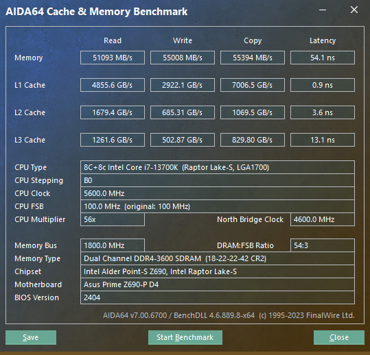

## 主板资料

华硕官方网站：

https://www.asus.com.cn/motherboards-components/motherboards/prime/prime-z690-p-d4/

主板优势：

1. 价格便宜，超频能力尚可，用来超频13700k 和旗舰主板差距不大，够用了。
2. 有四条pcie16x：只有一条是pcie5.0 16x（实际16x）, 两条 pcie3.0 16x（实际4x），一条pcie4.0 16x（实际4x） 

## 主板用途

### 主力机 13700kf

13700k oc 全核 5.6g，小核 4.2g, 搭配 英睿达铂胜8G c9bjz 内存 实现 8g x 4 = 32g 

主板超频bios设置 (bios 版本 2404）：

- [z690_5.6g_4200_32g.CMO](images/z690_5.6g_4200_32g.CMO) 
-  [z690_5.6g_4200_32g.txt](images/z690_5.6g_4200_32g.txt) 
-  [z690_5.8g_4200_32g_noht.CMO](../../../../../../../../../media/sky/U16G/z690_5.8g_4200_32g_noht.CMO) 
-  [z690_5.8g_4200_32g_noht.txt](../../../../../../../../../media/sky/U16G/z690_5.8g_4200_32g_noht.txt) 

> 备注：升级到最新的支持14代cpu的bios（2802）之后，这个超频配置不稳定，需要重新调整。

### 开发机 13700k

13700k oc 全核 5.6g，小核 4.2g, 搭配 阿斯加特32G ddr4 2666 (真香条) 实现 32g x 4 = 128g 

主板超频bios设置 (bios 版本 2404）：

- [z690_5.6g_3600_128g.CMO](images/z690_5.6g_3600_128g.CMO)  
- [z690_5.6g_3600_128g_setting.txt](images/z690_5.6g_3600_128g_setting.txt) 

备注：升级到最新的支持14代cpu的bios（2802）之后，这个超频配置不稳定，需要重新调整。

### 备用机

12400，搭配内存 实现 16g x 2 = 32g 
