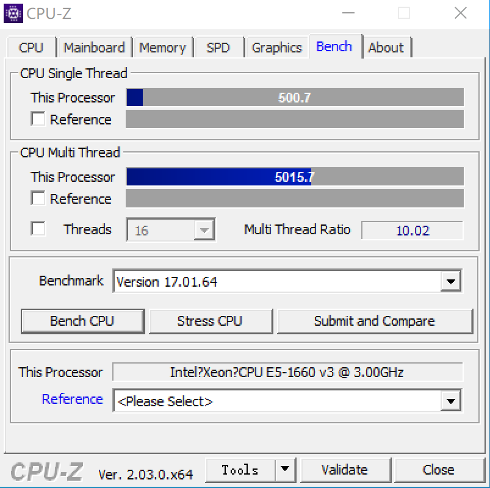
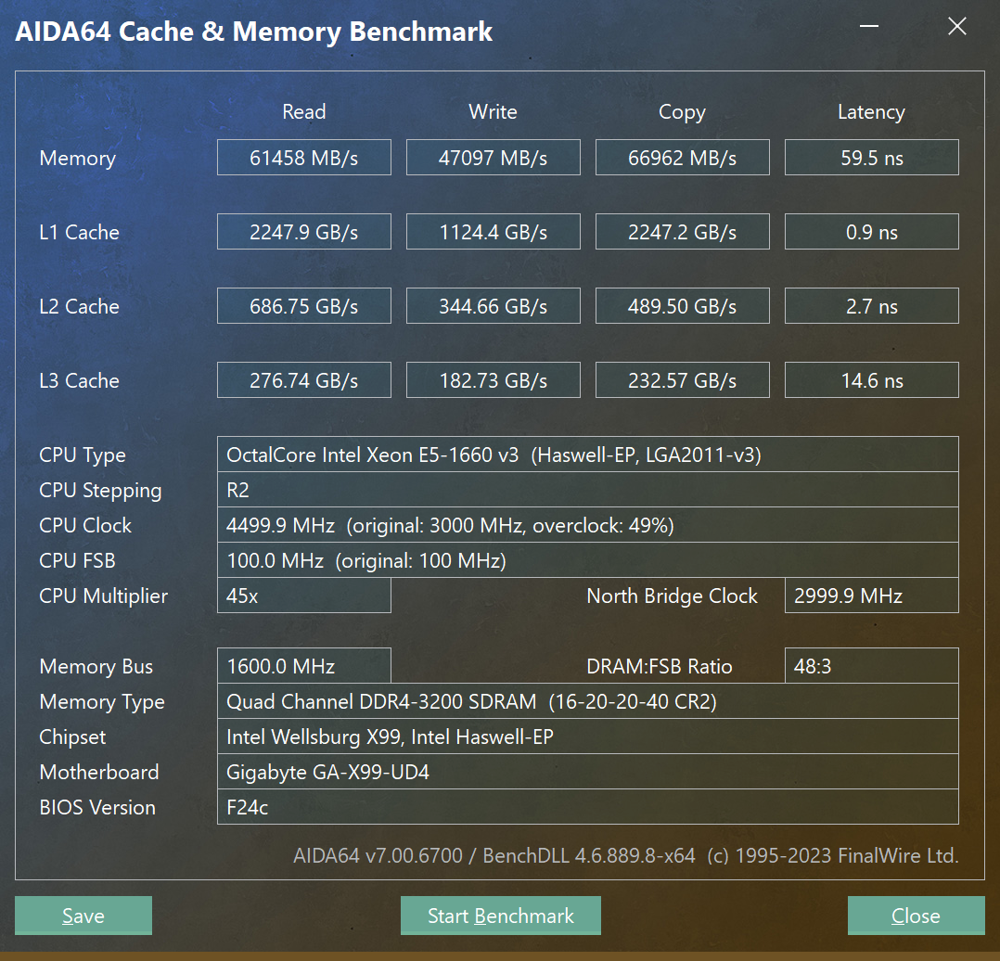

## 主板资料

技嘉官方网站：

https://www.gigabyte.cn/Motherboard/GA-X99-UD4-rev-10#ov

主板优势：

1. 这个主板最大的优势，是有四条 pcie8x 可同时用
2. 四条pcie8x同时插的时候，其中还有一条带宽是 pcie 16x. 
3. 待机功耗低，搭配 e5 2680 v4, 整机待机功耗才 40瓦出头。插四块 hp544+ 也才60瓦出头。
4. 价格相对便宜
5. 有三条 pcie 1x 插槽，可以插亮机卡（改成pcie 1x），2.5g网卡等

主板缺点：

1. 板载的 m2 带宽只有 10G,而不是标准的 pcie 3.0 x4 有 32g 带宽，因此限制了 ssd 的速度

## 主板用途

### linux 40g软交换


我用这个主板，插了四块 hp544+ 40/56g 网卡，安装ubuntu server,利用 linux bridge 实现了一个 56g 的软交换机，提供8个 56g eth 接口。

其次，修改主板 bios ，将 x16 的那个插槽拆分为 8 + 4 + 4, 配置反坦克拆分卡，可以在支持 hp544+ 40/56g 网卡的同时，提供两个满速的 pcie 3.0 x4 的 m2 接口。这样可以同时兼职做纯 ssd 的 nas。

#### bios设置

整机包括：主板，e5 2680 v4，8gx4 普通内存，低功耗亮机卡，2.5g网卡，3个14厘米机箱风扇，普通500瓦atx电源。开机进入bios后整机99瓦，进入ubuntu server后，整机待机功耗45.5瓦。

为了尽量降低整机功耗，需要的bios设置：

"M.I.T." -> "Advanced Frequency Settings" -> "Advanced CPU Core Settings"

- Hyper-threading technology: disabled
- cpu enhanced halt (c1e): enabled
- c3 state support: enabled
- c6/c7 state support: enabled
- cpu eist function: enabled

"C hipset"

- Audio controller: disabled
- PCH internal Lan: disabled
- Intel VT for Directed I/O(VT-d): enable
- execute disabled bit: enabled
- intel Virutalization Technology(vt-x): enabled

#### 附带：反坦克拆分卡


可以在闲鱼搜索 “反坦克拆分卡”，价格 130多。

- https://www.bilibili.com/read/cv15226168/

### 25g软交换兼ssd nas

#### bios设置

整机包括：主板，e5 2650 v4，8gx2 普通内存，gt1030低功耗亮机卡，dc电源。开机进入bios后整机99瓦，进入ubuntu server后，整机待机功耗41.3瓦。

后面后面 debian 12 之后的测试，这个主板 + e5 2630l v3，dc电源。在进入系统之后

- 8gx2 普通内存，r5 240低功耗亮机卡，待机40瓦
- 8gx2 普通内存，不插显卡，无头模式进入系统，待机34瓦，也就是r5 240低功耗亮机卡大概是6瓦的待机功耗
- 将内存从8gx2 普通内存换到16g x 4 的 reg ecc 服务器内存，待机54瓦，也就是每条 16g  reg ecc 服务器内存需要5-6瓦的功耗
- 继续用8gx2 普通内存，不插显卡（基础功耗为34瓦），增加一块cx4121a网卡，待机功耗增加到44瓦，也就是一块cx4121a网卡大概要10瓦待机功耗。

为了尽量降低整机功耗，需要的bios设置：

"M.I.T." -> "Advanced Frequency Settings" -> "Advanced CPU Core Settings"

- Hyper-threading technology: disabled
- cpu enhanced halt (c1e): enabled
- c3 state support: enabled
- c6/c7 state support: enabled
- cpu eist function: enabled

"C hipset"

- Audio controller: disabled
- PCH internal Lan: disabled
- Intel VT for Directed I/O(VT-d): enable
- execute disabled bit: enabled
- intel Virutalization Technology(vt-x): enabled

### nas机器

另一块主板用来做 nas 机器，机械硬盘和ssd硬盘混合，2.5g网卡 + 25g 网卡组合。

cpu 用的是 e5 1660 v3，超全核4.5g，cpuz测试成绩如下：



内存用的是海力士 reg ecc 内存，ddr4 2133，afr 颗粒，四条单根4g内存组成4通道16g。



#### 主板bios超频设置

超频 cpu 到全核 4.5g：

M.I.T. -> "Advanced Frequeency Settings"

```properties
CPU Clock Ratio = 45
```

M.I.T. -> "Advanced Voltage Settings" -> "CPU Core Voltage Control"

```properties
CPU VRIN External Override = 1.9v
CPU Vcore = 1.350v
```

超频 内存 到 ddr4 3200：

M.I.T. -> "Advanced Frequeency Settings"

```properties
System Memory Multiplier = 32.00
```

M.I.T. -> "Advanced Memory Settings"

```properties
Memory Timing Mode = Advanced Manual
```

M.I.T. -> "Advanced Memory Settings" -> "Channel A Memory Sub Timmings"

```properties
Cas Latency = 16
tRCD = 20
tRP = 20
tRAS = 40
rRFC = 660
Command Rate(tCMD) = 2 要不要改成1t？
tREFI = 30000
```

Channel B/C/D 同样设置。

M.I.T. -> "Advanced Voltage Settings" -> ""

```properties
DRAM Voltage (Ch A/B) = 1.40v
DRAM Training Voltage (Ch A/B) = 1.40v
DRAM Voltage (Ch C/D) = 1.40v
DRAM Training Voltage (Ch C/D) = 1.40v
```


## 主板 bios

- [modud4.rom](files/modud4.rom) ： 修改之后的bios文件，支持将上图中的 x16 插槽拆分为 8 + 4 + 4。注意原版bios没有pcie拆分选项，必须要修改bios。

- [x99ud4.rom](files/x99ud4.rom) ： 官方原版bios,最新版本。

### bios 刷新方式

先制作纯 dos 的启动 U 盘，然后在 u 盘下复制需要的  efiflash.exe 文件和相关的 rom 文件。

所需的文件打包在这里，解压缩后复制到u盘根目录下即可：

-  [u.zip](files/u.zip) 

用纯 dos 的 u 盘启动机器，在命令行下输入 mod 刷新修改后的bios, 输入 F 则刷新原版bios。
