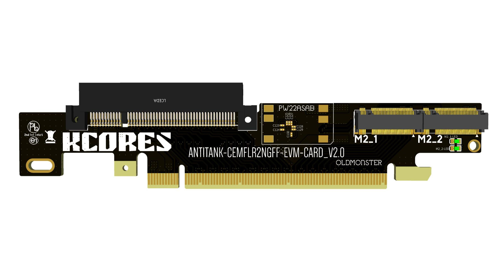

## 主板资料

技嘉官方网站：

https://www.gigabyte.cn/Motherboard/GA-X99-UD4-rev-10#ov

主板优势：

1. 这个主板最大的优势，是有四条 pcie8x 可同时用
2. 四条pcie8x同时插的时候，其中还有一条带宽是 pcie 16x. 
3. 待机功耗低，搭配 e5 2680 v4, 整机待机功耗才 40瓦出头。插四块 hp544+ 也才60瓦出头。
4. 价格相对便宜
5. 有三条 pcie 1x 插槽，可以插亮机卡（改成pcie 1x），2.5g网卡等

主板缺点：

1. 板载的 m2 带宽只有 10G,而不是标准的 pcie 3.0 x4 有 32g 带宽，因此限制了 ssd 的速度

## 主板用途

我用这个主板，插了四块 hp544+ 40/56g 网卡，安装ubuntu server,利用 linux bridge 实现了一个 56g 的软交换机，提供8个 56g eth 接口。

其次，修改主板 bios ，将 x16 的那个插槽拆分为 8 + 4 + 4, 配置反坦克拆分卡，可以在支持 hp544+ 40/56g 网卡的同时，提供两个满速的 pcie 3.0 x4 的 m2 接口。这样可以同时兼职做纯 ssd 的 nas。

### 附带：反坦克拆分卡

可以在闲鱼搜索 “反坦克拆分卡”，价格 130多。

- https://www.bilibili.com/read/cv15226168/

## 主板 bios

- [modud4.rom](files/modud4.rom) ： 修改之后的bios文件，支持将上图中的 x16 插槽拆分为 8 + 4 + 4。注意原版bios没有pcie拆分选项，必须要修改bios。

- [x99ud4.rom](files/x99ud4.rom) ： 官方原版bios,最新版本。

### bios 刷新方式

先制作纯 dos 的启动 U 盘，然后在 u 盘下复制需要的  efiflash.exe 文件和相关的 rom 文件。

所需的文件打包在这里，解压缩后复制到u盘根目录下即可：

-  [u.zip](files/u.zip) 

用纯 dos 的 u 盘启动机器，在命令行下输入 mod 刷新修改后的bios, 输入 F 则刷新原版bios。
