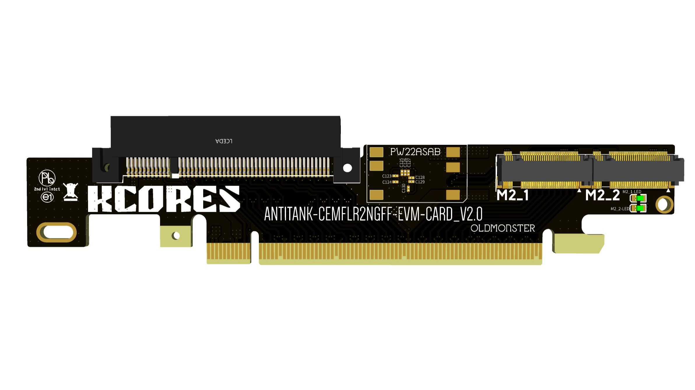

## 机器用途

我用这个主板，插了四块 hp544+ 40/56g 网卡，安装 debian12 操作系统，利用 linux bridge 实现了一个 56g 的软交换机，提供8个 56g eth 接口。

如下图所示的 4-way 方案：

其中三条x8的pcie插槽插了三张hp544+网卡。另外，修改主板 bios ，将 x16 的那个插槽拆分为 x8 + x4 + x4, 配置反坦克拆分卡，可以在支持一张 hp544+ 网卡的同时，提供两个满速的 pcie 3.0 x4 的 m2 接口。这样可以同时兼职做纯 ssd 的 nas，目前使用了两根三星pm983a 900G 22110企业级SSD。

反坦克拆分卡如图所示：

可以在闲鱼搜索 “反坦克拆分卡”，价格 130多。

- https://www.bilibili.com/read/cv15226168/

另外配置了一块16T的东芝mg08 机械硬盘，用来在资料备份等对速度要求不高的场合下使用。

debian12 操作系统单独安装在一块256g的三星pm981a 2280 SSD上，这块ssd插在主板自带的速度仅为 10g 的m2插槽上。主要目的是避免nas硬盘更换时不要影响到操作系统。

## 机器设置

整机包括：主板，e5 2680 v4，8gx4 普通内存，低功耗亮机卡，3个14厘米机箱风扇，普通500瓦atx电源。

由于 e5 2680 v4 不可超频，因此没太多玩法，简单使用即可。

### bios设置

开机进入bios后整机99瓦，进入debian操作系统后，整机待机功耗45.5瓦。

为了尽量降低整机功耗，需要的bios设置：

"M.I.T." -> "Advanced Frequency Settings" -> "Advanced CPU Core Settings"

- Hyper-threading technology: disabled
- cpu enhanced halt (c1e): enabled
- c3 state support: enabled
- c6/c7 state support: enabled
- cpu eist function: enabled

"Chipset"

- Audio controller: disabled
- PCH internal Lan: disabled
- Intel VT for Directed I/O(VT-d): enable
- execute disabled bit: enabled
- intel Virutalization Technology(vt-x): enabled

#### 内存时序

受cpu限制，内存只能跑2400。

TODO： 但内存时序时可以设置的， 有时间调一下，稍微优化一下性能。

