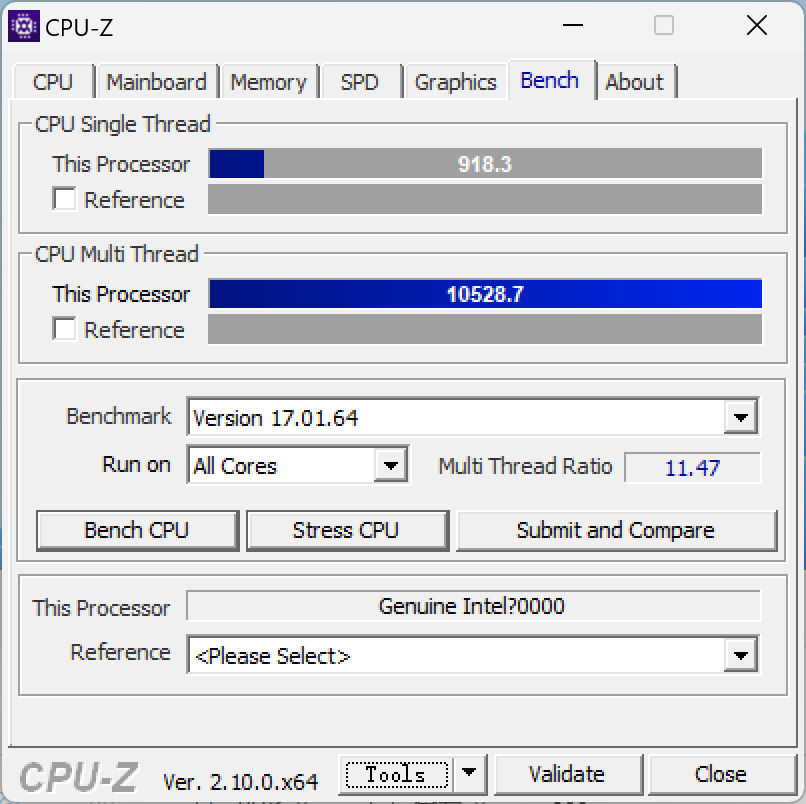
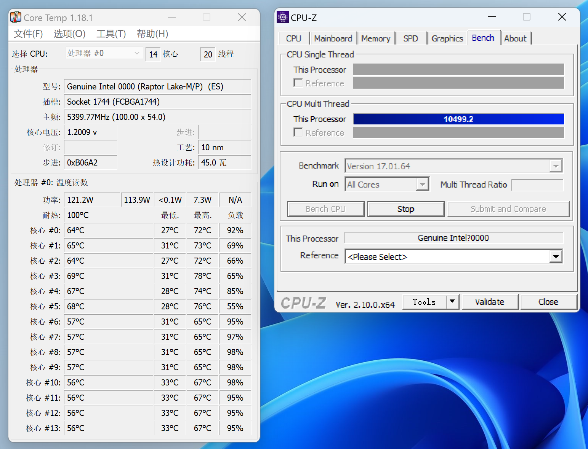
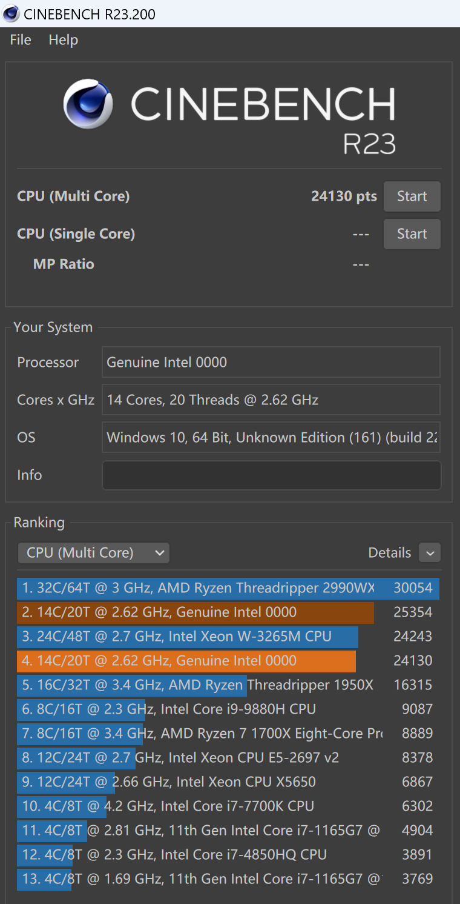
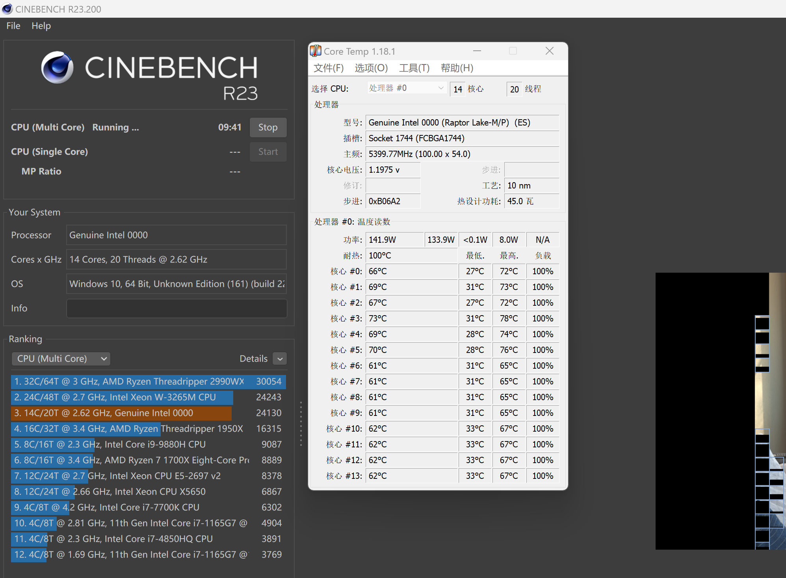
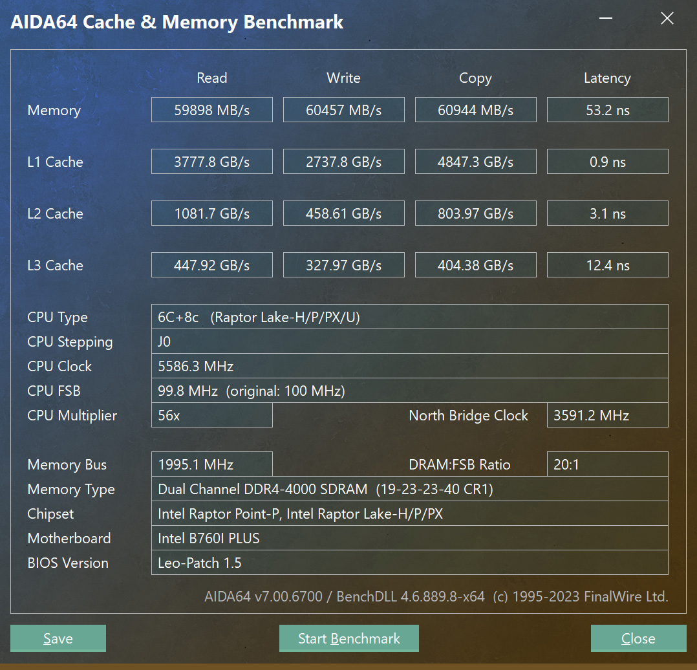

## 机器硬件配置

这台 q1hy 机器的硬件配置是：

- cpu/主板： q1hy，咸鱼加钱买的，体制较好
- 内存：京东买的宏基掠夺者ddr4 3600 16Gx2, 后来换成金百达银爵 DDR4 3600 32Gx2
- 机箱：开放式itx机箱
- 散热：ek 240 水冷
- 电源：长城g6电源

## 主板 bios 设置

参考 b 站视频： https://www.bilibili.com/video/BV1QN4y127iB/

下载地址： https://pan.baidu.com/s/1mdRQS7f5pYQWUF7B3SjIZQ?pwd=q1hy 

bios文件备份: [bios-解锁电流墙](./images/Q1HY-ITX-D4-BIOS2024.05.13.zip)

选择了 Q1HY-ITX-D4-BIOS2024.05.13.zip 这个 bios，刷新之后断电启动，然后 F9 载入默认配置，重启后再重新配置。

以下 bios 配置基于这个版本的 bios。

### CPU超频设置

#### OverClocking Performance Menu

高级 -> "OverClocking Performance Menu"

- OverCloking Feature: 开启
- Undervolt protection: 关闭
- Per-core HT Disable： 0
- wdt enable： 关闭
- bclk frequency： 100 MHz
- bclok 频率： 0
- bclk aware adaptive voltage： 开启
- fll overclock mode enable： 关闭
- sa pll frenquncy override： 3200 Mhz
- bclk tsc hw fixup： 开启

> 备注：以上内容都是默认，没有改动。

#### Processor

高级 -> "OverClocking Performance Menu" -> "Processor"

- Per code disable configuration: 关闭
- core max oc ratio: 0
- per core ratio override: 开启
  - core 0 max ratio： 57
  - core 1 max ratio： 57
  - core 2 max ratio： 57
  - core 3 max ratio： 57
  - core 4 max ratio： 57
  - core 5 max ratio： 57
  - cluster 0 max ratio: 42
  - cluster 1 max ratio: 42
- 核心电压模式：偏移模式
- 覆写大核电压：0
- vf offset mode：lagacy
- vf configuration scope： all-core
- p-core voltage offset： 30
  - offset prefix：[-]

- avx2 ratio offset: 3
- Avx2 voltage guardband scale factor: 3
- cpu极限降频温度补偿： 0
- Thermal velocity boost (TVB)
  - Thermal velocity boost : 关闭
  - TVB voltage optimizations: 关闭
  - Enhanced Thermal Velocity Boost: 关闭

#### Ring

高级 -> "OverClocking Performance Menu" -> "ring"

- Ring max超频: 47  [备注：默认就是47]
- Ring Voltage Mode: 偏移模式
- Ring extra turbo voltage： 0
- vf offset mode：lagacy
-  voltage offset： 0 
  - offset prefix：[+]

- Ring Down Bin： 开启
- Min Ring Ratio Llimit： 8 
- Max Ring Ratio Llimit： 45

#### GT

高级 -> "OverClocking Performance Menu" -> "GT"

- GT Overclocking frequency： 33
- GT Voltage Mode: 偏移模式
- GT extra turbo voltage： 0
-  GT voltage offset： 20
  - offset prefix：[-]

#### Uncore Voltage Mode

高级 -> "OverClocking Performance Menu" -> "Uncore"

- Uncore Voltage Mode: 覆写模式
-  Uncore voltage override： 1000 
- vccsa voltage offset： 0
  - offset prefix：[+]

#### Turbo Ratio Limit Options

高级 -> "Turbo Ratio Limit Options"

- P-core Turbo Ratio Limit Mumcore0: 1
- P-core Turbo Ratio Limit Mumcore1: 2
- P-core Turbo Ratio Limit Mumcore2: 3
- P-core Turbo Ratio Limit Mumcore3: 4
- P-core Turbo Ratio Limit Mumcore4: 5
- P-core Turbo Ratio Limit Mumcore5: 6
- P-core Turbo Ratio Limit Mumcore6: 7
- P-core Turbo Ratio Limit Mumcore7: 8
- P-core Turbo Ratio Limit Ratio0: 57
- P-core Turbo Ratio Limit Ratio1: 57
- P-core Turbo Ratio Limit Ratio2: 56
- P-core Turbo Ratio Limit Ratio3: 56
- P-core Turbo Ratio Limit Ratio4: 55
- P-core Turbo Ratio Limit Ratio5: 54
- P-core Turbo Ratio Limit Ratio6: 54
- P-core Turbo Ratio Limit Ratio7: 54
- E-core Turbo Ratio Limit Mumcore0: 1
- E-core Turbo Ratio Limit Mumcore1: 2
- E-core Turbo Ratio Limit Mumcore2: 3
- E-core Turbo Ratio Limit Mumcore3: 4
- E-core Turbo Ratio Limit Mumcore4: 5
- E-core Turbo Ratio Limit Mumcore5: 6
- E-core Turbo Ratio Limit Mumcore6: 7
- E-core Turbo Ratio Limit Mumcore7: 8
- E-core Turbo Ratio Limit Ratio0: 42
- E-core Turbo Ratio Limit Ratio1: 42
- E-core Turbo Ratio Limit Ratio2: 42
- E-core Turbo Ratio Limit Ratio3: 42
- E-core Turbo Ratio Limit Ratio4: 42
- E-core Turbo Ratio Limit Ratio5: 42
- E-core Turbo Ratio Limit Ratio6: 42
- E-core Turbo Ratio Limit Ratio7: 42

### 电源设置

#### power management configuration

"power" -> “power management configuration”

- EUP：开启

#### Power & performance

"Advanced" -> "Advanced" -> "Power & performance"

"Cpu - power management control"

- "Platform PL1 power": 140000  (140瓦)
- "Platform PL2 power": 140000  (140瓦)

### 风扇设置

#### cpu_fan

- cpu_fan mode: manual mode
- temperature 1: 45
- temperature 2: 55
- temperature 3: 65
- temperature 4: 75
- fd/rpm 1: 50
- fd/rpm 2: 100
- fd/rpm 3: 150
- fd/rpm 4: 230
- critical temperature: 80

### 内存超频设置

内存是宏基掠夺者 ddr4 36000 16gx2 （海力士DJR）

"Turbo"

- turbo mode: enabled
- ac loadline: 65
- dc loaline: 170

- memory profile: custom profile
- maximum memory frequency: 4000
- memory voltage vddq: 1.35v
- memory reference closk: 100
- gear mode: gear1

"Turbo" -> "memory custom profiles control"

| 参数     | 4000  |
| -------- | ----- |
| tCL      | 19    |
| tRCD/tRP | 23    |
| tRAS     | 40    |
| tCWL     | 20    |
| tFAW     | 16    |
| tREFI    | 65535 |
| tRFC     | 520   |
| TRRD     | 4     |
| TRTP     | 6     |
| TWR      | 12    |
| TWTR     | 0     |
| tRFCpb   | 0     |
| TRFC2    | 400   |
| TRFC4    | 250   |
| TRRD_L   | 8     |
| TRRD_S   | 4     |
| TWTR_L   | 10    |
| TCCD_L   | 8     |
| TWTR_S   | 4     |
| NMODE    | 1     |

## 性能和温度测试

### cpu-z 

cpu-z 单核 918，多核 10528，此时cpu频率为单核 5.7g，多核 5.4g。

跑cpuz压力测试时，功耗为 121 瓦，此时 cpu 温度为64到69度：

### r23 

r23成绩为 24130 分：

跑r23时，功耗为 142瓦，温度为 66 到 73 度：

### aida64 内存性能

