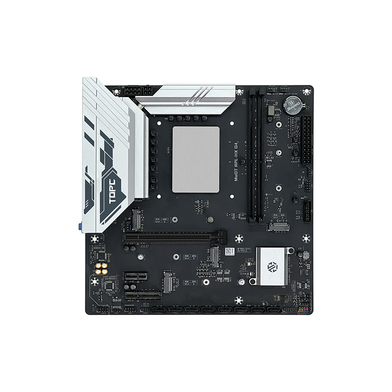
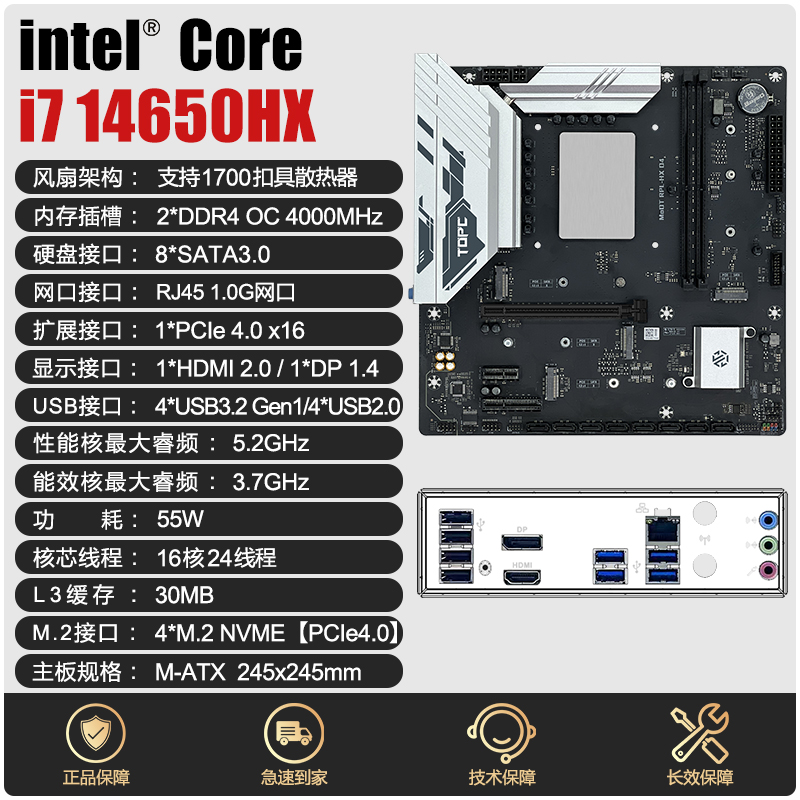

## 介绍

http://tbtopc.com/ProDetail.aspx?ProId=59

评测信息：

- [1699元的可超频14650HX+4M.2主板，vs 14600KF表现如何？ 天邦14650HX（QS）MoDT测评](https://www.bilibili.com/video/BV181koYoEhV/)

- [i7 14650HX最佳预设（双塔及以上散热可抄作业）](https://www.bilibili.com/video/BV1X2oQYQEZd/)

## 更新 bios

bios 来自： [MODT平台最能打的一集！TOPC i9-13980HX板U超频性能测试](https://www.bilibili.com/video/BV1AnSoY8EhH/)

最新12B微码，解锁功耗墙、电流墙等各种限制，更多详情网盘自取。

链接: https://pan.baidu.com/s/1nQzcyYExMWf1wWthNe1MFA?pwd=MODT 提取码: MODT

## Bios 设置

### 和超频无关的设置

#### 主页

- 修改语言为 中文。

#### "高级"

"图形配置"：

- 主要显示设备: PEG Slot  # 外接显卡优先
- VT-d: enabled
- 板载显卡: enabled

"PCI子系统设置"：

- PCIE speed： Gen4
- Resizable Bar support： 开启

"IT8613E 超级输入输出控制" -> "Serial Port 1 Configuration"

- Serial Port: 取消

#### 电源

"电源配置和电源管理接口"

- 启动休眠：取消

"电源管理配置"

- 深度睡眠：关闭
- usb唤醒：关闭
- 来电开机：上电

#### 启动 

- 启动等待： 5
- 数字键状态： 关闭
- 全屏开机画面：取消
- Bios写保护：开启

### cpu 超频设置

#### "高级"

"Turbo Ratio Limit Settings"：

- P-core Turbo Ratio Limit Ratio0: 54
- P-core Turbo Ratio Limit Ratio1: 54
- P-core Turbo Ratio Limit Ratio2: 53
- P-core Turbo Ratio Limit Ratio3: 53
- P-core Turbo Ratio Limit Ratio4: 52
- P-core Turbo Ratio Limit Ratio5: 52
- P-core Turbo Ratio Limit Ratio6: 52
- P-core Turbo Ratio Limit Ratio7: 52
- E-core Turbo Ratio Limit Ratio0: 40
- E-core Turbo Ratio Limit Ratio1: 40
- E-core Turbo Ratio Limit Ratio2: 40
- E-core Turbo Ratio Limit Ratio3: 40
- E-core Turbo Ratio Limit Ratio4: 40
- E-core Turbo Ratio Limit Ratio5: 40
- E-core Turbo Ratio Limit Ratio6: 40
- E-core Turbo Ratio Limit Ratio7: 40

"OverClocking Performance Menu" -> "Processor"：

- per core ratio override: 开启

  - core 0 max ratio： 54
  - core 1 max ratio： 54
  - core 2 max ratio： 54
  - core 3 max ratio： 54
  - core 4 max ratio： 54
  - core 5 max ratio： 54
  - core 6 max ratio： 54
  - core 7 max ratio： 54
  - cluster 0 max ratio: 40
  - cluster 1 max ratio: 40

- AVX2 Ratio Offset: 6
- Avx2 voltage guardband scale factor: 6

#### 超频

- "AC Loading": 默认 60，修改为 50
- 功耗限制1设定：开启，功耗限制 200000 （200瓦）
- 功耗限制2设定：开启，功耗限制 200000 （200瓦）

### 内存超频

#### 超频

- memory profile: 自定义
- 内存频率: 4000
- 内存电压 vddq: 1.40v
- 内存电压 vpp: 自动
- 内存参考时钟: 100
- gear mode: gear1
- 内存自定义设置

| 参数     | 4000  |
| -------- | ----- |
| NMODE    | 1    |
| tCL      | 19    |
| tRCD/tRP | 21    |
| tRAS     | 40    |
| TRFC2    | 660   |
| tREFI    | 65535 |
| TWR      | 12    |
| TWTR_L   | 10    |
| TWTR_S   | 4     |
| TRRD_L   | 8     |
| TRRD_S   | 4     |
| TRTP     | 6     |
| tFAW     | 16    |
| tCWL     | 20    |
| tCKE     | 0     |
| tRFC     | 660   |
| TRRD     | 4     |
| TWTR     | 0     |
| tRFCpb   | 0     |
| TRFC4    | 660   |
| TCCD_L   | 8     |

### ring 超频

#### "高级"

"OverClocking Performance Menu" -> "ring"：

- Ring max超频: 45
- Ring Voltage Mode: 偏移模式
- Ring extra turbo voltage： 0
- vf offset mode：lagacy
-  voltage offset： 0 
  - offset prefix：[+]

- Ring Down Bin： disabled
- Min Ring Ratio Llimit： 8
- Max Ring Ratio Llimit： 45

### 核显超频设置

#### "高级"

"OverClocking Performance Menu" -> "GT"：

- GT Overclocking frequency： 33
- GT Voltage Mode: 偏移模式
- GT extra turbo voltage： auto
-  GT voltage offset： 20
  - offset prefix：[-]

## 性能测试

- 默认：单核5.2g，全核4.8g，小核3.7g，AC Loading 60，avx offset 1
- 小超：单核5.4g，全核5.2g，小核4.0g，AC Loading 50，avx offset 6
- 大超：单核5.5g，全核5.2g，小核4.2g，AC Loading 50，avx offset 4

### cpu-z

|      | 单核分数 | 多核分数 | 单核频率 | 多核频率 | 小核频率 | AC Loading | CPUVID | 功耗  |
| ---- | -------- | -------- | -------- | -------- | -------- | ---------- | ------ | ----- |
| 默认 | 815      | 11280    | 5.2g     | 4.8g     | 3.7g     | 60         | 1.08   | 145瓦 |
| 小超 | 860      | 12450    | 5.4g     | 5.2g     | 4.0g     | 50         | 1.14   | 184瓦 |
| 大超 | 875      | 12383    | 5.5g     | 5.2g     | 4.2g     | 50         | 1.14   | 184瓦 |
|      |          |          |          |          |          |            |        |       |
|      |          |          |          |          |          |            |        |       |

- 小核跑4g和4.2g，对cpuz多核分数几乎没有增益。

### r23

|      | 分数  | 多核频率 | 小核频率 | AC Loading | CPUVID | 功耗        |
| ---- | ----- | -------- | -------- | ---------- | ------ | ----------- |
| 默认 | 27184 | 4.8g     | 3.7g     | 60         | 1.055  | 175瓦       |
| 小超 | 29200 | 5.1g     | 4.0g     | 50         | 1.073  | 200瓦（墙） |
| 大超 | 29505 | 5.1g     | 4.2g     | 50         | 1.073  | 200瓦（墙） |
|      |       |          |          |            |        |             |
|      |       |          |          |            |        |             |

- 200瓦功耗墙是限制 r23 分数提升的最大瓶颈。

## 稳定性测试

### AIDA 64 FPU

|      | avx offset | 多核频率 | 小核频率 | AC Loading | CPUVID | 功耗  |
| ---- | ---------- | -------- | -------- | ---------- | ------ | ----- |
| 默认 | 1          | 4.8g     | 3.7g     | 60         | 1.055  | 175瓦 |
| 小超 | 6          | 4.6g     | 4.0g     | 50         | 1.00   | 152瓦 |
| 大超 | 4          | 4.8g     | 4.2g     | 50         | 1.04   | 170瓦 |
|      |            |          |          |            |        |       |
|      |            |          |          |            |        |       |

- 大超：10分钟后死机，放弃

