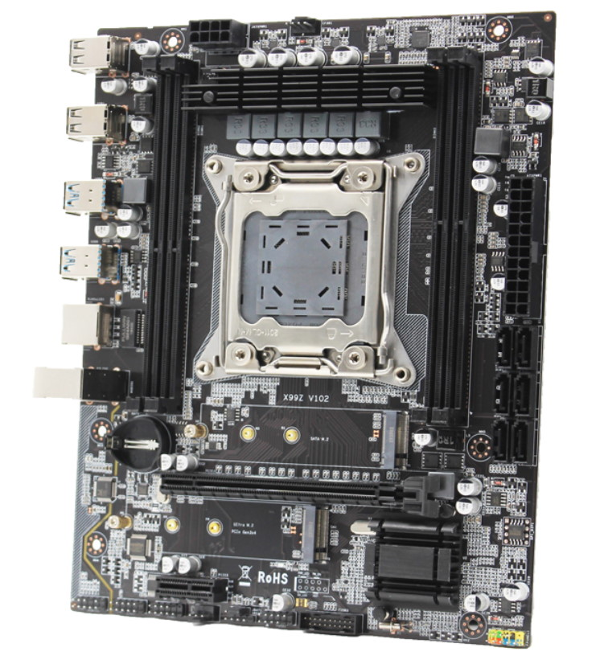
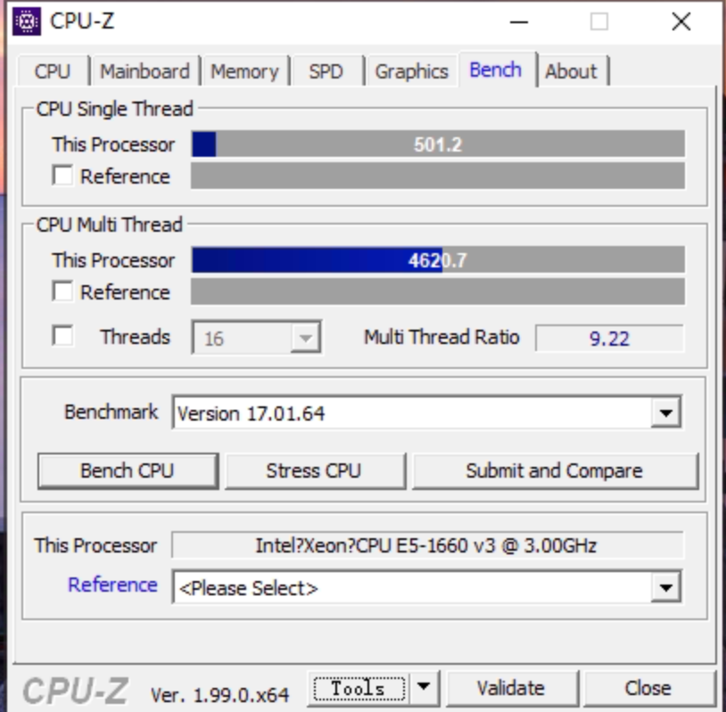
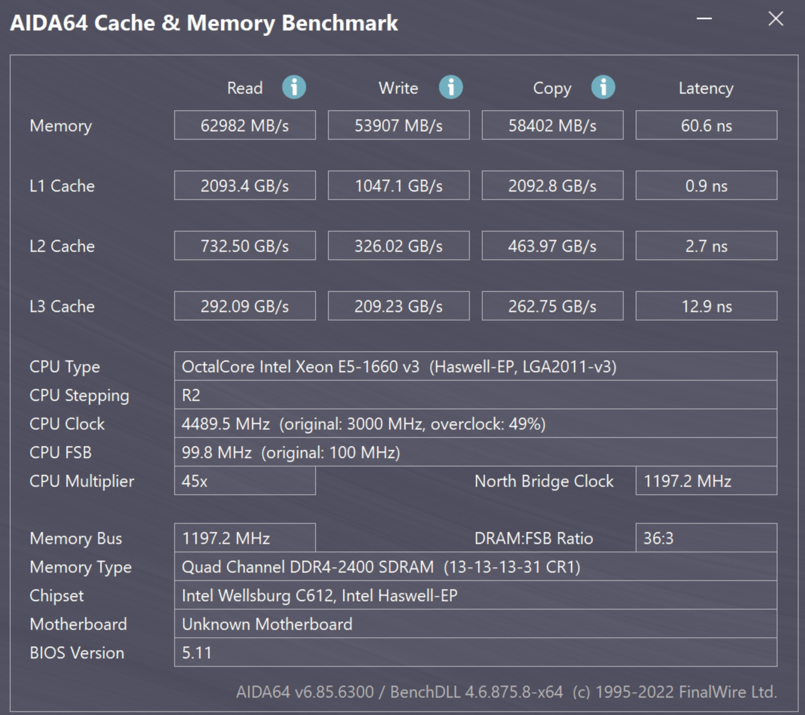

## 主板资料



俄罗斯网站：https://xeon-e5450.ru/socket-2011-3/x99z-v102/

介绍资料：

- [200元极致性价比X99z V102 值不值得买](https://www.bilibili.com/read/cv21732866/)

## 主板用途

用来做 NAS ，配合 e5 1660 v3 CPU

## 主板 bios

### iEngineer bios

https://github.com/BIOS-iEngineer/MACHINIST-X99ZV102

### 奶昔bios

https://www.bilibili.com/video/BV1wu411K7Em/?spm_id_from=333.999.0.0

但我用的超频bios 上e5 1660 v3 时，多核成绩总是上不去，停留在 3.7-3.9g 之间。用 iEngineer 的bios 就可以达到 4.2到 4.3 g。

备注： 他的这个 bios 不支持 intel 奥腾 nvme ssd，会无法识别，这个主板的其他 bios 都没有这个问题，但是奶昔bios我遇到了，用其他 nvme sdd没问题。

## 主板详细设置

### iEngineer bios

使用 俄罗斯 网站上的 iEngineer bios。

https://github.com/BIOS-iEngineer/MACHINIST-X99ZV102

#### 常规设置

Advanced

- PowerManagement Configuration
  - Restore  AC power Loss: 这里设置 power on 无效，重启后自动修改为 power off.
- Hardware Monitor
  - Tbase0： 30度
  - T1 / T2 / T3 / T4 / T5： 依次设置为 40/45/50/55/60
  - pwm1 / pwm2 / pwm3 /pwm4： 依次设置为 50%/60%/70%/80%

IntelRCSetup

- Advanced Power Management configuration
  - cpu c state control
    - cpu c6 report: 设置为 disbale。原因是看到俄罗斯网站上对此的描述： 在安装 EFI 驱动程序之前，您需要转到处理器电源管理菜单中的 BIOS，然后转到 CPU **C 状态控制**参数，并将 **CPU C6 报告**从**启用**位置设置为**禁用**。否则，已安装的 Windows 可能会在操作过程中开始挂起，或者根本无法启动。

Boot:

- setup prompt timeout: 5 ，开机时有5秒钟的等待时间方便进bios

#### cpu 超频设置

配合 e5 1660 v3 cpu进行超频，维持 140 瓦功耗墙不变。

“IntelRCSetup” -> "OverClocking Feature" 设置为 enable

Processor 设置：


- core max oc ration （cpu 最大倍频）： 45
- core voltage mode： adaptive
- core extra turbo voltage：1260  
- core voltage offset： -20
- vccu voltage offset： + 200
- avx2 negative offset： 10

这个设置可以很好的挖掘最大性能，cpuz单核4.5g 得分 500, cpuz 多核 4.1到4.3g, cpuz 多核得分 4600-4700。（备注：全核4.5g单核多核成绩分别是 500 和 5000）。



#### 缓存设置

暂时只超到3.6g，再高嫌麻烦。

CLR/Ring 设置：

- clr max oc ratio: 36
- clr min ratio: 12
- clr voltage mode: adaptive
- clr extra turbo voltage: 0
- clr voltage offset: + 200

#### 内存设置

“IntelRCSetup” -> "Memory Configuration"

- Memory Frequency: 2400 (这个主板最大只能支持到2400,设置再高会自动修改为2133)
- Intel XMP configuration
  - DIMM profile: Manual
  - command timing: 1N
  - CAS Latency: 13
  - tRP: 13
  - tRCD: 13
  - tRAS: 31
  - tRFC: 278
  - tFAW: 20
  - tRC: 44
  - 其他为0 （自动）

设置之后，内存读写速度和延迟会比默认2133 + 3T 高很多，尤其是延迟，会从 76ns 降低到 60.6 ns。



## 附录：c state 对性能和功耗的影响

其他维持不变，只修改 c state 的各个选项设置：

|                                                              | 单核成绩 | 多核成绩 | 待机功耗（瓦） |
| ------------------------------------------------------------ | -------- | -------- | -------------- |
| c state limit： c0/c1<br />c3 report：enable<br /> c6 report：disable | 502      | 4595     | 54.8           |
| c state limit： c0/c1<br />c3 report：disable<br /> c6 report：disable | 469      | 4530     | 58.3           |
| c state limit： c6(non retention )<br />c3 report：enable<br /> c6 report：disable | 502      | 4609     | 54.5           |
| c state limit： c6(retention )<br />c3 report：enable<br /> c6 report：disable | 502      | 4589     | 54.6           |
| c state limit： c6(retention )<br />c3 report：enable<br /> c6 report：enable | 502      | 4584     | 50.5           |

最后总结是： c state 各选节能开到最大，可以得到最大性能和最小待机功耗，有点颠覆认知。

## 附录：主板bios刷新方法

### winpe 下刷新

由于主板有bios锁，因此不能直接在 windows 下刷新bios。

比较方便的方式是用 winpe 启动电脑，之后 cmd 调出命令行，注意要用管理员权限，然后 cd 到 AFUWINx64 所在目录，执行下面命令：

```bash
AFUWINx64 your-rom-name.rom /P /B /N /X /SHUTDOWN
```

完成之后电脑会自动关机，之后启动电脑即可。

### 烧录器刷新

遇到 bios 刷新出错或者 bios 本身有问题，会造成主板无法启动从而没有机会再次刷bios。

此时需要使用到 烧录器。

>  备注：烧录器（编程器）的使用放到单独的章节中去了

