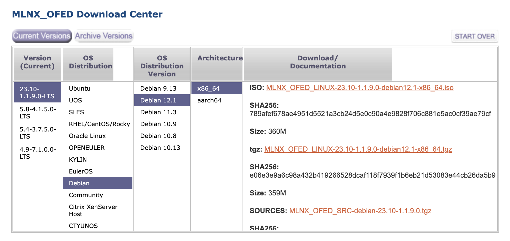

## debian12

### 下载驱动

下载地址：https://network.nvidia.com/products/infiniband-drivers/linux/mlnx_ofed/



下载得到 MLNX_OFED_LINUX-23.10-1.1.9.0-debian12.1-x86_64.tgz 文件， scp 传到 debian 12 下:

```bash
su root
tar xvf MLNX_OFED_LINUX-23.10-1.1.9.0-debian12.1-x86_64.tgz
cd MLNX_OFED_LINUX-23.10-1.1.9.0-debian12.1-x86_64

# 设置 PATH 否则默认 PATH 会找不到某些重要的命令而失败
export PATH=/usr/local/sbin:/usr/local/bin:/usr/sbin:/usr/bin:/sbin:/bin

./mlnxofedinstall --without-fw-update --with-nvmf --with-nfsrdma --ovs-dpdk --distro debian12.1
```

注意要加 `--distro debian12.1`, 否则可能会报错：

```bash
Error: The current MLNX_OFED_LINUX is intended for debian12.1
```

这是因为我安装debian12时版本已经是 12.4了：

```bash
./mlnxofedinstall --print-distro
debian12.4
```

`--with-nvmf --with-nfsrdma --ovs-dpdk` 这三个参数是可选的，我增加这三个参数主要是为了要学习测试这几个功能。


## windows 10/windows server 2022

### 下载驱动

下载地址： https://network.nvidia.com/products/adapter-software/ethernet/windows/winof-2/ 
