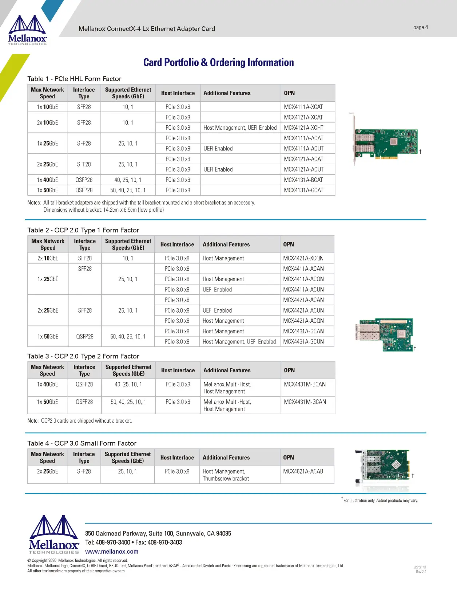

## 背景

Mellanox MCX4121A 网卡全系通过固件和固件配置进行了型号划分，还有其他厂家的oem型号，都可以通过刷新固件的方式来升级。

使用ConnectX-4 lx核心的网卡 作者：



主要是将10g刷新为25g，或者将dell等oem型号刷新为原厂。

## 刷新固件

### 准备mft工具

从官网下载 mft 工具，安装：

https://network.nvidia.com/products/adapter-software/firmware-tools/ 

### 下载固件

原厂固件下载地址：

https://network.nvidia.com/support/firmware/connectx4lxen/ 

型号选择 MCX4121A-ACUT ，具体看上面的型号列表， 2x25g uefi enable 的型号就是 MCX4121A-ACUT。

下载得到文件：fw-ConnectX4Lx-rel-14_32_1010-MCX4121A-ACU_Ax-UEFI-14.25.17-FlexBoot-3.6.502.bin.zip

### windows下刷新固件

MFT 中的 flint工具用于刷新网卡的固件。注意： 有权限要求，在 windows 下打开 cmd 时必须选择以管理员身份运行 cmd ，linux下需要用到 sudo。

用管理员方式打开 cmd，windows 下可以将要刷新的固件文件(如 `fw-ConnectX4Lx-rel-14_32_1010-MCX4121A-ACU_Ax-UEFI-14.25.17-FlexBoot-3.6.502.bin` ) 放在mft的安装目录下，如 `C:\Program Files\Mellanox\WinMFT`。

执行：

```bash
cd C:\Program Files\Mellanox\WinMFT

flint -d mt4103_pci_cr0 -i fw-ConnectX4Lx-rel-14_32_1010-MCX4121A-ACU_Ax-UEFI-14.25.17-FlexBoot-3.6.502.bin -allow_psid_change burn
```

### 实测

- dell cx4121c

  dell cx4121c 刷新 MCX4121A-ACUT  固件成功。

- MCX4121A-XCAT 10G

  刷新25g MCX4121A-ACUT  固件成功。

## 参考资料

- [迈络思MCX4121A网卡10G刷25G流程 - 哔哩哔哩 (bilibili.com)](https://www.bilibili.com/read/cv26561933/)

## 附录

### debian 12 下安装 mft

Debian 12 下安装 mft 会稍微麻烦一些。下载之后，首先要安装一些基础包才能安装：

```properties
su root
export all_proxy=socks5://192.168.0.1:7891
apt-get install gcc make dkms
```

安装过程中会自动安装 linux header。或者参考这个文章安装 linux header：

[How to Install Linux Kernel Headers on Debian 12 (linuxhint.com)](https://linuxhint.com/install-linux-kernel-headers-debian-12/)

安装完成执行 `./install.sh`，会继续报错，日志显示：

```bash
dpkg: warning: 'ldconfig' not found in PATH or not executable
dpkg: warning: 'start-stop-daemon' not found in PATH or not executable
dpkg: error: 2 expected programs not found in PATH or not executable
Note: root's PATH should usually contain /usr/local/sbin, /usr/sbin and /sbin
```

这时一个普遍问题，主要是 PATH 路径不对，不够齐全。参考文章：

[ubuntu - dpkg cannot find ldconfig/start-stop-daemon in the PATH variable - Unix & Linux Stack Exchange](https://unix.stackexchange.com/questions/160019/dpkg-cannot-find-ldconfig-start-stop-daemon-in-the-path-variable)

解决方法就是补全 PATH

```bash
export PATH=/usr/local/sbin:/usr/local/bin:/usr/sbin:/usr/bin:/sbin:/bin
```

然后再执行  `./install.sh` 就可以完成安装。

```bash
$ ./install.sh 

-I- Removing mft external packages installed on the machine
-I- Installing package: /home/sky/temp/mft-4.26.1-3-x86_64-deb/SDEBS/kernel-mft-dkms_4.26.1-3_all.deb
-I- Installing package: /home/sky/temp/mft-4.26.1-3-x86_64-deb/DEBS/mft_4.26.1-3_amd64.deb
-I- In order to start mst, please run "mst start".
```

执行 `mst start`:

```bash
$ mst start
Starting MST (Mellanox Software Tools) driver set
Loading MST PCI module - Success
Loading MST PCI configuration module - Success
Create devices
Unloading MST PCI module (unused) - Success
```

然后看一下情况，目前我插了两块网卡：

```bash
mst status
MST modules:
------------
    MST PCI module is not loaded
    MST PCI configuration module loaded

MST devices:
------------
/dev/mst/mt4117_pciconf0         - PCI configuration cycles access.
                                   domain:bus:dev.fn=0000:05:00.0 addr.reg=88 data.reg=92 cr_bar.gw_offset=-1
                                   Chip revision is: 00
/dev/mst/mt4117_pciconf1         - PCI configuration cycles access.
                                   domain:bus:dev.fn=0000:06:00.0 addr.reg=88 data.reg=92 cr_bar.gw_offset=-1
                                   Chip revision is: 00
```

我要删除他们的 flexboot ，避免影响启动速度：

```bash
flint -d /dev/mst/mt4117_pciconf0 --allow_rom_change drom
flint -d /dev/mst/mt4117_pciconf1 --allow_rom_change drom
```

执行过程很慢：

```bash
-I- Preparing to remove ROM ...
Removing ROM image    - OK  # 这一步要1分钟
Restoring signature  - OK
```

