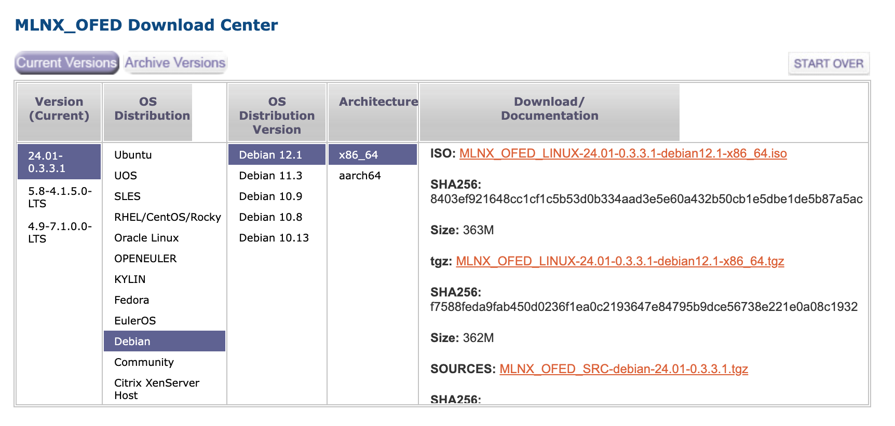

## 查看默认驱动

这是debian12自带的默认驱动情况：

```bash
$lsmod | grep mlx

mlx5_ib               405504  0
ib_uverbs             172032  1 mlx5_ib
ib_core               438272  2 ib_uverbs,mlx5_ib
mlx5_core            1683456  1 mlx5_ib
mlxfw                  36864  1 mlx5_core
psample                20480  1 mlx5_core
pci_hyperv_intf        16384  1 mlx5_core
```

mlx5_core 的详细信息：

```bash
 $ modinfo mlx5_core               
filename:       /lib/modules/6.1.0-20-amd64/kernel/drivers/net/ethernet/mellanox/mlx5/core/mlx5_core.ko
license:        Dual BSD/GPL
description:    Mellanox 5th generation network adapters (ConnectX series) core driver
author:         Eli Cohen <eli@mellanox.com>
alias:          auxiliary:mlx5_core.eth
alias:          pci:v000015B3d0000A2DFsv*sd*bc*sc*i*
alias:          pci:v000015B3d0000A2DCsv*sd*bc*sc*i*
alias:          pci:v000015B3d0000A2D6sv*sd*bc*sc*i*
alias:          pci:v000015B3d0000A2D3sv*sd*bc*sc*i*
alias:          pci:v000015B3d0000A2D2sv*sd*bc*sc*i*
alias:          pci:v000015B3d00001023sv*sd*bc*sc*i*
alias:          pci:v000015B3d00001021sv*sd*bc*sc*i*
alias:          pci:v000015B3d0000101Fsv*sd*bc*sc*i*
alias:          pci:v000015B3d0000101Esv*sd*bc*sc*i*
alias:          pci:v000015B3d0000101Dsv*sd*bc*sc*i*
alias:          pci:v000015B3d0000101Csv*sd*bc*sc*i*
alias:          pci:v000015B3d0000101Bsv*sd*bc*sc*i*
alias:          pci:v000015B3d0000101Asv*sd*bc*sc*i*
alias:          pci:v000015B3d00001019sv*sd*bc*sc*i*
alias:          pci:v000015B3d00001018sv*sd*bc*sc*i*
alias:          pci:v000015B3d00001017sv*sd*bc*sc*i*
alias:          pci:v000015B3d00001016sv*sd*bc*sc*i*
alias:          pci:v000015B3d00001015sv*sd*bc*sc*i*
alias:          pci:v000015B3d00001014sv*sd*bc*sc*i*
alias:          pci:v000015B3d00001013sv*sd*bc*sc*i*
alias:          pci:v000015B3d00001012sv*sd*bc*sc*i*
alias:          pci:v000015B3d00001011sv*sd*bc*sc*i*
alias:          auxiliary:mlx5_core.eth-rep
depends:        psample,pci-hyperv-intf,mlxfw
retpoline:      Y
intree:         Y
name:           mlx5_core
vermagic:       6.1.0-20-amd64 SMP preempt mod_unload modversions 
sig_id:         PKCS#7
signer:         Debian Secure Boot CA
sig_key:        32:A0:28:7F:84:1A:03:6F:A3:93:C1:E0:65:C4:3A:E6:B2:42:26:43
sig_hashalgo:   sha256
signature:      86:53:46:C0:77:7E:22:E0:2A:B3:23:32:E3:87:DA:7C:94:3A:B1:1B:
		5A:92:14:41:17:78:2B:25:A9:9E:B9:9E:0C:F7:1C:2E:30:F3:D3:96:
		44:27:A8:74:A3:7D:2F:83:7D:2B:F4:A7:4E:C5:00:98:0B:56:15:0C:
		DF:53:B8:01:66:B2:C0:9D:C9:DD:2C:E3:A6:BA:91:E0:B0:11:37:DF:
		D7:32:B9:DA:B4:B5:B8:FB:CA:8F:21:46:91:05:28:C1:F1:D9:1B:C5:
		C7:B4:67:58:D9:29:B2:43:84:A0:5F:AD:01:E8:41:71:18:08:18:83:
		0E:F3:E7:88:32:08:46:3B:42:AF:A9:8F:63:E4:45:5D:45:16:E8:48:
		84:67:02:C1:A1:AF:A3:71:35:4C:E5:12:83:4D:05:BD:BE:14:01:F6:
		E5:19:E2:3A:60:9D:0A:D1:C6:B7:E6:CE:FE:8C:7C:0F:B5:01:49:08:
		D9:BB:CE:16:4C:5D:18:CC:61:ED:D3:D4:CA:2E:44:A0:4A:2B:59:DC:
		2B:30:06:27:8E:25:7E:0D:4B:00:7B:4E:2A:7F:65:87:22:B0:1A:BC:
		75:C5:83:47:21:92:D9:84:F5:FC:89:5B:3F:5A:9F:6E:16:FC:38:C4:
		2F:5C:9C:BF:7A:AB:F3:91:32:C6:CA:05:50:5C:27:10
parm:           debug_mask:debug mask: 1 = dump cmd data, 2 = dump cmd exec time, 3 = both. Default=0 (uint)
parm:           prof_sel:profile selector. Valid range 0 - 2 (uint)
```

默认驱动的版本为 ``

```bash
modinfo mlx5_core |  grep version
vermagic:       6.1.0-20-amd64 SMP preempt mod_unload modversions 
```


## 下载驱动

下载地址：

https://network.nvidia.com/products/infiniband-drivers/linux/mlnx_ofed/



下载得到 **MLNX_OFED_LINUX-24.01-0.3.3.1-debian12.1-x86_64.tgz** 文件， scp 传到 debian 12 下。

## 安装驱动

```bash
su root
tar MLNX_OFED_LINUX-24.01-0.3.3.1-debian12.1-x86_64.tgz
cd MLNX_OFED_LINUX-24.01-0.3.3.1-debian12.1-x86_64
```

设置 PATH 否则默认 PATH 会找不到某些重要的命令而失败:

```bash
export PATH=/usr/local/sbin:/usr/local/bin:/usr/sbin:/usr/bin:/sbin:/bin
```

配置代理，加快下载速度:

```bash
export all_proxy=socks5://192.168.0.1:7891;export http_proxy=http://192.168.0.1:7890;export https_proxy=http://192.168.0.1:7890;export no_proxy=127.0.0.1,localhost,local,.local,.lan,192.168.0.0/16,10.0.0.0/16
```

开始安装:

```bash
./mlnxofedinstall --without-fw-update --with-nvmf --with-nfsrdma --ovs-dpdk --distro debian12.1
```

注意要加 `--distro debian12.1`, 否则可能会报错：

```bash
Error: The current MLNX_OFED_LINUX is intended for debian12.1
```

这是因为我安装debian12时版本已经是 12.5了：

```bash
./mlnxofedinstall --print-distro
debian12.5
```

`--with-nvmf --with-nfsrdma --ovs-dpdk` 这三个参数是可选的，我增加这三个参数主要是为了要学习测试这几个功能。

安装过程如下：

```bash
$./mlnxofedinstall --without-fw-update --with-nvmf --with-nfsrdma --ovs-dpdk --distro debian12.1

Logs dir: /tmp/MLNX_OFED_LINUX.1071.logs
General log file: /tmp/MLNX_OFED_LINUX.1071.logs/general.log

Below is the list of MLNX_OFED_LINUX packages that you have chosen
(some may have been added by the installer due to package dependencies):

ofed-scripts
mlnx-tools
mlnx-ofed-kernel-utils
mlnx-ofed-kernel-dkms
iser-dkms
isert-dkms
srp-dkms
mlnx-nvme-dkms
rdma-core
libibverbs1
ibverbs-utils
ibverbs-providers
libibverbs-dev
libibverbs1-dbg
libibumad3
libibumad-dev
ibacm
librdmacm1
rdmacm-utils
librdmacm-dev
mstflint
ibdump
libibmad5
libibmad-dev
libopensm
opensm
opensm-doc
libopensm-devel
libibnetdisc5
infiniband-diags
mft
kernel-mft-dkms
perftest
ibutils2
ibsim
ibsim-doc
ucx
sharp
hcoll
knem-dkms
knem
openmpi
mpitests
srptools
mlnx-ethtool
mlnx-iproute2
rshim
ibarr
libopenvswitch
openvswitch-common
openvswitch-switch

This program will install the MLNX_OFED_LINUX package on your machine.
Note that all other Mellanox, OEM, OFED, RDMA or Distribution IB packages will be removed.
Those packages are removed due to conflicts with MLNX_OFED_LINUX, do not reinstall them.

Do you want to continue?[y/N]:y

Checking SW Requirements...
One or more required packages for installing MLNX_OFED_LINUX are missing.
Attempting to install the following missing packages:
libipsec-mb1 uuid-runtime libunwind8 libunbound8 libpcap0.8
Removing old packages...
Uninstalling the previous version of MLNX_OFED_LINUX
Installing new packages
Installing ofed-scripts-24.01.OFED.24.01.0.3.3...
Installing mlnx-tools-24.01.0...
Installing mlnx-ofed-kernel-utils-24.01.OFED.24.01.0.3.3.1...
Installing mlnx-ofed-kernel-dkms-24.01.OFED.24.01.0.3.3.1...
Installing iser-dkms-24.01.OFED.24.01.0.3.3.1...
Installing isert-dkms-24.01.OFED.24.01.0.3.3.1...
Installing srp-dkms-24.01.OFED.24.01.0.3.3.1...
Installing mlnx-nvme-dkms-24.01.OFED.24.01.0.3.3.1...
Installing rdma-core-2307mlnx47...
Installing libibverbs1-2307mlnx47...
Installing ibverbs-utils-2307mlnx47...
Installing ibverbs-providers-2307mlnx47...
Installing libibverbs-dev-2307mlnx47...
Installing libibverbs1-dbg-2307mlnx47...
Installing libibumad3-2307mlnx47...
Installing libibumad-dev-2307mlnx47...
Installing ibacm-2307mlnx47...
Installing librdmacm1-2307mlnx47...
Installing rdmacm-utils-2307mlnx47...
Installing librdmacm-dev-2307mlnx47...
Installing mstflint-4.16.1...
Installing ibdump-6.0.0...
Installing libibmad5-2307mlnx47...
Installing libibmad-dev-2307mlnx47...
Installing libopensm-5.18.0.MLNX20240128.3f266a48...
Installing opensm-5.18.0.MLNX20240128.3f266a48...
Installing opensm-doc-5.18.0.MLNX20240128.3f266a48...
Installing libopensm-devel-5.18.0.MLNX20240128.3f266a48...
Installing libibnetdisc5-2307mlnx47...
Installing infiniband-diags-2307mlnx47...
Installing mft-4.27.0...
Installing kernel-mft-dkms-4.27.0.83...
Installing perftest-24.01.0...
Installing ibutils2-2.1.1...
Installing ibsim-0.12...
Installing ibsim-doc-0.12...
Installing ucx-1.16.0...
Installing sharp-3.6.0.MLNX20240128.e669b4e8...
Installing hcoll-4.8.3227...
Installing knem-dkms-1.1.4.90mlnx3...
Installing knem-1.1.4.90mlnx3...
Installing openmpi-4.1.7a1...
Installing mpitests-3.2.22...
Installing srptools-2307mlnx47...
Installing mlnx-ethtool-6.4...
Installing mlnx-iproute2-6.4.0...
Installing rshim-2.0.19...
Installing ibarr-0.1.3...
Installing libopenvswitch-2.17.8...
Installing openvswitch-common-2.17.8...
Installing openvswitch-switch-2.17.8...
Selecting previously unselected package mlnx-fw-updater.
(Reading database ... 101192 files and directories currently installed.)
Preparing to unpack .../mlnx-fw-updater_24.01-0.3.3.1_amd64.deb ...
Unpacking mlnx-fw-updater (24.01-0.3.3.1) ...
Setting up mlnx-fw-updater (24.01-0.3.3.1) ...

Added 'RUN_FW_UPDATER_ONBOOT=no to /etc/infiniband/openib.conf

Skipping FW update.
Device (01:00.0):
	01:00.0 Ethernet controller: Mellanox Technologies MT27800 Family [ConnectX-5]
	Link Width: x16
	PCI Link Speed: 8GT/s

Installation passed successfully
To load the new driver, run:
/etc/init.d/openibd restart
Note: In order to load the new nvme-rdma and nvmet-rdma modules, the nvme module must be reloaded.
```

## 特殊处理

### 取消 openibd 的自动启动

安装完成后，重启之前，取消 openibd 的开机自动启动：

```bash
systemctl disable openibd
```

输出为：

```bash
Synchronizing state of openibd.service with SysV service script with /lib/systemd/systemd-sysv-install.
Executing: /lib/systemd/systemd-sysv-install disable openibd
Removed "/etc/systemd/system/sysinit.target.wants/openibd.service".
```

反正目前也只用到 eth 模式，不用 ib 模式。

参考：

- [Known Issues - NVIDIA Docs](https://docs.nvidia.com/networking/display/mlnxofedv23101190lts/known+issues)： 页面搜索 3678715 或者 openIbd

## 查看安装后的驱动信息

```bash
$ lsmod | grep mlx
mlx5_ib               405504  0
ib_uverbs             172032  1 mlx5_ib
ib_core               438272  2 ib_uverbs,mlx5_ib
mlx5_core            1683456  1 mlx5_ib
mlxfw                  36864  1 mlx5_core
psample                20480  1 mlx5_core
pci_hyperv_intf        16384  1 mlx5_core
```

mlx5_core 的详细信息：

```bash
$ modinfo mlx5_core                
filename:       /lib/modules/6.1.0-20-amd64/updates/dkms/mlx5_core.ko
alias:          auxiliary:mlx5_core.eth-rep
alias:          auxiliary:mlx5_core.eth
basedon:        Korg 6.3-rc3
version:        24.01-0.3.3
license:        Dual BSD/GPL
description:    Mellanox 5th generation network adapters (ConnectX series) core driver
author:         Eli Cohen <eli@mellanox.com>
srcversion:     59290B9C495B89FC195B001
alias:          pci:v000015B3d0000A2DFsv*sd*bc*sc*i*
alias:          pci:v000015B3d0000A2DCsv*sd*bc*sc*i*
alias:          pci:v000015B3d0000A2D6sv*sd*bc*sc*i*
alias:          pci:v000015B3d0000A2D3sv*sd*bc*sc*i*
alias:          pci:v000015B3d0000A2D2sv*sd*bc*sc*i*
alias:          pci:v000015B3d00001023sv*sd*bc*sc*i*
alias:          pci:v000015B3d00001021sv*sd*bc*sc*i*
alias:          pci:v000015B3d0000101Fsv*sd*bc*sc*i*
alias:          pci:v000015B3d0000101Esv*sd*bc*sc*i*
alias:          pci:v000015B3d0000101Dsv*sd*bc*sc*i*
alias:          pci:v000015B3d0000101Csv*sd*bc*sc*i*
alias:          pci:v000015B3d0000101Bsv*sd*bc*sc*i*
alias:          pci:v000015B3d0000101Asv*sd*bc*sc*i*
alias:          pci:v000015B3d00001019sv*sd*bc*sc*i*
alias:          pci:v000015B3d00001018sv*sd*bc*sc*i*
alias:          pci:v000015B3d00001017sv*sd*bc*sc*i*
alias:          pci:v000015B3d00001016sv*sd*bc*sc*i*
alias:          pci:v000015B3d00001015sv*sd*bc*sc*i*
alias:          pci:v000015B3d00001014sv*sd*bc*sc*i*
alias:          pci:v000015B3d00001013sv*sd*bc*sc*i*
alias:          auxiliary:mlx5_core.sf
depends:        mlx_compat,mlxdevm,psample,tls,pci-hyperv-intf,mlxfw
retpoline:      Y
name:           mlx5_core
vermagic:       6.1.0-20-amd64 SMP preempt mod_unload modversions 
sig_id:         PKCS#7
signer:         DKMS module signing key
sig_key:        3F:5E:C0:5F:E6:49:8A:F5:4A:C7:DA:1B:55:3C:50:18:9F:E0:70:C9
sig_hashalgo:   sha256
signature:      91:E0:1B:FE:CA:B0:27:B1:76:4B:19:C3:FB:1F:1A:42:2E:1F:EC:79:
		43:70:B4:D7:E5:BA:36:FA:91:0A:50:D3:F1:B6:D7:11:15:86:E8:CC:
		CA:3B:D7:05:92:77:DE:7F:24:0E:0A:5B:45:9F:74:08:97:C1:A2:3D:
		C3:27:87:8B:2C:05:3B:61:63:6A:92:1C:69:52:76:F4:5F:B1:96:F7:
		F7:01:33:BA:40:58:EC:7F:46:9D:28:11:11:CC:BE:1D:91:E2:19:FB:
		B9:50:7D:91:23:23:93:9D:B9:12:6D:76:11:1D:34:D9:B9:2B:65:C0:
		B6:B6:5D:9C:01:7A:0E:26:0A:D1:8B:28:79:4E:2E:AB:73:FA:48:01:
		4D:4A:76:5E:D6:61:9A:2C:8E:45:60:96:EB:6E:94:EE:75:2F:B8:B3:
		E9:02:B5:C2:D3:3E:CD:0D:0A:AE:64:B9:68:9D:BE:10:06:B2:55:57:
		D7:E7:0D:28:5A:9A:DE:19:4F:00:94:7E:45:06:E8:2F:46:3C:5C:F6:
		FF:75:ED:E9:87:98:B0:D1:17:50:59:38:1E:D2:C8:FE:B9:6F:60:5E:
		03:2A:36:38:27:EB:0E:D4:2B:4E:BB:E6:F5:83:50:EC:AE:FE:A6:D1:
		CA:25:40:62:78:15:20:34:ED:15:3D:95:4A:AC:95:15
parm:           num_of_groups:Eswitch offloads number of big groups in FDB table. Valid range 1 - 1024. Default 15 (uint)
parm:           debug_mask:debug mask: 1 = dump cmd data, 2 = dump cmd exec time, 3 = both. Default=0 (uint)
parm:           prof_sel:profile selector. Valid range 0 - 3 (uint)
parm:           probe_vf:probe VFs or not, 0 = not probe, 1 = probe. Default = 1 (bool)
```

更新

```bash
$ modinfo mlx5_core |  grep version

version:        24.01-0.3.3
srcversion:     59290B9C495B89FC195B001
vermagic:       6.1.0-20-amd64 SMP preempt mod_unload modversions
```


