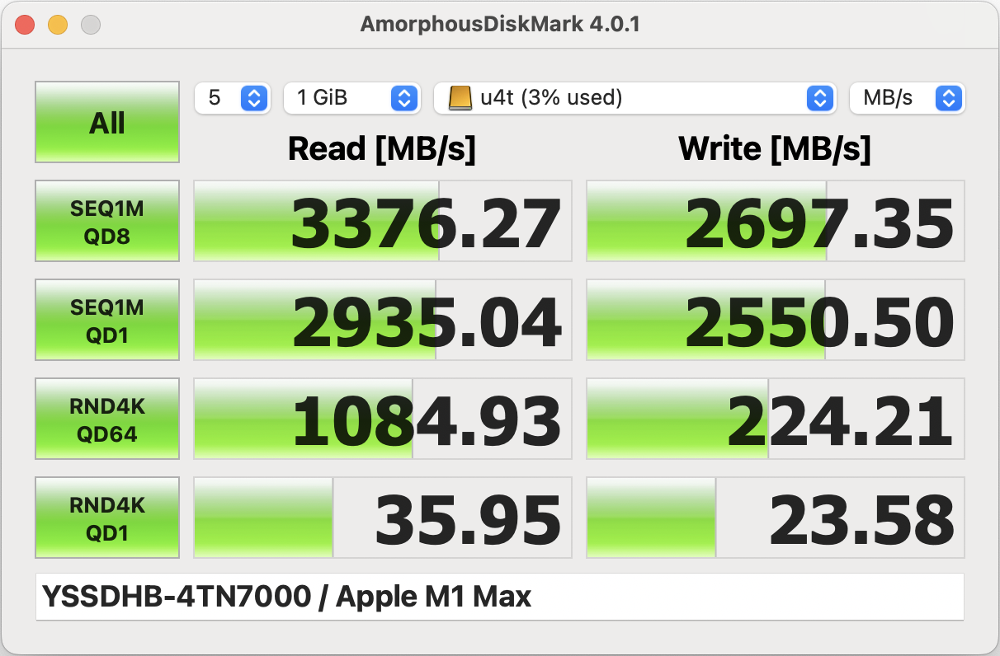
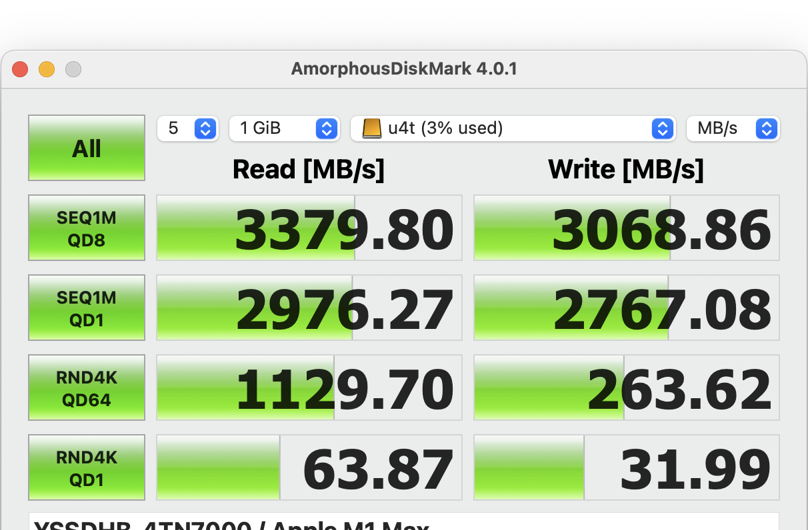
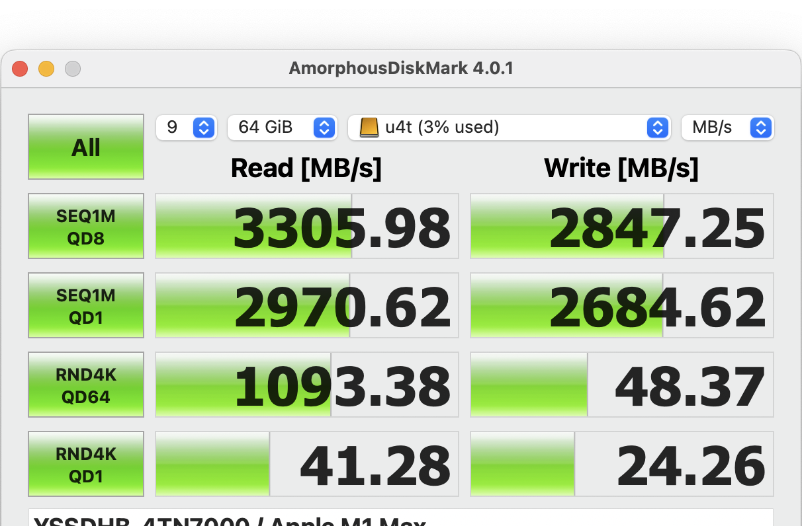
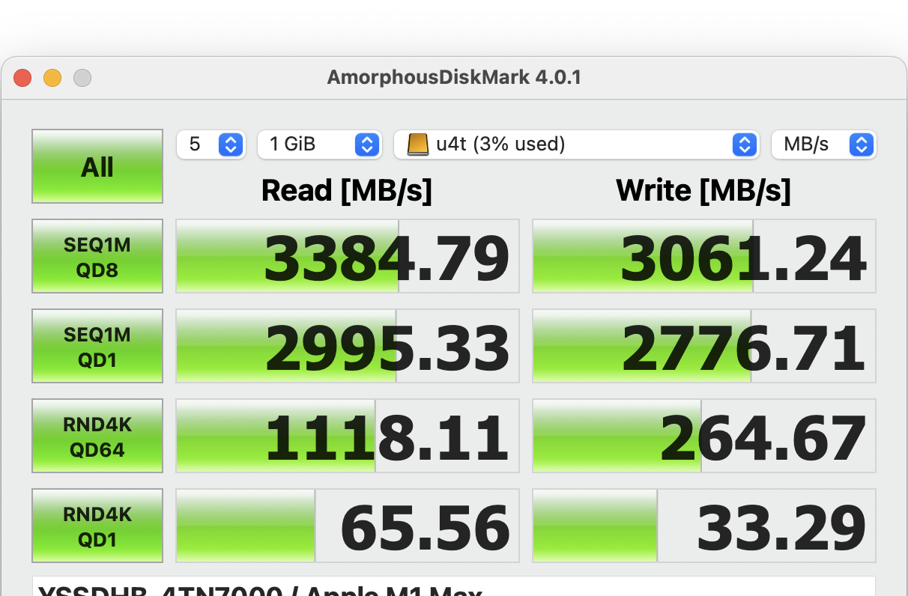
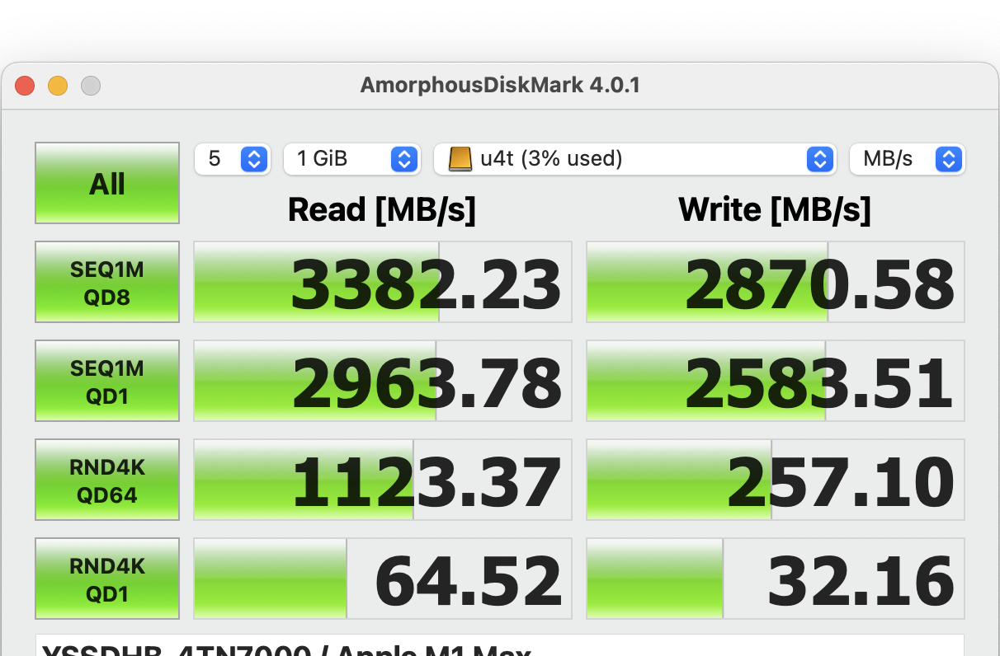
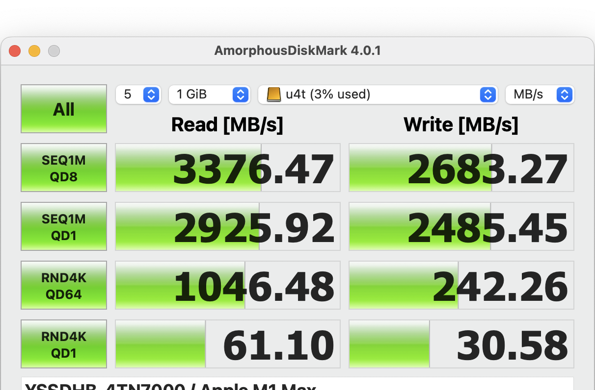

## 背景

- 硬盘盒：ITGZ USB4 40g M.2 nvme 移动硬盘盒
- 硬盘：移速4TN7000 pcie4.0 4T ssd
- 笔记本：macbook pro m1 max
- 数据线1：hagibis 海备思双typec全功能usb4数据线，13厘米长度
- 数据线2: HP惠普雷电4数据线0.7米

## 测试

### AmorphousDiskMark 测试

5次每次1GB设置下的速度测试情况（数据线1，笔记本左边接口）：

5次每次1GB设置下的速度测试情况（数据线2，笔记本左边接口）：

9次每次64GB设置下的速度测试情况（数据线1，笔记本左边接口）：

9次每次64GB设置下的速度测试情况（数据线2，笔记本左边接口）：

看来是雷电数据线的影响？

又重新测试了一下，还是用海备思的短线，接刚才的雷电口，很奇怪速度又正常了，基本和hp的线成绩完全一致（数据线1，笔记本右边接口）：

想起来第一次测试短线时用的是笔记本左边的雷电口，这次是换成了m1 max 笔记本的右边的雷电口。一次再次测试，插在左边的雷电口上。结果速度又回到了第一次（比较慢的那一次）的结果（数据线1，笔记本坐边接口）：

重复测试了左边的另外一个雷电口（数据线1，笔记本左边的另一个接口）：

