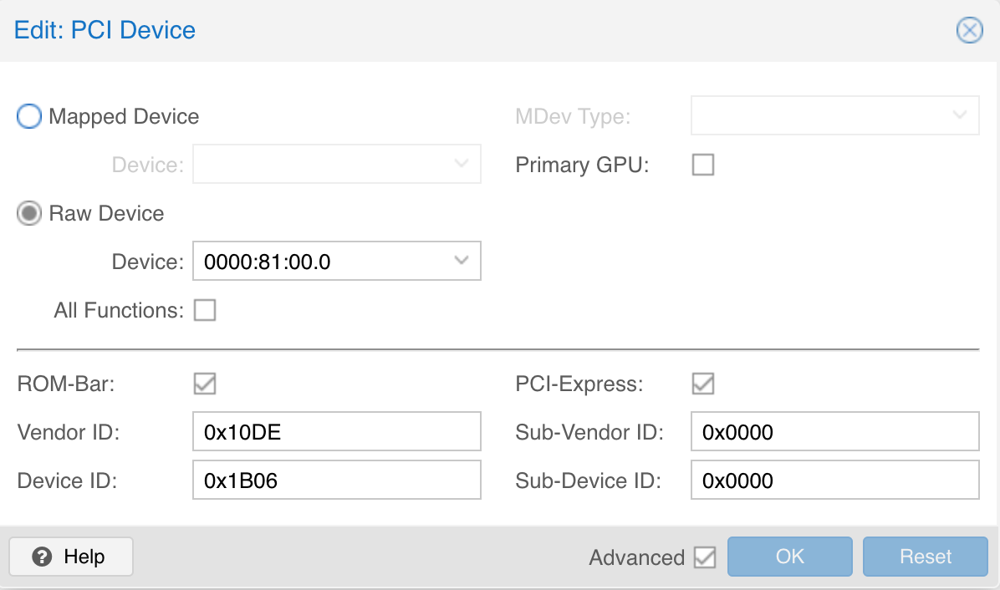
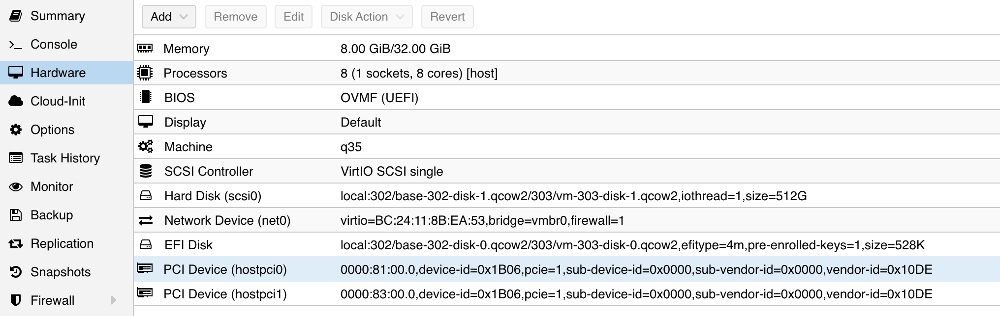

## 准备工作

在 pve8 下查看 p102 显卡的信息：

```bash
lspci |  grep 3D
81:00.0 3D controller: NVIDIA Corporation GP102 [P102-100] (rev a1)
```

要直通这块卡给 debian12 虚拟机，需要准备：

- 开启 pcie 直通
- 安装 debian 12 虚拟机

### 修改 device ID

直通显卡时，需要修改显卡的设备ID，仿冒 1080 TI 显卡。

- Vendor ID:  0x10DE
- Device ID: 0x1B06
- Sub-Vendor ID:  0x0000
- Sub-Device ID: 0x0000



### 直通给 debian12

之后将卡直通给 debian12 虚拟机：



启动 debian12 之后，查看显卡信息：

```bash
$ lspci | grep 3D
01:00.0 3D controller: NVIDIA Corporation GP102 [GeForce GTX 1080 Ti] (rev a1)

$ lspci -nn | egrep -i "3d|display|vga"
00:01.0 VGA compatible controller [0300]: Device [1234:1111] (rev 02)
01:00.0 3D controller [0302]: NVIDIA Corporation GP102 [GeForce GTX 1080 Ti] [10de:1b06] (rev a1)
```

### 关闭 security boot

进入 bios，关闭 security boot，否则无法安装驱动或者安装完成后无法加载驱动。

## 安装 nvidia 驱动

### 更新系统

安装驱动前先更新一下

```bash
sudo apt update
sudo apt upgrade
sudo reboot
```

重启之后，如果有内核更新，可以先删除不用的旧内核。

### 添加 non-free 仓库

```bash
sudo vi /etc/apt/sources.list
```

在最后加入一行：

```bash
deb http://deb.debian.org/debian/ bullseye main contrib non-free

deb http://deb.debian.org/debian bookworm main contrib non-free non-free-firmware
deb-src http://deb.debian.org/debian bookworm main contrib non-free non-free-firmware

# 这两行可能会重复，如果重复就不要加了
#deb http://security.debian.org/debian-security bookworm-security main contrib non-free non-free-firmware
#deb-src http://security.debian.org/debian-security bookworm-security main contrib non-free non-free-firmware

deb http://deb.debian.org/debian bookworm-updates main contrib non-free non-free-firmware
deb-src http://deb.debian.org/debian bookworm-updates main contrib non-free non-free-firmware
```

执行更新：

```bash
sudo apt update
```

### 安装 linux-headers

```bash
sudo apt install linux-headers-$(uname -r)
```

### 安装 nvidia-detect

```bash
sudo apt -y install nvidia-detect
```

注意如果安装的版本是 470.256.02-2，说明前面的 non-free 仓库的设置有问题，470 驱动太老了，无法支持 linux 6.1 内核。正常正常应该可以找到 535 版本 ：

```bash
sudo apt -y install nvidia-detect
Reading package lists... Done
Building dependency tree... Done
Reading state information... Done
nvidia-detect is already the newest version (535.216.01-1~deb12u1).
0 upgraded, 0 newly installed, 0 to remove and 0 not upgraded.
```

安装完成之后执行：

```bash
sudo nvidia-detect 
```

能看到输出如下：

```bash
Detected NVIDIA GPUs:
01:00.0 3D controller [0302]: NVIDIA Corporation GP102 [GeForce GTX 1080 Ti] [10de:1b06] (rev a1)

Checking card:  NVIDIA Corporation GP102 [GeForce GTX 1080 Ti] (rev a1)
Your card is supported by all driver versions.
Your card is also supported by the Tesla 470 drivers series.
It is recommended to install the
    nvidia-driver
package.
```

### 安装 nvidia-driver

```bash
sudo apt install nvidia-driver
```

输出为：

```bash
Reading package lists... Done
Building dependency tree... Done
Reading state information... Done
The following additional packages will be installed:
  firmware-nvidia-gsp glx-alternative-mesa glx-alternative-nvidia glx-diversions libcuda1 libegl-nvidia0 libgl1-nvidia-glvnd-glx
  libgles-nvidia1 libgles-nvidia2 libgles1 libglx-nvidia0 libnvcuvid1 libnvidia-allocator1 libnvidia-cfg1 libnvidia-egl-gbm1
  libnvidia-egl-wayland1 libnvidia-eglcore libnvidia-encode1 libnvidia-glcore libnvidia-glvkspirv libnvidia-ml1
  libnvidia-pkcs11-openssl3 libnvidia-ptxjitcompiler1 libnvidia-rtcore libopengl0 libunwind8 libvdpau1 libvulkan1 libxcvt0 libxfont2
  nvidia-alternative nvidia-driver-bin nvidia-driver-libs nvidia-egl-common nvidia-egl-icd nvidia-installer-cleanup nvidia-kernel-common
  nvidia-kernel-dkms nvidia-kernel-support nvidia-legacy-check nvidia-modprobe nvidia-persistenced nvidia-settings nvidia-smi
  nvidia-support nvidia-suspend-common nvidia-vdpau-driver nvidia-vulkan-common nvidia-vulkan-icd update-glx xcvt xfonts-base
  xfonts-encodings xfonts-utils xserver-common xserver-xorg-core xserver-xorg-video-nvidia
Suggested packages:
  nvidia-cuda-mps vulkan-tools xfs | xserver xfonts-100dpi | xfonts-75dpi xfonts-scalable
Recommended packages:
  libcuda1:i386 nvidia-driver-libs:i386
The following NEW packages will be installed:
  firmware-nvidia-gsp glx-alternative-mesa glx-alternative-nvidia glx-diversions libcuda1 libegl-nvidia0 libgl1-nvidia-glvnd-glx
  libgles-nvidia1 libgles-nvidia2 libgles1 libglx-nvidia0 libnvcuvid1 libnvidia-allocator1 libnvidia-cfg1 libnvidia-egl-gbm1
  libnvidia-egl-wayland1 libnvidia-eglcore libnvidia-encode1 libnvidia-glcore libnvidia-glvkspirv libnvidia-ml1
  libnvidia-pkcs11-openssl3 libnvidia-ptxjitcompiler1 libnvidia-rtcore libopengl0 libunwind8 libvdpau1 libvulkan1 libxcvt0 libxfont2
  nvidia-alternative nvidia-driver nvidia-driver-bin nvidia-driver-libs nvidia-egl-common nvidia-egl-icd nvidia-installer-cleanup
  nvidia-kernel-common nvidia-kernel-dkms nvidia-kernel-support nvidia-legacy-check nvidia-modprobe nvidia-persistenced nvidia-settings
  nvidia-smi nvidia-support nvidia-suspend-common nvidia-vdpau-driver nvidia-vulkan-common nvidia-vulkan-icd update-glx xcvt xfonts-base
  xfonts-encodings xfonts-utils xserver-common xserver-xorg-core xserver-xorg-video-nvidia
0 upgraded, 58 newly installed, 0 to remove and 0 not upgraded.
Need to get 167 MB of archives.
After this operation, 504 MB of additional disk space will be used.
Do you want to continue? [Y/n] Y
Get:1 http://mirrors.ustc.edu.cn/debian bookworm/main amd64 libnvidia-egl-wayland1 amd64 1:1.1.10-1 [25.5 kB]
Get:2 http://deb.debian.org/debian bookworm/contrib amd64 update-glx amd64 1.2.2 [5,432 B]
Get:3 http://deb.debian.org/debian bookworm/contrib amd64 glx-alternative-mesa amd64 1.2.2 [4,760 B]
Get:4 http://deb.debian.org/debian bookworm/contrib amd64 nvidia-installer-cleanup amd64 20220217+3~deb12u1 [13.3 kB]
Get:5 http://security.debian.org/debian-security bookworm-security/main amd64 xserver-common all 2:21.1.7-3+deb12u9 [2,383 kB]
Get:6 http://deb.debian.org/debian bookworm/contrib amd64 glx-diversions amd64 1.2.2 [7,408 B]
Get:7 http://deb.debian.org/debian bookworm/contrib amd64 glx-alternative-nvidia amd64 1.2.2 [5,776 B]
Get:8 http://deb.debian.org/debian bookworm/non-free amd64 nvidia-legacy-check amd64 535.216.01-1~deb12u1 [158 kB]
Get:9 http://deb.debian.org/debian bookworm/contrib amd64 nvidia-support amd64 20220217+3~deb12u1 [14.2 kB]
Get:10 http://deb.debian.org/debian bookworm/non-free amd64 nvidia-alternative amd64 535.216.01-1~deb12u1 [154 kB]
Get:11 http://deb.debian.org/debian bookworm/non-free amd64 libnvidia-ptxjitcompiler1 amd64 535.216.01-1~deb12u1 [6,979 kB]
Get:12 http://mirrors.ustc.edu.cn/debian bookworm/main amd64 libunwind8 amd64 1.6.2-3 [51.2 kB]
Get:13 http://deb.debian.org/debian bookworm/non-free amd64 libnvidia-pkcs11-openssl3 amd64 535.216.01-1~deb12u1 [156 kB]
Get:14 http://deb.debian.org/debian bookworm/non-free amd64 libcuda1 amd64 535.216.01-1~deb12u1 [3,001 kB]
Get:15 http://mirrors.ustc.edu.cn/debian bookworm/main amd64 libxcvt0 amd64 0.1.2-1 [5,400 B]
Get:16 http://mirrors.ustc.edu.cn/debian bookworm/main amd64 libxfont2 amd64 1:2.0.6-1 [136 kB]
Get:17 http://deb.debian.org/debian bookworm/non-free amd64 libnvidia-glvkspirv amd64 535.216.01-1~deb12u1 [10.7 MB]
Get:18 http://security.debian.org/debian-security bookworm-security/main amd64 xserver-xorg-core amd64 2:21.1.7-3+deb12u9 [3,720 kB]
Get:19 http://deb.debian.org/debian bookworm/non-free amd64 libnvidia-eglcore amd64 535.216.01-1~deb12u1 [10.6 MB]
Get:20 http://deb.debian.org/debian bookworm/non-free amd64 libnvidia-glcore amd64 535.216.01-1~deb12u1 [10.8 MB]
Get:21 http://deb.debian.org/debian bookworm/non-free amd64 libglx-nvidia0 amd64 535.216.01-1~deb12u1 [388 kB]
Get:22 http://deb.debian.org/debian bookworm/non-free amd64 libgl1-nvidia-glvnd-glx amd64 535.216.01-1~deb12u1 [333 kB]
Get:23 http://deb.debian.org/debian bookworm/non-free amd64 nvidia-egl-common amd64 535.216.01-1~deb12u1 [152 kB]
Get:24 http://deb.debian.org/debian bookworm/non-free amd64 libegl-nvidia0 amd64 535.216.01-1~deb12u1 [422 kB]
Get:25 http://mirrors.ustc.edu.cn/debian bookworm/main amd64 libvdpau1 amd64 1.5-2 [26.1 kB]
Get:26 http://deb.debian.org/debian bookworm/non-free amd64 nvidia-egl-icd amd64 535.216.01-1~deb12u1 [152 kB]
Get:27 http://deb.debian.org/debian bookworm/non-free amd64 nvidia-driver-libs amd64 535.216.01-1~deb12u1 [152 kB]
Get:28 http://deb.debian.org/debian bookworm/non-free amd64 libnvidia-ml1 amd64 535.216.01-1~deb12u1 [686 kB]
Get:29 http://deb.debian.org/debian bookworm/non-free amd64 nvidia-driver-bin amd64 535.216.01-1~deb12u1 [219 kB]
Get:30 http://deb.debian.org/debian bookworm/non-free amd64 xserver-xorg-video-nvidia amd64 535.216.01-1~deb12u1 [2,316 kB]
Get:31 http://deb.debian.org/debian bookworm/non-free amd64 nvidia-vdpau-driver amd64 535.216.01-1~deb12u1 [642 kB]
Get:32 http://mirrors.ustc.edu.cn/debian bookworm/non-free-firmware amd64 firmware-nvidia-gsp amd64 535.216.01-1~deb12u1 [38.5 MB]
Get:33 http://deb.debian.org/debian bookworm/contrib amd64 nvidia-kernel-common amd64 20220217+3~deb12u1 [4,488 B]
......
Setting up nvidia-driver-bin (535.216.01-1~deb12u1) ...
Setting up nvidia-persistenced (535.171.04-1~deb12u1) ...
Created symlink /etc/systemd/system/multi-user.target.wants/nvidia-persistenced.service → /lib/systemd/system/nvidia-persistenced.service.
Could not execute systemctl:  at /usr/bin/deb-systemd-invoke line 145.
Setting up libcuda1:amd64 (535.216.01-1~deb12u1) ...
Setting up nvidia-egl-icd:amd64 (535.216.01-1~deb12u1) ...
Setting up nvidia-driver-libs:amd64 (535.216.01-1~deb12u1) ...
Setting up libnvcuvid1:amd64 (535.216.01-1~deb12u1) ...
Setting up libnvidia-encode1:amd64 (535.216.01-1~deb12u1) ...
Processing triggers for nvidia-alternative (535.216.01-1~deb12u1) ...
update-alternatives: updating alternative /usr/lib/nvidia/current because link group nvidia has changed slave links
Setting up nvidia-kernel-dkms (535.216.01-1~deb12u1) ...
Loading new nvidia-current-535.216.01 DKMS files...
Building for 6.1.0-31-amd64
Module build for kernel 6.1.0-31-amd64 was skipped since the
kernel headers for this kernel do not seem to be installed.
Setting up nvidia-driver (535.216.01-1~deb12u1) ...
Processing triggers for libc-bin (2.36-9+deb12u9) ...
Processing triggers for initramfs-tools (0.142+deb12u1) ...
update-initramfs: Generating /boot/initrd.img-6.1.0-31-amd64
Processing triggers for update-glx (1.2.2) ...
Processing triggers for glx-alternative-nvidia (1.2.2) ...
update-alternatives: using /usr/lib/nvidia to provide /usr/lib/glx (glx) in auto mode
Processing triggers for glx-alternative-mesa (1.2.2) ...
Processing triggers for libc-bin (2.36-9+deb12u9) ...
Processing triggers for initramfs-tools (0.142+deb12u1) ...
update-initramfs: Generating /boot/initrd.img-6.1.0-31-amd64
```

顺利安装驱动，之后重启机器。

## 参考资料

- [适用于 Debian 12 的 NVIDIA 驱动程序](https://www.reddit.com/r/linux4noobs/comments/18n34c3/nvidia_drivers_for_debian_12_step_by_step/)
- [How to install Nvidia driver on Debian 12 Bookworm Linux](https://linuxconfig.org/how-to-install-nvidia-driver-on-debian-12-bookworm-linux)
