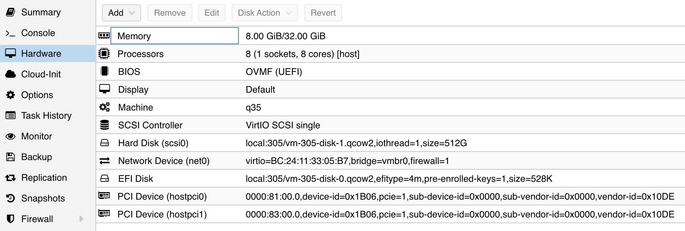

## 准备工作

在 pve8 下查看两块 p102 显卡的信息：

```bash
lspci |  grep 3D
81:00.0 3D controller: NVIDIA Corporation GP102 [P102-100] (rev a1)
83:00.0 3D controller: NVIDIA Corporation GP102 [P102-100] (rev a1)
```

要直通这两块卡给 ubuntu 22.04 虚拟机，需要准备：

- 开启 pcie 直通
- 安装 ubuntu 22.04 虚拟机

## 修改 device ID

直通显卡时，需要修改显卡的设备ID，仿冒 1080 TI 显卡。

- Vendor ID:  0x10DE
- Device ID: 0x1B06
- Sub-Vendor ID:  0x0000
- Sub-Device ID: 0x0000


## 直通给 ubuntu 22.04

之后将两块卡都直通给 ubuntu 22.04 虚拟机：



启动 ubuntu 22.04 之后，查看显卡信息：

```bash
lspci | grep 3D  
01:00.0 3D controller: NVIDIA Corporation GP102 [GeForce GTX 1080 Ti] (rev a1)
02:00.0 3D controller: NVIDIA Corporation GP102 [GeForce GTX 1080 Ti] (rev a1)
```

## 安装 nvidia 驱动

参考：[How to install the NVIDIA drivers on Ubuntu 22.04 ](https://linuxconfig.org/how-to-install-the-nvidia-drivers-on-ubuntu-22-04)

### 更新系统

安装驱动前先更新一下

```bash
sudo apt update
sudo apt upgrade
sudo reboot
```

重启之后，如果有内核更新，可以先删除不用的旧内核。

### 检测显卡和推荐驱动

执行下面的命令

```bash
sudo ubuntu-drivers devices
```

输出为：

```bash
$ sudo ubuntu-drivers devices

ERROR:root:aplay command not found
== /sys/devices/pci0000:00/0000:00:1c.1/0000:02:00.0 ==
modalias : pci:v000010DEd00001B06sv00000000sd00000000bc03sc02i00
vendor   : NVIDIA Corporation
model    : GP102 [GeForce GTX 1080 Ti]
driver   : nvidia-driver-535-server - distro non-free
driver   : nvidia-driver-550-server - distro non-free
driver   : nvidia-driver-470-server - distro non-free
driver   : nvidia-driver-418-server - distro non-free
driver   : nvidia-driver-535 - distro non-free recommended
driver   : nvidia-driver-450-server - distro non-free
driver   : nvidia-driver-470 - distro non-free
driver   : nvidia-driver-525 - distro non-free
driver   : nvidia-driver-390 - distro non-free
driver   : nvidia-driver-525-server - distro non-free
driver   : nvidia-driver-545 - distro non-free
driver   : xserver-xorg-video-nouveau - distro free builtin
```

可以看到推荐的是 nvidia-driver-535 驱动。

如果同意推荐的驱动，则直接安装：

```bash
sudo ubuntu-drivers autoinstall
```

输出为:

```bash
sudo ubuntu-drivers autoinstall
ERROR:root:aplay command not found
Reading package lists... Done
Building dependency tree... Done
Reading state information... Done
The following additional packages will be installed:
  bzip2 libdpkg-perl libdrm-amdgpu1 libdrm-intel1 libdrm-nouveau2 libdrm-radeon1 libegl-mesa0 libegl1 libfile-fcntllock-perl libfontenc1 libgbm1 libgl1 libgl1-amber-dri
  libgl1-mesa-dri libglapi-mesa libglvnd0 libglx-mesa0 libglx0 libice6 libllvm15 libnvidia-cfg1-535 libnvidia-common-535 libnvidia-compute-535 libnvidia-decode-535
  libnvidia-encode-535 libnvidia-extra-535 libnvidia-fbc1-535 libnvidia-gl-535 libpciaccess0 libsensors-config libsensors5 libsm6 libvdpau1 libwayland-server0 libx11-xcb1
  libxaw7 libxcb-dri2-0 libxcb-dri3-0 libxcb-glx0 libxcb-present0 libxcb-randr0 libxcb-sync1 libxcb-xfixes0 libxcvt0 libxfont2 libxkbfile1 libxmu6 libxnvctrl0 libxpm4
  libxshmfence1 libxt6 libxxf86vm1 linux-modules-nvidia-535-5.15.0-102-generic linux-objects-nvidia-535-5.15.0-102-generic linux-signatures-nvidia-5.15.0-102-generic
  mesa-vdpau-drivers nvidia-compute-utils-535 nvidia-firmware-535-535.161.07 nvidia-kernel-common-535 nvidia-kernel-source-535 nvidia-prime nvidia-settings
  nvidia-utils-535 pkg-config screen-resolution-extra vdpau-driver-all x11-xkb-utils xcvt xfonts-base xfonts-encodings xfonts-utils xserver-common xserver-xorg-core
  xserver-xorg-video-nvidia-535
Suggested packages:
  bzip2-doc debian-keyring gcc | c-compiler bzr lm-sensors dpkg-dev libvdpau-va-gl1 xfs | xserver xfonts-100dpi | xfonts-75dpi xfonts-scalable
Recommended packages:
  libnvidia-compute-535:i386 libnvidia-decode-535:i386 libnvidia-encode-535:i386 libnvidia-fbc1-535:i386 libnvidia-gl-535:i386
The following NEW packages will be installed:
  bzip2 libdpkg-perl libdrm-amdgpu1 libdrm-intel1 libdrm-nouveau2 libdrm-radeon1 libegl-mesa0 libegl1 libfile-fcntllock-perl libfontenc1 libgbm1 libgl1 libgl1-amber-dri
  libgl1-mesa-dri libglapi-mesa libglvnd0 libglx-mesa0 libglx0 libice6 libllvm15 libnvidia-cfg1-535 libnvidia-common-535 libnvidia-compute-535 libnvidia-decode-535
  libnvidia-encode-535 libnvidia-extra-535 libnvidia-fbc1-535 libnvidia-gl-535 libpciaccess0 libsensors-config libsensors5 libsm6 libvdpau1 libwayland-server0 libx11-xcb1
  libxaw7 libxcb-dri2-0 libxcb-dri3-0 libxcb-glx0 libxcb-present0 libxcb-randr0 libxcb-sync1 libxcb-xfixes0 libxcvt0 libxfont2 libxkbfile1 libxmu6 libxnvctrl0 libxpm4
  libxshmfence1 libxt6 libxxf86vm1 linux-modules-nvidia-535-5.15.0-102-generic linux-modules-nvidia-535-generic linux-objects-nvidia-535-5.15.0-102-generic
  linux-signatures-nvidia-5.15.0-102-generic mesa-vdpau-drivers nvidia-compute-utils-535 nvidia-driver-535 nvidia-firmware-535-535.161.07 nvidia-kernel-common-535
  nvidia-kernel-source-535 nvidia-prime nvidia-settings nvidia-utils-535 pkg-config screen-resolution-extra vdpau-driver-all x11-xkb-utils xcvt xfonts-base
  xfonts-encodings xfonts-utils xserver-common xserver-xorg-core xserver-xorg-video-nvidia-535
0 upgraded, 76 newly installed, 0 to remove and 0 not upgraded.
Need to get 438 MB of archives.

......
......
Processing triggers for linux-image-5.15.0-102-generic (5.15.0-102.112) ...
/etc/kernel/postinst.d/initramfs-tools:
update-initramfs: Generating /boot/initrd.img-5.15.0-102-generic
/etc/kernel/postinst.d/zz-update-grub:
Sourcing file `/etc/default/grub'
Sourcing file `/etc/default/grub.d/init-select.cfg'
Generating grub configuration file ...
Found linux image: /boot/vmlinuz-5.15.0-102-generic
Found initrd image: /boot/initrd.img-5.15.0-102-generic
Warning: os-prober will not be executed to detect other bootable partitions.
Systems on them will not be added to the GRUB boot configuration.
Check GRUB_DISABLE_OS_PROBER documentation entry.
Adding boot menu entry for UEFI Firmware Settings ...
done
Scanning processes...                                                                                                                                                        
Scanning linux images...                                                                                                                                                     

Running kernel seems to be up-to-date.

No services need to be restarted.

No containers need to be restarted.

No user sessions are running outdated binaries.

No VM guests are running outdated hypervisor (qemu) binaries on this host.
```

然后重启机器：

```bash
sudo reboot
```

如果想安装其他版本的驱动，可以这样:

```bash
sudo apt install nvidia-driver-470
```

## 参考资料

- [How to install the NVIDIA drivers on Ubuntu 22.04 ](https://linuxconfig.org/how-to-install-the-nvidia-drivers-on-ubuntu-22-04)
