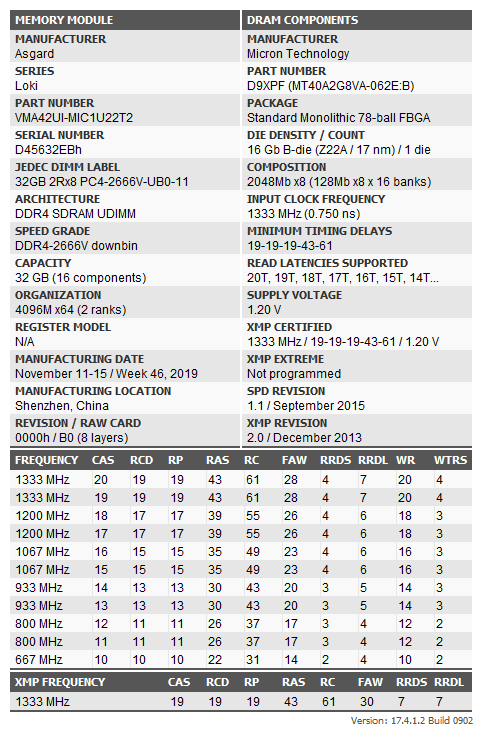

从京东自营处买了两对阿斯加特32G内存，频率2666 c18。

https://item.jd.com/10081657664778.html

全称：阿斯加特（Asgard）32GB2666频率DDR4台式机内存条洛极51℃灰

## 资料介绍

- [128GB（32G*4）阿斯加特真香条超频3800mhz的深度解析！颗粒为D9XPF 时序18-25-25-58](https://www.bilibili.com/read/cv6717434/) 
- [超频潜力惊人：阿斯加特 T2 32G DDR4 2666](https://post.smzdm.com/p/a783ww4l/)

## 内存信息

### 内存颗粒信息

thaiphoon-burner 读取到的内存颗粒信息，第一条：

第二条：

第三条：

第四条：

