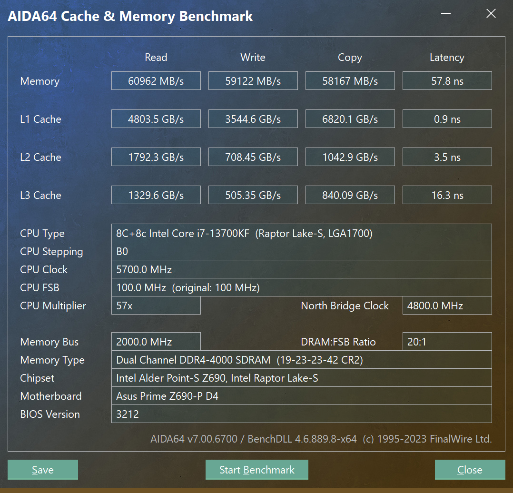
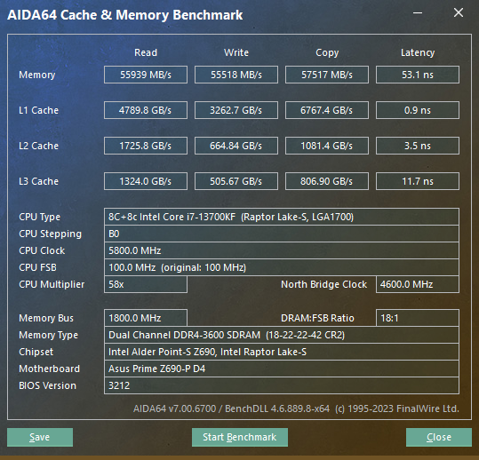

## 32gx2 ddr4000 超频设置

可以重用海盗船内存的参数，将 tCL 放宽到 19，tRCD 放宽到23，也可以跑ddr4000，小惊喜。

```properties
tCL       19
tRCD      23
tRP       23
tRAS      42
CR 2N
tRRD_L 12
tRRD_S 9
tRFC 660
tRFC2 400   
tRFC4 250
tREFI 65535
tWR 24
tRTP   12
tFAW 24
tWTR 5
tWTR_L 15
tWTR_S 6 
tCCD_L 8
tCKE 12
tWL 20
```

4000 c19 时的 aida64 内存测试结果：



此时内存电压 1.40v，sa电压 1.20，vddq 电压 1.38v，测试通过。


## 32gx4 ddr3600 超频设置

32g x 4 压力大增，跑不了ddr4 4000，只能跑ddr4 3600, 参数可以抄上面的，但主参数可以收紧到 18/22/22/42，如下：


```properties
DRAM CAS# Latency [18]
DRAM RAS# to CAS# Delay [22]
DRAM RAS# PRE Time [22]
DRAM RAS# ACT Time [42]
DRAM Command Rate [2N]
DRAM RAS# to RAS# Delay L [12]
DRAM RAS# to RAS# Delay S [9]
DRAM REF Cycle Time [660]
DRAM REF Cycle Time 2 [400]
DRAM REF Cycle Time 4 [250]
DRAM Refresh Interval [65535]
DRAM WRITE Recovery Time [24]
DRAM READ to PRE Time [12]
DRAM FOUR ACT WIN Time [24]
DRAM WRITE to READ Delay [5]
DRAM WRITE to READ Delay L [15]
DRAM WRITE to READ Delay S [6]
DRAM CAS to CAS Delay L [8]
DRAM CKE Minimum Pulse Width [12]
DRAM Write Latency [20]
```

3600 c18 时的 aida64 内存测试结果：



此时内存电压 1.40v，sa电压 1.20，vddq 电压 1.38v，测试通过。

## 32gx4 ddr3800 超频设置

TODO: 有时间尝试一下能不能跑3800，参考介绍中的作业。