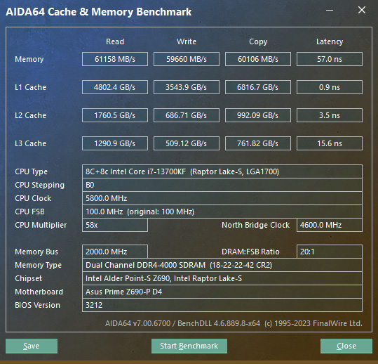

## 通用参数

以下参数为海盗船复仇者32G内存在 4000/4100/4200/4300 时通用的参数，后面都是在这个参数基础上进行小幅度修改。

```properties
tCL       18
tRCD      22
tRP       22
tRAS      42
CR 2N
tRRD_L 12
tRRD_S 9
tRFC 660
tRFC2 400   
tRFC4 250
tREFI 65535
tWR 24
tRTP   12
tFAW 24
tWTR 5
tWTR_L 15
tWTR_S 6 
tCCD_L 8
tCKE 12
tWL 20
```

aida64 内存测试结果：




## 32gx2 ddr4200 超频设置

套用上面的海盗船内存的参数，频率可以上到4200:

```properties
DRAM CAS# Latency [18]
DRAM RAS# to CAS# Delay [22]
DRAM RAS# PRE Time [22]
DRAM RAS# ACT Time [42]
DRAM Command Rate [2N]
DRAM RAS# to RAS# Delay L [12]
DRAM RAS# to RAS# Delay S [9]
DRAM REF Cycle Time [660]
DRAM REF Cycle Time 2 [400]
DRAM REF Cycle Time 4 [250]
DRAM Refresh Interval [65535]
DRAM WRITE Recovery Time [24]
DRAM READ to PRE Time [12]
DRAM FOUR ACT WIN Time [24]
DRAM WRITE to READ Delay [5]
DRAM WRITE to READ Delay L [15]
DRAM WRITE to READ Delay S [6]
DRAM CAS to CAS Delay L [8]
DRAM CKE Minimum Pulse Width [12]
DRAM Write Latency [20]
```

aida64 内存测试结果：


此时内存电压 1.40v，sa电压 1.20，vddq 电压 1.35v，测试通过。

> 备注：如果体质实在差可以考虑内存电压设置为 1.45v / sa电压1.32v / vddq电压1.38v。

## 32gx2 ddr4000 超频设置

如果只是跑 ddr4 4000 c18，内存电压可以降低为 1.35v，其他不变。

## 32gx4 ddr3800 超频设置

32g x 4 压力大增，跑不了ddr4 4200, 甚至4000/3900都不能，只能跑ddr4 3800, 参数同上。

此时内存电压 1.35v，sa电压 1.20，vddq 电压 1.35v，测试通过。