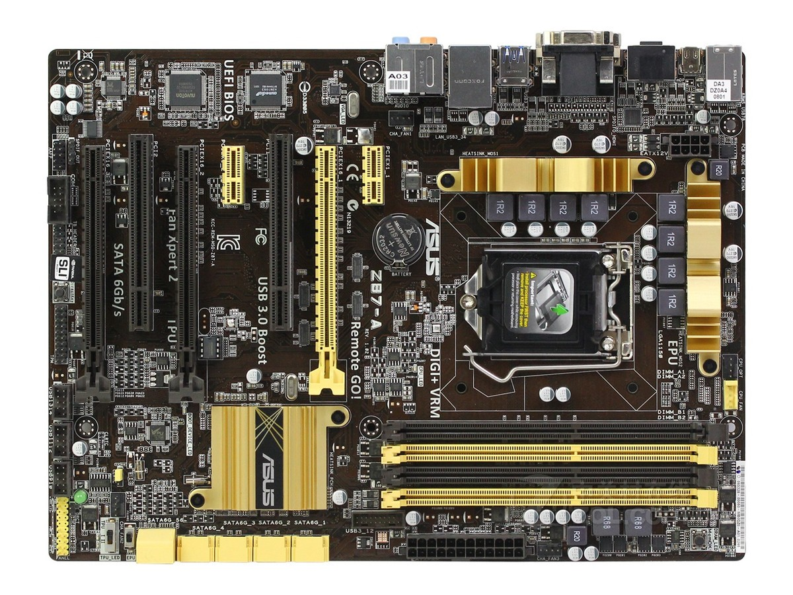

## 主板资料

https://www.asus.com.cn/supportonly/z87-a/helpdesk_download/

- [华硕Z87-A主板评测](https://mb.zol.com.cn/389/3890025.html)

主要优势：

- 功耗低，配合e3 1265l v3 待机功耗只有20瓦出头。
- 支持锁定 e3 1265l v3 到全核 3.7 g
- 有两条 pcie 3.0 16x 插槽，可以配置为 8x + 8x （接两个万兆或者40g网卡）
- 有两条 pcie 3.0 1x 插槽，可以插两个 2.5g 网卡（做软路由）
- 6个 sata 3.0 接口（做nas）
- 有 D-Sub/DVI/HDMI/mini-DP 四个视频输出接口，mini-DP 支持4k 60hz.

## 主板用途

用来做NAS/软路由/pt下载机等低功耗设备，配合 e3 1265l v3 cpu

## 主板 bios

原版bios 不支持 nvme ssd 启动，也无法锁定 e3 1265l v3 到全核 3.7 g。

修改之后的 bios 可以支持 nvme ssd 启动，也能锁定 e3 1265l v3 到全核 3.7 g。还可以小超一下外频到 103, 实现全核 3.8G.

- [mod_z87a.rom](files/mod_z87a.rom) ： 修改之后的 bios
-  [AFUWIN_3.05.04.zip](files/AFUWIN_3.05.04.zip) : 主板 bios 刷新工具

锁定 e3 1265l v3 到全核 3.7 g的方式：

- 刷上面的bios
- 在bios中设置 cpu 倍频为 37 （默认是auto）
