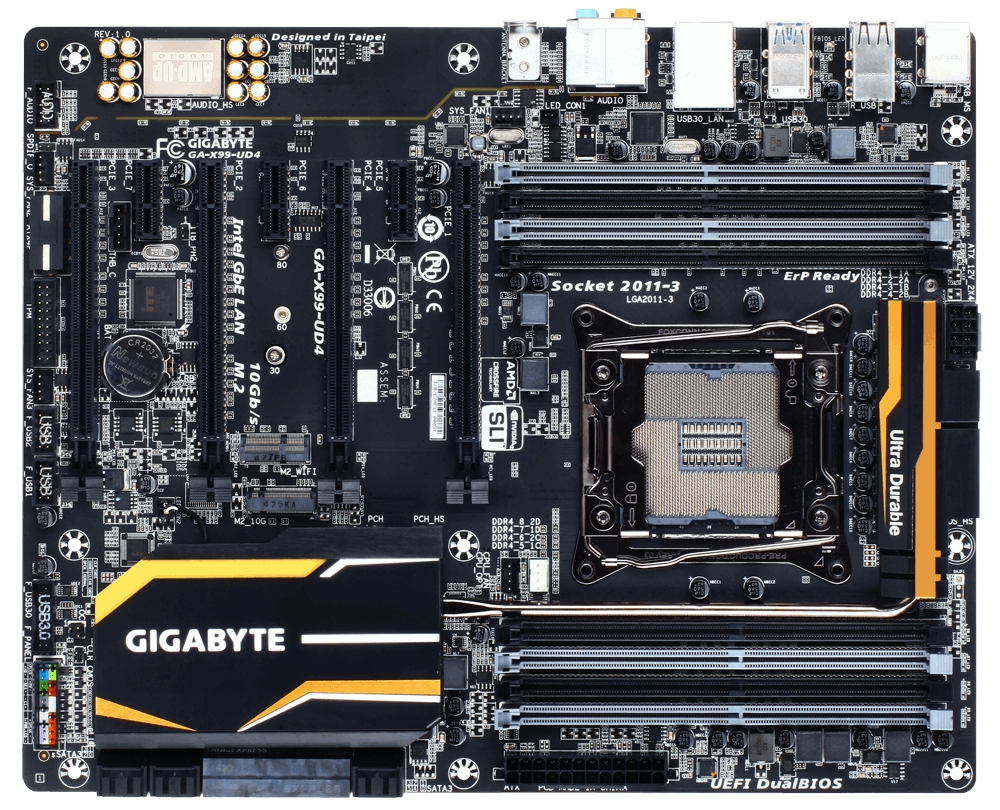
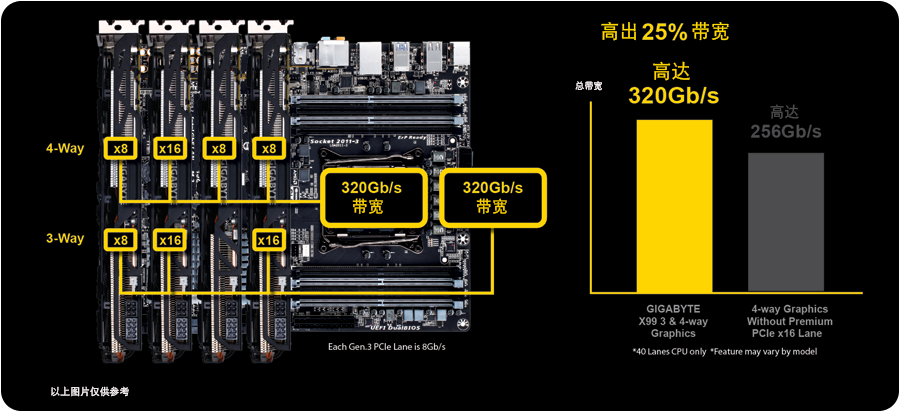

## 主板资料

技嘉x99 UD4主板是一块中端x99 ATX大板。

技嘉官方网站：

https://www.gigabyte.cn/Motherboard/GA-X99-UD4-rev-10

主板优势：

1. 这个主板最大的优势，是有四条 pcie8x 可同时用
2. 四条pcie8x同时插的时候，其中还有一条带宽是 pcie 16x. 

  

3. 待机功耗低，搭配 e5 2680 v4, 整机待机功耗才 40瓦出头。插四块 hp544+ 也才60瓦出头。
4. 有三条 pcie 1x 插槽，可以插亮机卡（改成pcie 1x），2.5g网卡等

主板缺点：

1. 板载的 m2 带宽只有 10G,而不是标准的 pcie 3.0 x4 有 32g 带宽，因此限制了 ssd 的速度
2. 技嘉的bios简陋的令人发指
3. 技嘉的x99主板基本不能超频ring，造成性能低下

## 主板 bios

### 官方bios

- [x99ud4.rom](files/x99ud4.rom) ： 官方原版bios,最新版本。

### 拆分一条pcie x16的bios

支持将上图中的 x16 插槽拆分为 x8 + x4 + x4。

注意原版bios没有pcie拆分选项，必须要修改bios。

- [modud4.rom](files/modud4.rom) ： 基于官方bios修改之后的bios文件，拆分pcie x16为 x8 + x4 + x4。

### 拆分一条pcie x16和一条pcie x8的bios

除了支持 x16 插槽拆分为 x4 + x4 + x4 + x4 之外，还将主板最下方（离cpu插座最远）的那条 x8 插槽拆分为 x4 + x4。这样配合常见的pcie 转m2的转换卡可以支持到六条满速的pcie3.0 x4 的m2 SSD。

- [modud4x4x4x4x4.rom](files/modud4x4x4x4x4.rom) ： 基于官方bios修改之后的bios文件，拆分pcie x16为 x4 + x4 + x4 + x4, 拆分pcie x8为 x4 + x4。

### bios 刷新方式

由于是自行修改的bios，会无法通过主板的校验，因此不能用主板bios自带的功能来刷新bios，需要在 dos 下通过命令进行。

先制作纯 dos 的启动 U 盘，然后在 u 盘下复制需要的  efiflash.exe 文件和相关的 rom 文件。

所需的文件打包在这里，解压缩后复制到u盘根目录下即可：

-  [u.zip](files/u.zip) 

用纯 dos 的 u 盘启动机器，在命令行下输入 mod 刷新修改后的bios, 输入 F 则刷新原版bios。

## 用途

我先后买了两块这个主板，组了两台机器，主要是看中其 pcie 通道足够多的优点。