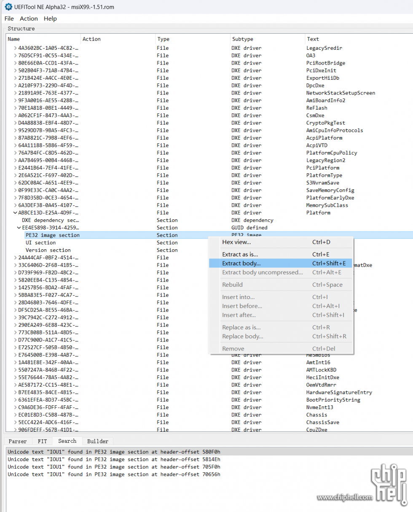
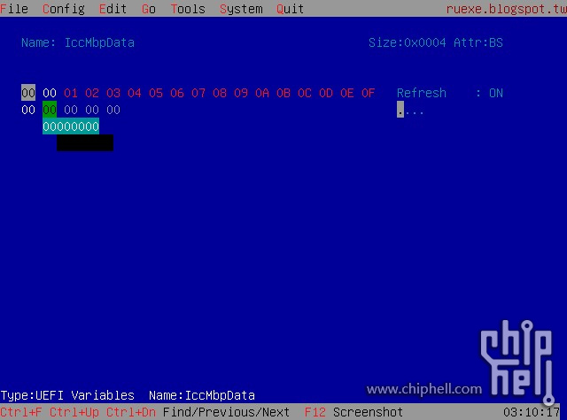
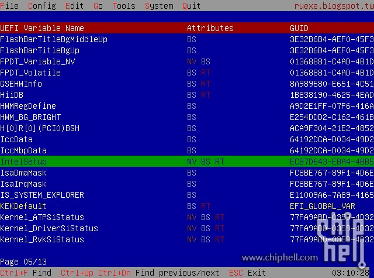
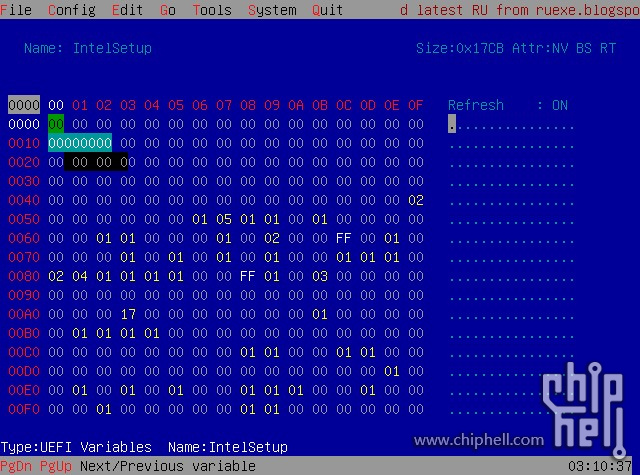
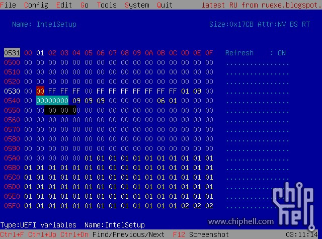
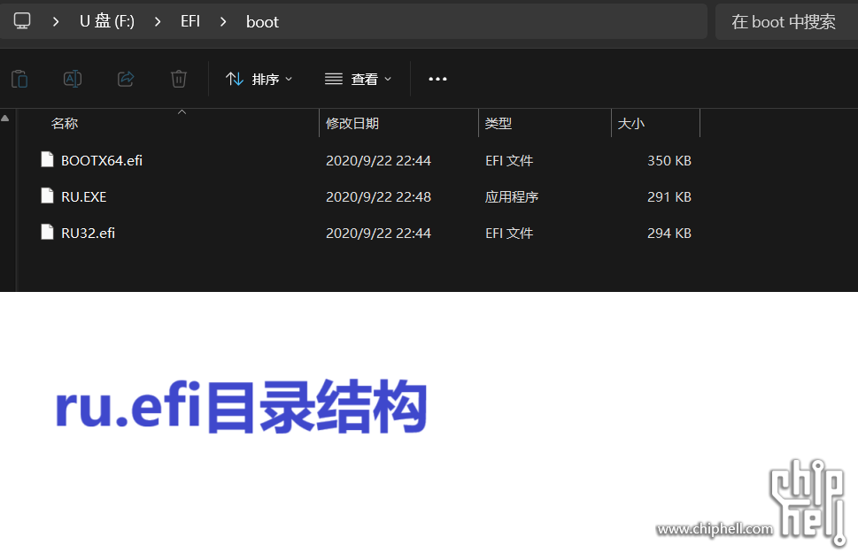
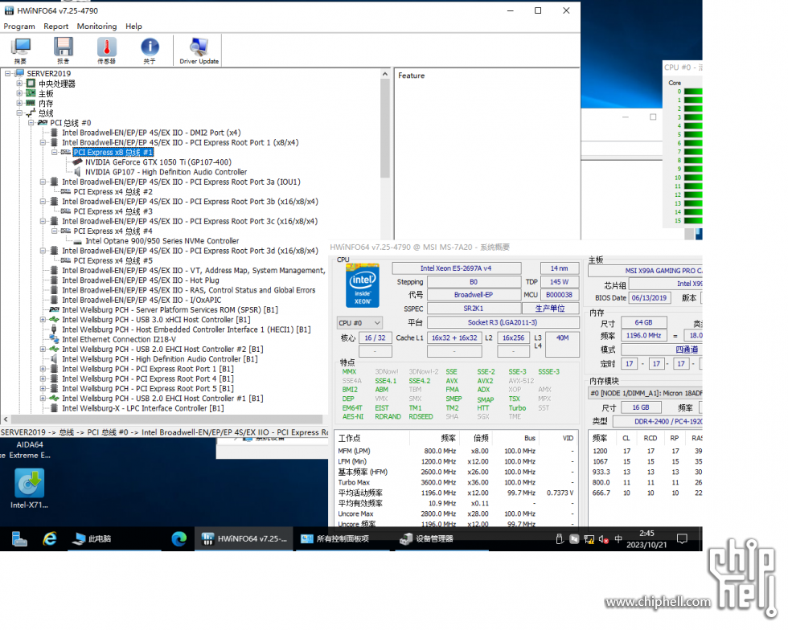
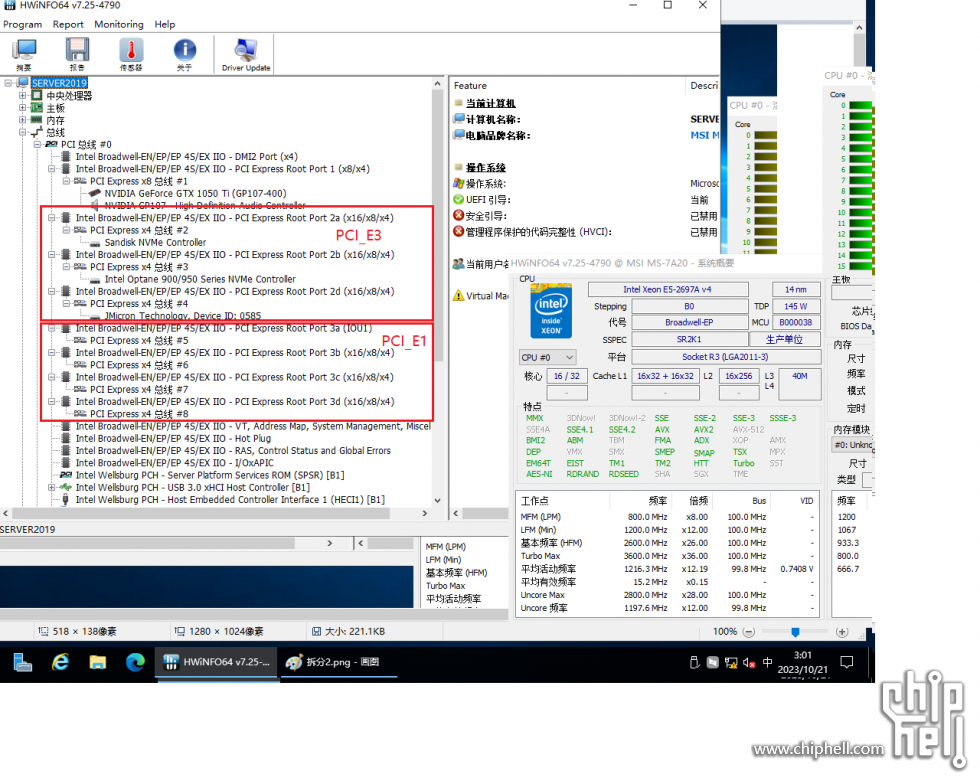
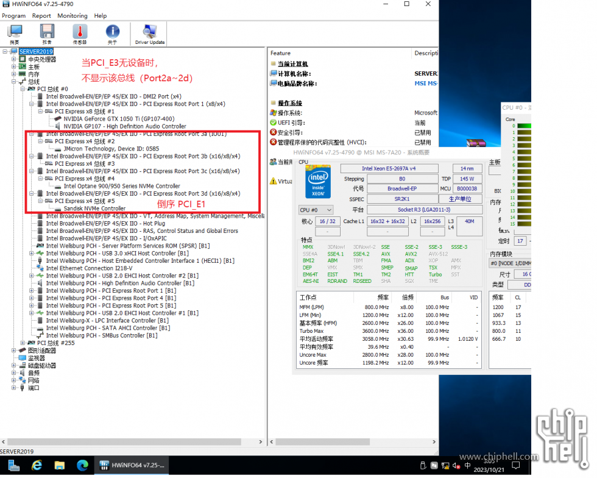
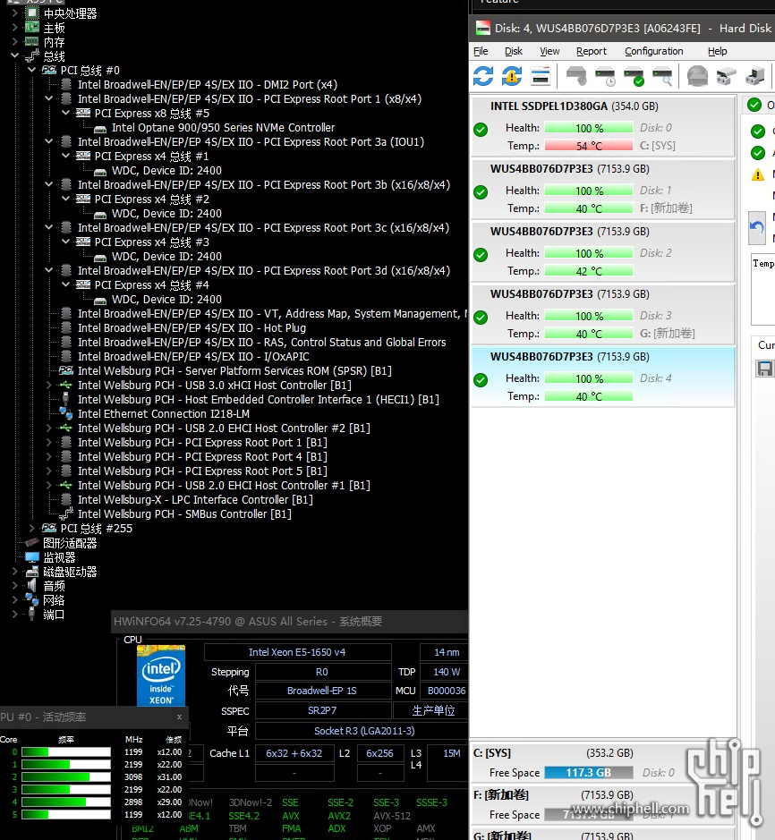

>  原文地址： https://www.chiphell.com/thread-2559311-1-1.html


## 前言

  在16年前后，X99是非常热门的平台，是高性能PC的代表，也是服务器工作站的主流配置。当年在这个论坛，各种鸡血超频也是如火如荼。我当年也是办公室和家里各一套X99。
  如今，由于其性能过于老旧，尤其是过低的主频，导致很多人都已经放弃。我的X99m也因为6950X挂掉而束之高阁。
  这些退役的主板，食之无味，弃之可惜，在日益流行的全闪存储到来之际，我想起了他们。
其丰富的PCIE扩展能力,以及支持四通道的rEcc内存，在all in one的存储应用下，性能是绰绰有余。

除窄版外，市面上的X99主板，主流品牌大都不具备在bios内直接设置X4拆分的选项。如果要使用这些X16，X8的PCIE槽位能链接更多的NVME通道，就必须使用昂贵且耗电的PLX switch扩展卡。显然这不是我们的初衷。

很早之前看过国外一个大神手动拆分X99主板pciE的帖子，感觉应该有戏。
于是开始爬网找资料。经过数次踩坑、数次的重启之后，终于达成目标，成功拆分。
不得不说，还是有那么一点点麻烦，但是只要理解了每个环节的逻辑，细心操作，难度系数基本为0。

为了让更多人轻松完成X99拆分，早日低成本部署全闪NAS，遂记录于此。
参照本帖，不出意外应该在十分钟内就能简单直观的完成拆分。

## 正文

1，使用软件AMIBCP打开bios文件（从网站下载的最新版bios就可以），这个软件可以看到BIOS的各种配置情况，在这里，可以找到对应的IOU1,2,3的PCIE槽通道顺序，以便确定你需要拆分哪个槽位。（该步骤可省略）

2，使用UEFITool_NE_A32打开bios(.cap或.bin)文件
如果从官网下载的.CAP bios无法使用UEFITool打开（我的华硕X99m-ws的BIOS文件就可以用这个工具直接打开，但是微星X99的不可以）；可尝试使用BIOS_Backup_TooKit工具直接在windows下对本机的bios进行读取、备份生成一个bios文件，如上图中的misX99-1.51.rom这个文件就是从微星主板上备份出来的，这个.rom文件就可以用UEFITool打开了；

3，在UEFItool下搜索，关键字为 IOU1，一般X99的系统应该可以搜到4个条目（分别对应IOO0~IOO4,（IOO2~IOO4是对多路CPU的），在搜索结果的第一个条目下，PE32...和这个条目，右键 extract body，生成一个.bin的文件，再使用Universal IFR Extractor工具将这个bin文件转换成txt文件。



4，有了这个TXT文件，我们就可以找到bios里面关于相关字段的定义及变量的设置情况。打开txt文件，搜索“IOU1”）能找到类似下面的内容：注意一定要是IOO 0下面的，也就是第一次出现的IOU1这里。下面还有3个条目，不用管，我们只关注第一路CPU（如果是双路CPU主板，那么就还需要修改下面的IOO 1）

```
Form: IIO 0, Form ID: 0x76 {01 86 76 00 7B 04}
0x1C1A3         Suppress If: {0A 82}
0x1C1A5             Variable 0x211 equals 0x0 {12 06 11 02 00 00}
0x1C1AB             Setting: IOU2 (IIO PCIe Port 1), Variable: 0x539 {05 91 BB 04 C7 04 46 02 01 00 39 05 10 10 00 FF 00}
0x1C1BC                 Option: x4x4, Value: 0x0 {09 07 CC 04 00 00 00}
0x1C1C3                 Option: x8, Value: 0x1 {09 07 4F 0A 00 00 01}
0x1C1CA                 Option: Auto, Value: 0xFF {09 07 76 03 30 00 FF}
0x1C1D1             End of Options {29 02}
0x1C1D3             Setting: IOU0 (IIO PCIe Port 2), Variable: 0x531 {05 91 BF 04 C7 04 47 02 01 00 31 05 10 10 00 FF 00}
0x1C1E4                 Option: x4x4x4x4, Value: 0x0 {09 07 C8 04 00 00 00}
0x1C1EB                 Option: x4x4x8, Value: 0x1 {09 07 C9 04 00 00 01}
0x1C1F2                 Option: x8x4x4, Value: 0x2 {09 07 CA 04 00 00 02}
0x1C1F9                 Option: x8x8, Value: 0x3 {09 07 CB 04 00 00 03}
0x1C200                 Option: x16, Value: 0x4 {09 07 50 0A 00 00 04}
0x1C207                 Option: Auto, Value: 0xFF {09 07 76 03 30 00 FF}
0x1C20E             End of Options {29 02}
0x1C210             Setting: IOU1 (IIO PCIe Port 3), Variable: 0x535 {05 91 C3 04 C7 04 48 02 01 00 35 05 10 10 00 FF 00}
0x1C221                 Option: x4x4x4x4, Value: 0x0 {09 07 C8 04 00 00 00}
0x1C228                 Option: x4x4x8, Value: 0x1 {09 07 C9 04 00 00 01}
0x1C22F                 Option: x8x4x4, Value: 0x2 {09 07 CA 04 00 00 02}
0x1C236                 Option: x8x8, Value: 0x3 {09 07 CB 04 00 00 03}
0x1C23D                 Option: x16, Value: 0x4 {09 07 50 0A 00 00 04}
0x1C244                 Option: Auto, Value: 0xFF {09 07 76 03 30 00 FF}
0x1C24B             End of Options {29 02}
0x1C24D         End If {29 02}
```


0539下面代表着X8的pcie槽，配置的变量情况。
0531和0535是另2个x16的pcie槽。

下面的 x4x4x4x4, Value: 0x0,意思是如果按照4个独立的x4配置这个槽，那么对应的0531这个变量的值应该设定为00.


上面第1步的目的其实也就是为了找到我们要修改的目标PCIE槽的编号。如果第1步无法完成，其实也没有关系，我们可以修改一下试试看，用拆分转接卡插上NVME硬盘，验证一下改的槽位对不对。如果不对的话可以改回来也无妨。

5，前面都是准备工作，正式修改环节却是相当简单：

找到了上面的变量信息，就可以插上U盘重启电脑了，重启时，在进入BIOS画面瞬间按F8，（MSI的主板是按F11），选择对应的U盘启动，RU这个引导信息将会引导我们进入BIOS的读取。










分别按以下键：回车，按[ALT]+[+=] 进入设置界面，[PGDN]翻页找到intelsetup项，回车进入，使用[CTRL]+[PGDN]按键组合找到对应的条目。比如这个0531变量（使用方向键定位，注意看表格左上角的数值053x变化），默认此处的变量值为FF。光标停留在变量字符处，回车，将其修改为00，再回车。
531,535这两处修改完成后，使用[CTRL]+[W] 保存，并使用Alt+Q退出修改界面。重启电脑，即可发现两条X16都被拆分为4个x4.

我已经将 0531和0535这两个参数修改为00，即可获得8个独立的X4。


6，U盘的制作：找一个U盘（容量没有要求）将EFI这个文件夹放在U盘的根目录。


7，使用HWINFO查看拆分的情况








成果：

使用这个方法，ASUS X99m-ws只成功了第一条X16，可以装4个SN640，略显遗憾。

我成功拆分了MSI X99a Gaming Pro Carbon 的2条pcie X16槽，可以接8个NVME,剩下的X8可以继续拆分成2个X4，也可以上个E810或X710-da4光卡，ESXI系统盘放在了主板自带的M.2（注意：这个M.2接口只有2.0X2，也就是10gbps的速度）

拿掉显卡，安装8盘U.2，enjoy！




## 工具分享

以上所需工具均在baiduyun共享:

链接：https://pan.baidu.com/s/1C7s1yu_X9RK5jRMEoStccQ
提取码：1234

## 备注

备注1：经拆分设置，如果后续刷新BIOS或者重置BIOS，需要再做一次第5步，即可完成拆分，否则默认X16系统只能识别第一个NVME。这个跟进BIOS重设启动盘位次一样，没啥太大难度，唯一麻烦的是在没有IPMI的主板上需要插个亮机显卡。

备注2: X99的PCH只有4XPcieGen2.0的DMI带宽，也就是20Gbps。板载网卡，SATA，USB等等都需要共享这点带宽，所以南桥扩展出来的模块上不适合跑太大的数据，能直连的还是尽量用直连吧。
