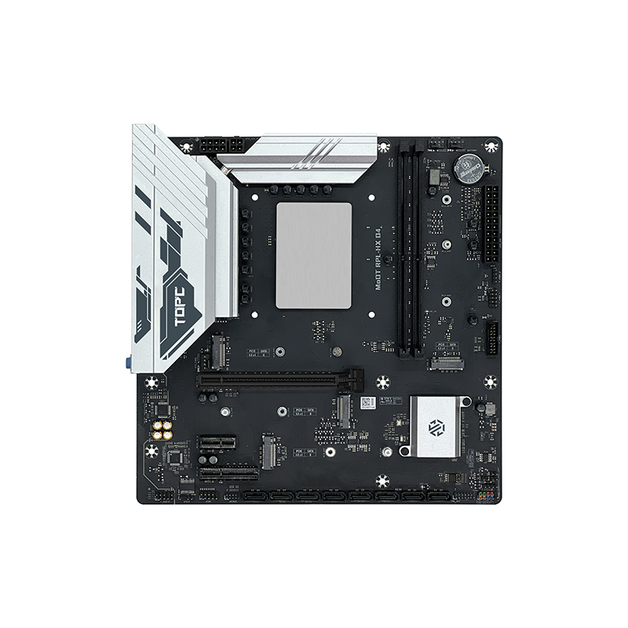

## 介绍

备注：我这个主板买的早，板载的是千兆网卡，后来的新版本更换了2.5g网卡。

https://tbtopc.com/product/topc-intel-i7-14700hx-%e6%9d%bf%e8%bd%bdcpu%e5%a5%97%e8%a3%85/

评测信息：

- [谁才是你心目中的最强6P！topc 14500hx matx简单测试，游戏对比q1hy、14600kf](https://www.bilibili.com/video/BV1cCScYTEzN/)：这个帖子里面有魔改bios的下载地址

## CPU

### cpu信息

英特尔® 酷睿™ i5 处理器 14500HX

https://www.intel.cn/content/www/cn/zh/products/sku/235999/intel-core-i5-processor-14500hx-24m-cache-up-to-4-90-ghz/specifications.html

| cpu规格                                | 数量                     |
| -------------------------------------- | ------------------------ |
| Performance-core（性能核）数           | 6                        |
| Efficient-core（能效核）数             | 8                        |
| 总线程数                               | 20                       |
| Performance-core（性能核）最大睿频频率 | 4.9 GHz                  |
| Efficient-core（能效核）最大睿频频率   | 3.5 GHz                  |
| Performance-core（性能核）基本频率     | 2.6 GHz                  |
| Efficient-core（能效核）基本频率       | 1.9 GHz                  |
| 缓存                                   | 24 MB Intel® Smart Cache |
| 处理器基础功耗                         | 55 W                     |
| 最大睿频功耗                           | 157 W                    |
| 最小保证功率                           | 45 W                     |

## 核显

|                   |                                                    |
| ----------------- | -------------------------------------------------- |
| GPU Name          | Intel® UHD Graphics for 14th Gen Intel® Processors |
| 显卡最大动态频率  | 1.55 GHz                                           |
| 图形输出          | eDP 1.4b, DP 1.4a, HDMI 2.1                        |
| 执行单元          | 32                                                 |
| 最大分辨率 (HDMI) | 4096 x 2160 @ 60Hz                                 |
| 最大分辨率 (DP)   | 7680 x 4320 @ 60Hz                                 |

l亮点：对比i5-13500HX核显的16个EU执行单元升级到32个EU执行单元，核显性能有大幅度的提升，对比i5-13500HX的核显性能提升大约为52%。

## 主板 bios

### 官方bios

### 魔改bios

topc intel hx matx d4系列优化bios下载

下载地址:https://pan.baidu.com/s/1TaCzWlkHrpkB2u8UO6jjyQ?pwd=4321 

提取码:4321

