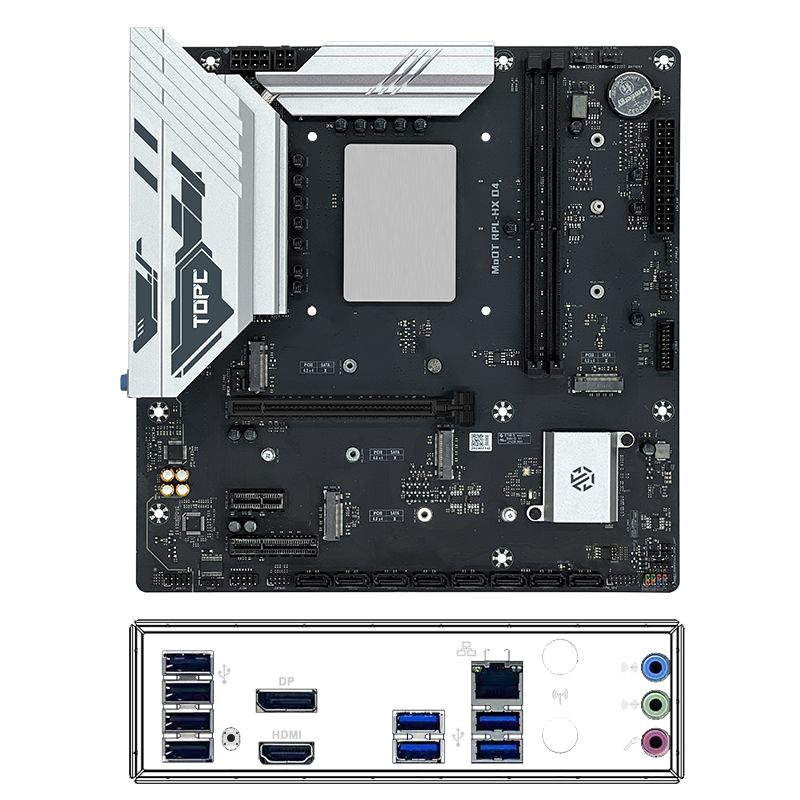
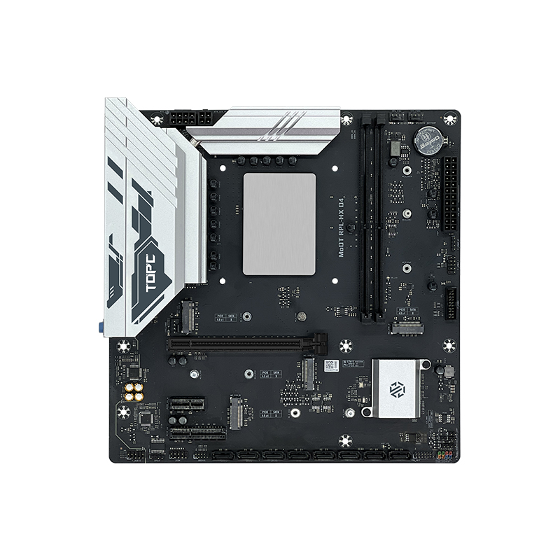

## 介绍

备注：我这个主板买的早，板载的是千兆网卡，后来的新版本更换了2.5g网卡。

评测信息：

- [1699元的可超频14650HX+4M.2主板，vs 14600KF表现如何？ 天邦14650HX（QS）MoDT测评](https://www.bilibili.com/video/BV181koYoEhV/)

- [i7 14650HX最佳预设（双塔及以上散热可抄作业）](https://www.bilibili.com/video/BV1X2oQYQEZd/)

## 主板

### 主板信息

https://tbtopc.com/product/topc-intel-i7-14700hx-%e6%9d%bf%e8%bd%bdcpu%e5%a5%97%e8%a3%85/

### 主板 bios

#### 官方bios

https://tbtopc.com/supports/#76-100-wpfd-modt-bios

注意是 Intel-RPL-HX-BIOS（13-14th），而不是 Intel-RPL-HX-BIOS-2.5G（13-14th）。

#### 魔改bios

bios 来自： [MODT平台最能打的一集！TOPC i9-13980HX板U超频性能测试](https://www.bilibili.com/video/BV1AnSoY8EhH/)

最新12B微码，解锁功耗墙、电流墙等各种限制，更多详情网盘自取。

链接: https://pan.baidu.com/s/1nQzcyYExMWf1wWthNe1MFA?pwd=MODT 提取码: MODT

## CPU

### cpu信息

## 核显

### 核显信息

