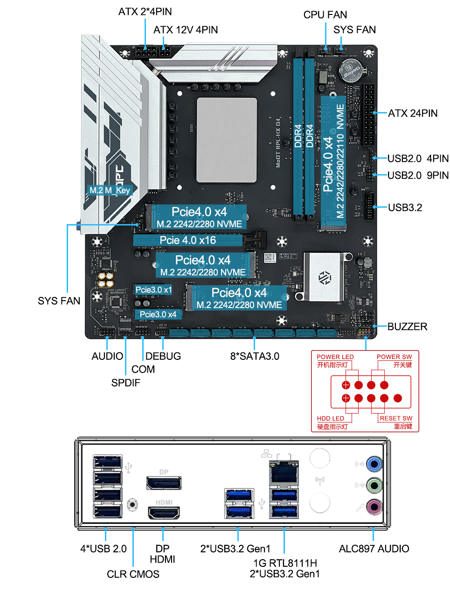
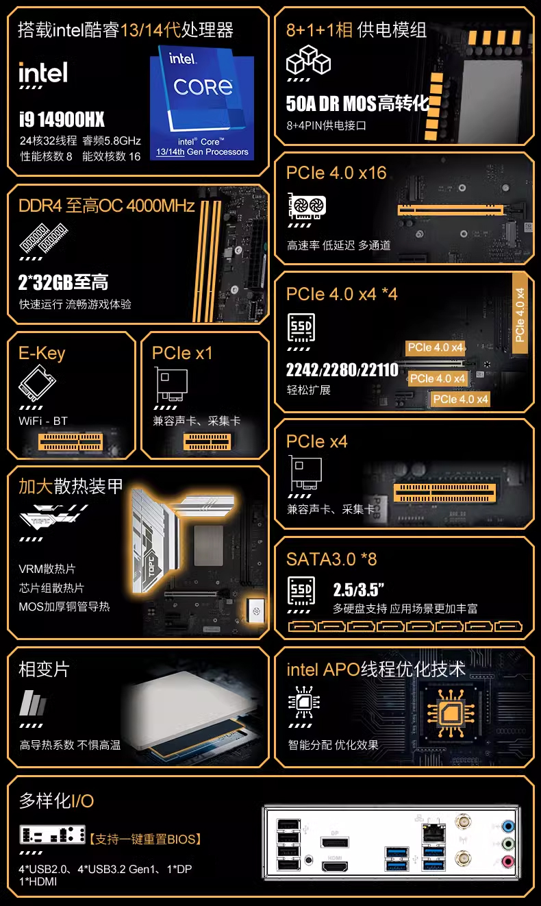
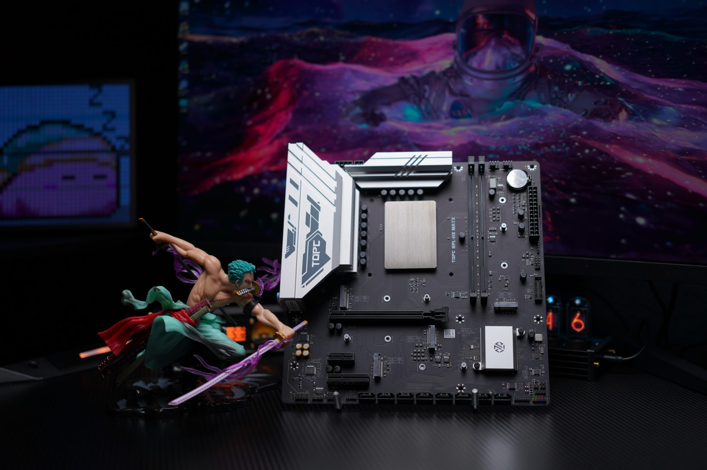

## 介绍

备注：我这个主板买的早，板载的是千兆网卡，后来的新版本更换了2.5g网卡。

评测信息：

- [i7 14650HX最佳预设（双塔及以上散热可抄作业）](https://www.bilibili.com/video/BV1X2oQYQEZd/)：没找到 14700hx 的，但是 14650hx 的预设可以参考。

## 主板

### 主板信息

官方网页：

https://tbtopc.com/product/topc-intel-i7-14700hx-%e6%9d%bf%e8%bd%bdcpu%e5%a5%97%e8%a3%85/

官方图片：








### 主板 bios

#### 官方bios

https://tbtopc.com/supports/#76-100-wpfd-modt-bios

注意是 Intel-RPL-HX-BIOS（13-14th），而不是 Intel-RPL-HX-BIOS-2.5G（13-14th）。

目前刷的是这个版本：

```
Intel-RPL-HX-BIOS（13-14th）
Size: 8 MB
Hits: 503
Date added: 13-08-2025
```

但这个版本不能设置cpu倍频，无法解锁电流墙，性能无法发挥。

#### LEO版魔改bios

bios 来自： b站 UP 主满头大汗的企鹅 https://space.bilibili.com/14022282 

链接: https://pan.baidu.com/s/1nQzcyYExMWf1wWthNe1MFA?pwd=MODT 提取码: MODT

备注：不知道为什么，我的 14700hx 刷LEO版魔改bios都会出问题

- 1.8 和 1.7 14700hx 是进入 bios 后,一旦通过移动鼠标或者键盘，进入 高级 菜单，就会卡死失去响应，只能重启，其他菜单正常。

- 1.6 版本，14700hx 是进入 bios 后黑屏，完全黑屏，不显示任何东西，但是可以正常启动进入 windows 系统。

- 1.5 版本，14700hx 是进入 bios 后界面空白不载入 bios 设置。


以下 bios 设置基于官方bios。

## CPU

### cpu信息

英特尔® 酷睿™ i5 处理器 14700HX

https://www.intel.cn/content/www/cn/zh/products/sku/235997/intel-core-i7-processor-14700hx-33m-cache-up-to-5-50-ghz/specifications.html

| cpu规格                                | 数量                     |
| -------------------------------------- | ------------------------ |
| Performance-core（性能核）数           | 6                        |
| Efficient-core（能效核）数             | 12                        |
| 总线程数                               | 28                       |
| Performance-core（性能核）最大睿频频率 | 5.5 GHz                  |
| Efficient-core（能效核）最大睿频频率   | 3.9 GHz                  |
| Performance-core（性能核）基本频率     | 2.1 GHz                  |
| Efficient-core（能效核）基本频率       | 1.5 GHz                  |
| 缓存                                   | 33 MB Intel® Smart Cache |
| 处理器基础功耗                         | 55 W                     |
| 最大睿频功耗                           | 157 W                    |
| 最小保证功率                           | 45 W                     |


## 核显

### 核显信息

|                   |                                                    |
| ----------------- | -------------------------------------------------- |
| GPU Name          | Intel® UHD Graphics for 14th Gen Intel® Processors |
| 显卡最大动态频率  | 1.6 GHz                                           |
| 图形输出          | eDP 1.4b, DP 1.4a, HDMI 2.1                        |
| 执行单元          | 32                                                 |
| 最大分辨率 (HDMI) | 4096 x 2160 @ 60Hz                                 |
| 最大分辨率 (DP)   | 7680 x 4320 @ 60Hz                                 |


## Bios 设置

### 和超频无关的设置

#### 主页

- 修改语言为 中文。

#### "高级"

"图形配置"：

- 主要显示设备: 自动   
- VT-d: enabled
- 板载显卡: enabled

"PCI子系统设置"：

- PCIE speed： Gen4
- Resizable Bar support： 开启

"IT8613E 超级输入输出控制" -> "Serial Port 1 Configuration"

- Serial Port: 取消

#### 电源

"电源配置和电源管理接口"

- 启动休眠：取消

"电源管理配置"

- 深度睡眠：关闭
- usb唤醒：关闭
- 来电开机：上电

#### 启动 

- 启动等待： 5
- 数字键状态： 关闭
- 全屏开机画面：取消
- Bios写保护：开启

### cpu 超频设置

#### "超频"

"OverClocking Performance Menu" -> "Processor"：

- per core ratio override: 开启

  - core 0 max ratio： 54
  - core 1 max ratio： 54
  - core 2 max ratio： 54
  - core 3 max ratio： 54
  - core 4 max ratio： 54
  - core 5 max ratio： 54
  - core 6 max ratio： 54
  - core 7 max ratio： 54
  - cluster 0 max ratio: 40
  - cluster 1 max ratio: 40
  - cluster 2 max ratio: 40

- AVX2 Ratio Offset: 6
- Avx2 voltage guardband scale factor: 100 # 默认就是100

#### 超频

- "AC Loading": 默认 100，修改为 50
- 功耗限制1设定：开启，功耗限制 250000 （250瓦）
- 功耗限制2设定：开启，功耗限制 250000 （250瓦）

### 内存超频

特别说明：天邦的 14000hx 系列主板超内存时非常不友好，内存超低了和超高了都会失效（也就是重启后内存设置会自动恢复到2666频率），因此无法一步一步的提升频率，需要直接一步到位设置内存最终的超频频率。

以金百达 32gx2 的 CJR 颗粒为例，超频到 4000 频率，电压 1.40v 时，内存超频设置如下：

#### 超频

- CPU VDDQ: 1.35v

- memory profile: 自定义
- 内存频率: 4000
- 内存电压 vddq: 1.40v
- 内存电压 vpp: 自动
- 内存参考时钟: 100
- gear mode: gear1
- 内存自定义设置

| 参数     | 4000  |
| -------- | ----- |
| NMODE    | 1    |
| tCL      | 18    |
| tRCD/tRP | 22    |
| tRAS     | 42    |
| TRFC2    | 400   |
|     |    |
| tREFI    | 65535 |
| TWR      | 24    |
| TWTR_L   | 17    |
| TWTR_S   | 6     |
| TRRD_L   | 12     |
| TRRD_S   | 9     |
| TRTP     | 12     |
| tFAW     | 24    |
| tCWL     | 20    |
| tCKE     | 12     |
| tRFC     | 660   |
| TRRD     | 0     |
| TWTR     | 0     |
| tRFCpb   | 0     |
| TRFC4    | 250   |
| TCCD_L   | 8     |

### ring 超频

#### "高级"

"OverClocking Performance Menu" -> "ring"：

- Ring max超频: 45
- Ring Voltage Mode: 偏移模式
- Ring extra turbo voltage： 0
- vf offset mode：lagacy
-  voltage offset： 0 
  - offset prefix：[+]

- Ring Down Bin： disabled
- Min Ring Ratio Llimit： 8
- Max Ring Ratio Llimit： 45

### 核显超频设置

#### "高级"

"OverClocking Performance Menu" -> "GT"：

- GT Overclocking frequency： 33
- GT Voltage Mode: 偏移模式
- GT extra turbo voltage： auto
-  GT voltage offset： 20
  - offset prefix：[-]

## 性能测试

- 默认：单核5.4g，全核4.8g，小核3.7g，AC Loading 50，avx offset 6
- 小超：单核5.4g，全核5.2g，小核4.0g，AC Loading 50，avx offset 6 
- 大超：单核5.6g，全核5.3g，小核4.2g，AC Loading 50，avx offset 6

### cpu-z

|      | 单核分数 | 多核分数 | 单核频率 | 大核频率 | 小核频率 | AC Loading | CPUVID | 功耗  |
| ---- | -------- | -------- | -------- | -------- | -------- | ---------- | ------ | ----- |
| 默认 | 866      | 13687    | 5.2g     | 5.1g     | 3.9g     | 50         | 1.08   | 203瓦 |
| 小超 |   871    |  14050   | 5.4g     | 5.2g     | 4.0g     | 50         | 1.089   | 210瓦 |
| 大超 |   870    |  14489   | 5.5g     | 5.3g     | 4.2g     | 50         |  1.108  | 224瓦 |

### r23

|      | 分数  | 大核频率 | 小核频率 | AC Loading | CPUVID | 功耗        |
| ---- | ----- | -------- | -------- | ---------- | ------ | ----------- |
| 默认 | 33225 | 5.1g     | 3.9g     | 50         | 1.033  | 230瓦       |
| 小超 | 33989 | 5.2g     | 4.0g     | 50         | 1.028  | 254瓦 |
| 大超 | 34588 | 5.3g     | 4.2g     | 50         | 1.028  | 254瓦 |

### aida64 内存性能


