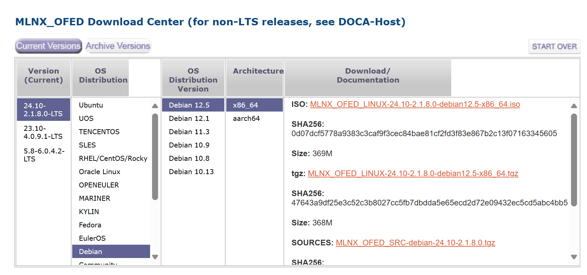

> 2025-04-23 更新： debian12 已经升级到 12.9 版本，网卡驱动版本为最新的 24.07-0.6.1.0 版本。

## 准备工作

### 查看默认驱动

这是debian12自带的默认驱动情况：

```bash
$ lsmod | grep mlx

mlx5_ib               405504  0
ib_uverbs             172032  1 mlx5_ib
ib_core               438272  2 ib_uverbs,mlx5_ib
mlx5_core            1691648  1 mlx5_ib
mlxfw                  36864  1 mlx5_core
psample                20480  1 mlx5_core
pci_hyperv_intf        16384  1 mlx5_core
```

mlx5_core 的详细信息：

```bash
 $ modinfo mlx5_core               
filename:       /lib/modules/6.1.0-31-amd64/kernel/drivers/net/ethernet/mellanox/mlx5/core/mlx5_core.ko
license:        Dual BSD/GPL
description:    Mellanox 5th generation network adapters (ConnectX series) core driver
author:         Eli Cohen <eli@mellanox.com>
alias:          auxiliary:mlx5_core.eth
alias:          pci:v000015B3d0000A2DFsv*sd*bc*sc*i*
alias:          pci:v000015B3d0000A2DCsv*sd*bc*sc*i*
alias:          pci:v000015B3d0000A2D6sv*sd*bc*sc*i*
alias:          pci:v000015B3d0000A2D3sv*sd*bc*sc*i*
alias:          pci:v000015B3d0000A2D2sv*sd*bc*sc*i*
alias:          pci:v000015B3d00001025sv*sd*bc*sc*i*
alias:          pci:v000015B3d00001023sv*sd*bc*sc*i*
alias:          pci:v000015B3d00001021sv*sd*bc*sc*i*
alias:          pci:v000015B3d0000101Fsv*sd*bc*sc*i*
alias:          pci:v000015B3d0000101Esv*sd*bc*sc*i*
alias:          pci:v000015B3d0000101Dsv*sd*bc*sc*i*
alias:          pci:v000015B3d0000101Csv*sd*bc*sc*i*
alias:          pci:v000015B3d0000101Bsv*sd*bc*sc*i*
alias:          pci:v000015B3d0000101Asv*sd*bc*sc*i*
alias:          pci:v000015B3d00001019sv*sd*bc*sc*i*
alias:          pci:v000015B3d00001018sv*sd*bc*sc*i*
alias:          pci:v000015B3d00001017sv*sd*bc*sc*i*
alias:          pci:v000015B3d00001016sv*sd*bc*sc*i*
alias:          pci:v000015B3d00001015sv*sd*bc*sc*i*
alias:          pci:v000015B3d00001014sv*sd*bc*sc*i*
alias:          pci:v000015B3d00001013sv*sd*bc*sc*i*
alias:          pci:v000015B3d00001012sv*sd*bc*sc*i*
alias:          pci:v000015B3d00001011sv*sd*bc*sc*i*
alias:          auxiliary:mlx5_core.eth-rep
depends:        psample,pci-hyperv-intf,mlxfw
retpoline:      Y
intree:         Y
name:           mlx5_core
vermagic:       6.1.0-31-amd64 SMP preempt mod_unload modversions
sig_id:         PKCS#7
signer:         Debian Secure Boot CA
sig_key:        32:A0:28:7F:84:1A:03:6F:A3:93:C1:E0:65:C4:3A:E6:B2:42:26:43
sig_hashalgo:   sha256
signature:      0B:7F:71:B7:60:71:43:5A:78:9B:7A:A0:9B:80:CC:B1:22:DE:6E:01:
                97:CF:38:0D:14:6A:A7:5D:A8:E5:84:DE:89:6E:28:78:73:90:D1:CF:
                AD:87:4E:0D:92:A9:32:68:36:B8:1A:8A:AF:8E:38:73:85:B8:42:CC:
                77:63:4B:00:06:B9:07:33:5C:63:62:00:D8:4A:FD:64:71:DB:CC:CB:
                20:4B:47:12:F9:C5:38:B8:DA:02:72:8D:55:CE:BF:5D:0A:BE:73:22:
                B5:8B:C7:A6:71:49:43:23:EA:23:E2:7B:0D:F4:7D:22:FE:36:E8:00:
                64:F2:93:9D:45:54:49:09:58:0E:DE:54:A8:17:1D:66:2E:21:47:1D:
                C7:A8:2F:41:41:AC:80:0C:30:7B:21:CD:B5:05:93:69:50:1A:65:DB:
                03:D5:C8:06:5D:CE:5B:45:6C:F2:D3:6D:58:A8:56:C3:46:89:05:FA:
                5E:FD:04:EA:29:5F:1B:5A:E6:40:5D:7E:46:D5:61:30:AC:E8:83:A8:
                67:E6:05:26:91:7F:43:31:E3:70:A1:CF:E9:E5:65:5A:46:AE:86:F4:
                84:6F:A8:18:A7:C4:97:67:71:76:93:4C:7E:3F:68:65:3D:E9:A1:0C:
                FB:BB:94:58:52:AE:9F:F0:9D:74:FC:60:10:EF:4A:83
parm:           debug_mask:debug mask: 1 = dump cmd data, 2 = dump cmd exec time, 3 = both. Default=0 (uint)
parm:           prof_sel:profile selector. Valid range 0 - 2 (uint)
```

### 下载驱动

下载地址：

https://network.nvidia.com/products/infiniband-drivers/linux/mlnx_ofed/

选择对应的 debian 版本，最新的 24.10-2.1.8.0 版本已经提供对 debian 12.5 版本的支持了：



下载得到 **MLNX_OFED_LINUX-24.10-2.1.8.0-debian12.5-x86_64.tgz** 文件， scp 传到 debian 12 下。

### 关闭 secure boot

需要在物理机或者虚拟机的 bios 中关闭了 secure boot，会和最新 24.10-2.1.8.0 版本的 mlnx_ofed 驱动冲突。

pve虚拟机中如图：

"Device Manager" -> "Secure Boot Configuration" -> "Attempt Secure Boot" -> 取消勾选。


否则安装最新版本的驱动后会报错而导致网卡无法使用。

## 安装驱动

```bash
su root
tar xvf MLNX_OFED_LINUX-24.10-2.1.8.0-debian12.5-x86_64.tgz
cd MLNX_OFED_LINUX-24.10-2.1.8.0-debian12.5-x86_64
```

设置 PATH 否则默认 PATH 会找不到某些重要的命令而失败:

```bash
export PATH=/usr/local/sbin:/usr/local/bin:/usr/sbin:/usr/bin:/sbin:/bin
```

配置代理，加快下载速度:

```bash
export all_proxy=socks5://192.168.0.1:7891;export http_proxy=http://192.168.0.1:7890;export https_proxy=http://192.168.0.1:7890;export no_proxy=127.0.0.1,localhost,local,.local,.lan,192.168.0.0/16,10.0.0.0/16
```

开始安装:

```bash
./mlnxofedinstall --without-fw-update --with-nvmf --with-nfsrdma --ovs-dpdk --distro debian12.5
```

注意对于某些版本的驱动要加 `--distro debian12.5`, 否则可能会报错：

```bash
Error: The current MLNX_OFED_LINUX is intended for debian12.1
```

这是因为我安装debian12时版本已经是 12.9了，而最新的 24.10-2.1.8.0 驱动针对 debian 12.5 的打包：

```bash
./mlnxofedinstall --print-distro
debian12.9
```

`--with-nvmf --with-nfsrdma --ovs-dpdk` 这三个参数是可选的，我增加这三个参数主要是为了要学习测试这几个功能。

安装过程如下：

```bash
$./mlnxofedinstall --without-fw-update --with-nvmf --with-nfsrdma --ovs-dpdk

Logs dir: /tmp/MLNX_OFED_LINUX.3039.logs
General log file: /tmp/MLNX_OFED_LINUX.3039.logs/general.log

Below is the list of MLNX_OFED_LINUX packages that you have chosen
(some may have been added by the installer due to package dependencies):

ofed-scripts
mlnx-tools
mlnx-ofed-kernel-utils
mlnx-ofed-kernel-dkms
iser-dkms
isert-dkms
srp-dkms
mlnx-nvme-dkms
rdma-core
libibverbs1
ibverbs-utils
ibverbs-providers
libibverbs-dev
libibverbs1-dbg
libibumad3
libibumad-dev
ibacm
librdmacm1
rdmacm-utils
librdmacm-dev
ibdump
libibmad5
libibmad-dev
libopensm
opensm
opensm-doc
libopensm-devel
libibnetdisc5
infiniband-diags
mft
kernel-mft-dkms
perftest
ibutils2
ibsim
ibsim-doc
ucx
sharp
hcoll
knem-dkms
knem
openmpi
mpitests
libxpmem0
libxpmem-dev
srptools
mlnx-ethtool
mlnx-iproute2
rshim
ibarr
libopenvswitch
openvswitch-common
openvswitch-switch

This program will install the MLNX_OFED_LINUX package on your machine.
Note that all other Mellanox, OEM, OFED, RDMA or Distribution IB packages will be removed.
Those packages are removed due to conflicts with MLNX_OFED_LINUX, do not reinstall them.

Do you want to continue?[y/N]:y

Checking SW Requirements...
Removing old packages...
Installing new packages
Installing ofed-scripts-24.10.OFED.24.10.2.1.8...
Installing mlnx-tools-24.10...
Installing mlnx-ofed-kernel-utils-24.10.OFED.24.10.2.1.8.1...
Installing mlnx-ofed-kernel-dkms-24.10.OFED.24.10.2.1.8.1...
Installing iser-dkms-24.10.OFED.24.10.2.1.8.1...
Installing isert-dkms-24.10.OFED.24.10.2.1.8.1...
Installing srp-dkms-24.10.OFED.24.10.2.1.8.1...
Installing mlnx-nvme-dkms-24.10.OFED.24.10.2.1.8.1...
Installing rdma-core-2410mlnx54...
Installing libibverbs1-2410mlnx54...
Installing ibverbs-utils-2410mlnx54...
Installing ibverbs-providers-2410mlnx54...
Installing libibverbs-dev-2410mlnx54...
Installing libibverbs1-dbg-2410mlnx54...
Installing libibumad3-2410mlnx54...
Installing libibumad-dev-2410mlnx54...
Installing ibacm-2410mlnx54...
Installing librdmacm1-2410mlnx54...
Installing rdmacm-utils-2410mlnx54...
Installing librdmacm-dev-2410mlnx54...
Installing ibdump-6.0.0...
Installing libibmad5-2410mlnx54...
Installing libibmad-dev-2410mlnx54...
Installing libopensm-5.21.0.MLNX20241126.d9aa3dff...
Installing opensm-5.21.0.MLNX20241126.d9aa3dff...
Installing opensm-doc-5.21.0.MLNX20241126.d9aa3dff...
Installing libopensm-devel-5.21.0.MLNX20241126.d9aa3dff...
Installing libibnetdisc5-2410mlnx54...
Installing infiniband-diags-2410mlnx54...
Installing mft-4.30.1...
Installing kernel-mft-dkms-4.30.1.113...
Installing perftest-24.10.0...
Installing ibutils2-2.1.1...
Installing ibsim-0.12...
Installing ibsim-doc-0.12...
Installing ucx-1.18.0...
Installing sharp-3.9.0.MLNX20241029.7a20b607...
Installing hcoll-4.8.3230...
Installing knem-dkms-1.1.4.90mlnx3...
Installing knem-1.1.4.90mlnx3...
Installing openmpi-4.1.7rc1...
Installing mpitests-3.2.24...
Installing libxpmem0-2.7...
Installing libxpmem-dev-2.7...
Installing srptools-2410mlnx54...
Installing mlnx-ethtool-6.9...
Installing mlnx-iproute2-6.10.0...
Installing rshim-2.1.10...
Installing ibarr-0.1.3...
Installing libopenvswitch-2.17.8...
Installing openvswitch-common-2.17.8...
Installing openvswitch-switch-2.17.8...
Selecting previously unselected package mlnx-fw-updater.
(Reading database ... 74800 files and directories currently installed.)
Preparing to unpack .../mlnx-fw-updater_24.10-2.1.8.0_amd64.deb ...
Unpacking mlnx-fw-updater (24.10-2.1.8.0) ...
Setting up mlnx-fw-updater (24.10-2.1.8.0) ...

Added 'RUN_FW_UPDATER_ONBOOT=no to /etc/infiniband/openib.conf

Skipping FW update.
Device (01:00.0):
        01:00.0 Ethernet controller: Mellanox Technologies MT28800 Family [ConnectX-5 Ex]
        Link Width: x16
        PCI Link Speed: 16GT/s

Device (01:00.1):
        01:00.1 Ethernet controller: Mellanox Technologies MT28800 Family [ConnectX-5 Ex]
        Link Width: x16
        PCI Link Speed: 16GT/s

Installation passed successfully
To load the new driver, run:
/etc/init.d/openibd restart
Note: In order to load the new nvme-rdma and nvmet-rdma modules, the nvme module must be reloaded.
```

重启之后, 24.01-0.3.3.1 和之前的版本就可以正常工作了。

### 报错：pci_hp_register failed

但最新的 24.07-0.6.1.0 版本会报错， `ip addr` 会发现 cx5 网卡不见了。

`dmesg` 查看，会发现有这样的错误提示：

```bash
pci_hp_register failed with error -16
```

如果升级 linix 内核，则会在升级时提示 "Your system has UEFI Secure Boot enabled"：


我就是根据这个线索，去虚拟机的 bios 中关闭了 secure boot：


重启就正常了。

## 安装后处理

### ~~取消 openibd 的自动启动~~

安装完成后，重启之前，取消 openibd 的开机自动启动：

```bash
sudo systemctl disable openibd
```

输出为：

```bash
Synchronizing state of openibd.service with SysV service script with /lib/systemd/systemd-sysv-install.
Executing: /lib/systemd/systemd-sysv-install disable openibd
Removed "/etc/systemd/system/sysinit.target.wants/openibd.service".
```

~~反正目前也只用到 eth 模式，不用 ib 模式。~~ 先保留吧，可能 nfs on rdma 会用到？待验证。

参考：

- [Known Issues - NVIDIA Docs](https://docs.nvidia.com/networking/display/mlnxofedv23101190lts/known+issues)： 页面搜索 3678715 或者 openIbd

### 查看安装后的驱动信息

```bash
$ lsmod | grep mlx

mlx5_ib               495616  0
ib_uverbs             188416  1 mlx5_ib
ib_core               462848  2 ib_uverbs,mlx5_ib
mlx5_core            2441216  1 mlx5_ib
mlxfw                  36864  1 mlx5_core
psample                20480  1 mlx5_core
mlxdevm               188416  1 mlx5_core
mlx_compat             20480  6 mlxdevm,mlxfw,ib_core,ib_uverbs,mlx5_ib,mlx5_core
tls                   135168  1 mlx5_core
pci_hyperv_intf        16384  1 mlx5_core
```

mlx5_core 的详细信息：

```bash
$ modinfo mlx5_core                
filename:       /lib/modules/6.1.0-31-amd64/updates/dkms/mlx5_core.ko
alias:          auxiliary:mlx5_core.eth-rep
alias:          auxiliary:mlx5_core.eth
basedon:        Korg 6.8-rc4
version:        24.10-2.1.8
license:        Dual BSD/GPL
description:    Mellanox 5th generation network adapters (ConnectX series) core driver
author:         Eli Cohen <eli@mellanox.com>
srcversion:     78352976D87E8F24553D352
alias:          pci:v000015B3d0000A2DFsv*sd*bc*sc*i*
alias:          pci:v000015B3d0000A2DCsv*sd*bc*sc*i*
alias:          pci:v000015B3d0000A2D6sv*sd*bc*sc*i*
alias:          pci:v000015B3d0000A2D3sv*sd*bc*sc*i*
alias:          pci:v000015B3d0000A2D2sv*sd*bc*sc*i*
alias:          pci:v000015B3d00001025sv*sd*bc*sc*i*
alias:          pci:v000015B3d00001023sv*sd*bc*sc*i*
alias:          pci:v000015B3d00001021sv*sd*bc*sc*i*
alias:          pci:v000015B3d0000101Fsv*sd*bc*sc*i*
alias:          pci:v000015B3d0000101Esv*sd*bc*sc*i*
alias:          pci:v000015B3d0000101Dsv*sd*bc*sc*i*
alias:          pci:v000015B3d0000101Csv*sd*bc*sc*i*
alias:          pci:v000015B3d0000101Bsv*sd*bc*sc*i*
alias:          pci:v000015B3d0000101Asv*sd*bc*sc*i*
alias:          pci:v000015B3d00001019sv*sd*bc*sc*i*
alias:          pci:v000015B3d00001018sv*sd*bc*sc*i*
alias:          pci:v000015B3d00001017sv*sd*bc*sc*i*
alias:          pci:v000015B3d00001016sv*sd*bc*sc*i*
alias:          pci:v000015B3d00001015sv*sd*bc*sc*i*
alias:          pci:v000015B3d00001014sv*sd*bc*sc*i*
alias:          pci:v000015B3d00001013sv*sd*bc*sc*i*
alias:          auxiliary:mlx5_core.sf
depends:        mlxdevm,mlx_compat,tls,pci-hyperv-intf,psample,mlxfw
retpoline:      Y
name:           mlx5_core
vermagic:       6.1.0-31-amd64 SMP preempt mod_unload modversions
sig_id:         PKCS#7
signer:         DKMS module signing key
sig_key:        71:58:C0:4E:AD:2B:3B:86:A0:6C:5E:B4:1B:14:52:CB:B6:CA:D0:91
sig_hashalgo:   sha256
signature:      65:99:87:08:64:8C:B3:04:74:79:60:3E:83:4A:F8:48:96:C7:D4:3D:
                70:D6:32:B8:B3:6D:EE:CA:41:4D:CA:A4:8B:8F:60:79:17:81:21:40:
                41:87:E6:B9:25:C4:C8:1E:25:60:15:87:D3:F6:EA:D9:E6:CB:57:7B:
                DC:59:D1:C6:4E:6C:D3:80:BE:8E:D6:C0:1F:E3:1F:0F:07:8A:9B:E4:
                06:E7:7D:2C:27:C1:B6:47:01:5D:11:CC:DF:9A:14:63:0F:3F:84:6A:
                9F:22:AE:70:68:E8:7F:5F:AB:4D:DB:9B:C4:A1:E2:E6:9D:AD:E0:6C:
                BD:2D:50:4F:31:CA:29:C6:86:D0:D2:5E:B2:3F:44:7C:4E:23:A0:CD:
                E2:3C:2E:2A:DC:8E:7E:E1:B0:E8:7C:86:6D:78:29:E1:56:3A:91:BD:
                41:C4:40:09:0D:A1:75:70:0A:AC:44:AE:91:CB:26:64:1C:3C:F2:B5:
                E3:F6:0B:01:25:D9:D2:4E:5A:7D:EA:C4:86:4A:2F:93:0B:E5:AF:25:
                ED:D5:A3:50:99:94:A9:3B:8F:AD:B9:55:2D:A5:C3:E3:A5:A7:3B:F0:
                D0:A1:19:C9:8E:85:02:0E:A9:6A:54:94:41:C0:AE:E1:78:EB:D9:CB:
                A8:9E:9E:41:24:AF:D5:26:FF:DB:E5:08:0D:16:6B:0B
parm:           num_of_groups:Eswitch offloads number of big groups in FDB table. Valid range 1 - 1024. Default 15 (uint)
parm:           debug_mask:debug mask: 1 = dump cmd data, 2 = dump cmd exec time, 3 = both. Default=0 (uint)
parm:           prof_sel:profile selector. Valid range 0 - 4 (uint)
```

更新之后 mlx5_core 的版本从默认升级到 24.10-2.1.8 ：

```bash
$ modinfo mlx5_core |  grep version

version:        24.10-2.1.8
srcversion:     78352976D87E8F24553D352
vermagic:       6.1.0-31-amd64 SMP preempt mod_unload modversions
```

## 安装 nfsrdma

```bash
sudo cp ./mlnx-nfsrdma-dkms_24.10.OFED.24.10.2.1.8.1-1_all.deb /tmp/
cd /tmp
sudo apt-get install ./mlnx-nfsrdma-dkms_24.10.OFED.24.10.2.1.8.1-1_all.deb
```

输出为：

```bash
Reading package lists... Done
Building dependency tree... Done
Reading state information... Done
Note, selecting 'mlnx-nfsrdma-dkms' instead of './mlnx-nfsrdma-dkms_24.10.OFED.24.10.2.1.8.1-1_all.deb'
The following NEW packages will be installed:
  mlnx-nfsrdma-dkms
0 upgraded, 1 newly installed, 0 to remove and 2 not upgraded.
Need to get 0 B/71.2 kB of archives.
After this operation, 395 kB of additional disk space will be used.
Get:1 /home/sky/temp/mlnx-nfsrdma-dkms_24.10.OFED.24.10.2.1.8.1-1_all.deb mlnx-nfsrdma-dkms all 24.10.OFED.24.10.2.1.8.1-1 [71.2 kB]
Selecting previously unselected package mlnx-nfsrdma-dkms.
(Reading database ... 74820 files and directories currently installed.)
Preparing to unpack .../mlnx-nfsrdma-dkms_24.10.OFED.24.10.2.1.8.1-1_all.deb ...
Unpacking mlnx-nfsrdma-dkms (24.10.OFED.24.10.2.1.8.1-1) ...
Setting up mlnx-nfsrdma-dkms (24.10.OFED.24.10.2.1.8.1-1) ...
Loading new mlnx-nfsrdma-24.10.OFED.24.10.2.1.8.1 DKMS files...
First Installation: checking all kernels...
Building only for 6.1.0-31-amd64
Building for architecture x86_64
Building initial module for 6.1.0-31-amd64
Done.
Forcing installation of mlnx-nfsrdma

rpcrdma.ko:
Running module version sanity check.
 - Original module
 - Installation
   - Installing to /lib/modules/6.1.0-31-amd64/updates/dkms/

svcrdma.ko:
Running module version sanity check.
 - Original module
 - Installation
   - Installing to /lib/modules/6.1.0-31-amd64/updates/dkms/

xprtrdma.ko:
Running module version sanity check.
 - Original module
 - Installation
   - Installing to /lib/modules/6.1.0-31-amd64/updates/dkms/
depmod...
```

如果安装时最后有如下报错：

```bash
N: Download is performed unsandboxed as root as file '/home/sky/temp/mlnx-nfsrdma-dkms_24.10.OFED.24.10.2.1.8.1-1_all.deb' couldn't be accessed by user '_apt'. - pkgAcquire::Run (13: Permission denied)
```

最后的 Permission denied 提示是因为 _apt 用户无法直接访问下载的 .deb 文件（比如位于 /home/sky/temp/），需要先复制到 /tmp/ 目录下。

重启。

总结，在安装 nfsrdma 时，包含了以下重要模块：

- rpcrdma
- svcrdma
- xprtrdma

另外在驱动安装时， 也包含了和 rdma 相关的模块：

- rdma-core
- rdmacm-utils

### 验证模块加载

运行以下命令检查模块是否已加载：

```
lsmod | grep -E "rpcrdma|svcrdma|xprtrdma"
```

如果无输出，手动加载模块：

```bash
sudo modprobe rpcrdma
sudo modprobe svcrdma
sudo modprobe xprtrdma
```

------

### 检查 DKMS 状态

确认 DKMS 模块已注册：

```bash
sudo dkms status | grep nfsrdma
```

输出：

```bash
mlnx-nfsrdma/24.10.OFED.24.10.2.1.8.1, 6.1.0-31-amd64, x86_64: installed
```

## 配置 nfs server（non-rdma）

### 准备硬盘和分区

直通一块 3.84T 的 KIOXIA CD6 pcie4 SSD 进来虚拟机。查看这块 ssd 硬盘：

```bash
lspci | grep Non-Volatile
02:00.0 Non-Volatile memory controller: KIOXIA Corporation NVMe SSD Controller Cx6 (rev 01)
```

硬盘分区：

```bash
sudo fdisk /dev/nvme0n1
```

g 转为 GPT partition table p 打印分区表 n 创建新分区，这里就只创建一个大分区。

```bash
$ lsblk
NAME        MAJ:MIN RM   SIZE RO TYPE MOUNTPOINTS
sda           8:0    0   512G  0 disk
├─sda1        8:1    0   512M  0 part /boot/efi
├─sda2        8:2    0 465.7G  0 part /
└─sda3        8:3    0  45.8G  0 part /timeshift
nvme0n1     259:0    0   3.5T  0 disk
└─nvme0n1p1 259:1    0   3.5T  0 part

```

将硬盘格式化为 ext4 文件系统：

```bash
sudo mkfs.ext4 /dev/nvme0n1p1
```

查看 ssd 分区的 uuid：

```bash
$ sudo lsblk -f
NAME        FSTYPE FSVER LABEL UUID                                 FSAVAIL FSUSE% MOUNTPOINTS
sda
├─sda1      vfat   FAT32       BE75-FC62                             505.1M     1% /boot/efi
├─sda2      ext4   1.0         81fdaf25-6712-48ee-bb53-1c4a78c8ef9f  430.4G     1% /
└─sda3      ext4   1.0         4b922cfb-2123-48ce-b9fe-635e73fb6aa8     39G     8% /timeshift
nvme0n1
└─nvme0n1p1 ext4   1.0         1dee904a-aa51-4180-b65b-9449405b841f
```

准备挂载这块硬盘

```bash
sudo vi /etc/fstab
```

增加以下内容：

```bash
# data storage was on /dev/nvme0n1p1(3.84T)
UUID=1dee904a-aa51-4180-b65b-9449405b841f /mnt/data      ext4    defaults        0       2
```

重启之后再看：

```bash
$ sudo lsblk -f

NAME        FSTYPE FSVER LABEL UUID                                 FSAVAIL FSUSE% MOUNTPOINTS
sda
├─sda1      vfat   FAT32       BE75-FC62                             505.1M     1% /boot/efi
├─sda2      ext4   1.0         81fdaf25-6712-48ee-bb53-1c4a78c8ef9f  430.4G     1% /
└─sda3      ext4   1.0         4b922cfb-2123-48ce-b9fe-635e73fb6aa8     39G     8% /timeshift
nvme0n1
└─nvme0n1p1 ext4   1.0         1dee904a-aa51-4180-b65b-9449405b841f    3.3T     0% /mnt/data
```

### 准备伪文件系统

为了方便后续的管理，采用伪文件系统:

```bash
cd /mnt/data 

sudo mkdir shared

sudo chown -R nobody:nogroup /mnt/data/shared
```

创建 export 目录：

```bash
sudo mkdir -p /exports/shared

sudo chown -R nobody:nogroup /exports
```

修改 `/etc/fstab` 文件来 mount 伪文件系统和 exports :

```bash
sudo vi /etc/fstab
```

增加如下内容:

```bash
# nfs exports
/mnt/data/shared /exports/shared     none bind
```

### 配置 nfs export

```bash
sudo vi /etc/exports
```

增加以下内容：

```bash
/exports/shared   192.168.0.0/16(rw,sync,no_subtree_check,no_root_squash)
```

重启 nfs-kernel-server，查看 nfs-kernel-server 的状态：

```bash
sudo systemctl restart nfs-kernel-server
sudo systemctl status nfs-kernel-server
```

验证：

```bash
ps -ef | grep nfs
```

输出为：

```
root         918       1  0 01:25 ?        00:00:00 /usr/sbin/nfsdcld
root        1147       2  0 01:26 ?        00:00:00 [nfsd]
root        1148       2  0 01:26 ?        00:00:00 [nfsd]
root        1149       2  0 01:26 ?        00:00:00 [nfsd]
root        1150       2  0 01:26 ?        00:00:00 [nfsd]
root        1151       2  0 01:26 ?        00:00:00 [nfsd]
root        1152       2  0 01:26 ?        00:00:00 [nfsd]
root        1153       2  0 01:26 ?        00:00:00 [nfsd]
root        1154       2  0 01:26 ?        00:00:00 [nfsd]
```

查看当前挂载情况：

```bash
$ sudo showmount -e
Export list for debian12:
/exports/shared 192.168.0.0/16
```

## 配置 nfs client（non-rdma）

### 准备驱动和 nfsrdma

和 nfs server 一样安装驱动和nfsrdma。

### 安装 nfs-common

然后安装 nfs-common 作为 nfs client：

```bash
sudo apt-get install nfs-common 
```

### 建立服务器和客户端之间的网络连接

为了避免 linux bridge 或者 ovs 的桥接，直接使用物理网口连接两台服务器。

服务器端设置网卡地址：

```bash
sudo vi /etc/network/interfaces
```

增加内容：

```bash
allow-hotplug enp1s0f1np1
# iface enp1s0f1np1 inet dhcp
iface enp1s0f1np1 inet static
address 192.168.119.1
netmask 255.255.255.0
gateway 192.168.3.1
dns-nameservers 192.168.3.1
```

重启网卡：

```bash
sudo systemctl restart networking
```

客户端设置网卡地址：

```bash
sudo vi /etc/network/interfaces
``` 

增加内容：

```bash
allow-hotplug enp1s0np0
# iface enp1s0np0 inet dhcp
iface enp1s0np0 inet static
address 192.168.119.2
netmask 255.255.255.0
gateway 192.168.119.1
dns-nameservers 192.168.119.1
```

重启网卡：

```bash
sudo systemctl restart networking
```

验证两台机器可以互联：

```bash
ping 192.168.119.1
ping 192.168.119.2
```

验证两台机器之间的网速，服务器端自动 iperf 服务器端：

```bash
iperf -s 192.168.119.1
```

客户端 iperf 测试：

```bash
iperf -c 192.168.119.1 -i 1 -t 20 -P 4
```

测试出来的速度大概是 94.1 Gbits/sec，比较接近100G网卡的理论最大速度了：

```bash
[  4] 0.0000-20.0113 sec  39.2 GBytes  16.8 Gbits/sec
[  2] 0.0000-20.0111 sec  70.1 GBytes  30.1 Gbits/sec
[  3] 0.0000-20.0113 sec  70.8 GBytes  30.4 Gbits/sec
[  1] 0.0000-20.0111 sec  39.2 GBytes  16.8 Gbits/sec
[SUM] 0.0000-20.0007 sec   219 GBytes  94.1 Gbits/sec
```

此时 nfs 服务器端和客户端之间的网络连接已经没有问题了，可以开始配置 nfs 了。

### 配置 nfs 访问（non-rdma）

准备好挂载点：

```bash
cd /mnt
sudo mkdir -p nfs
```

不带 nfsrdma 方式的挂载 nfs：

```bash
sudo mount -t nfs 192.168.119.1:/exports/shared /mnt/nfs
```

挂载成功后，测试一下读写速度：

```bash
cd nfs

# nfs 写入100G数据，速度大概在 1.1 GB/s
sudo dd if=/dev/zero of=./test-100g.img bs=1G count=100 oflag=dsync
107374182400 bytes (107 GB, 100 GiB) copied, 107.297 s, 1.0 GB/s

# nfs 读取100G数据，速度大概在 3.4 GB/s
sudo dd if=./test-100g.img of=/dev/null bs=1G count=100 iflag=dsync
107374182400 bytes (107 GB, 100 GiB) copied, 43.7245 s, 2.5 GB/s
```

对比一下在 nfs server 端直接硬盘读写 10G 数据的速度：

```bash
# 直接硬盘写入100G数据，速度大概在 1.3 GB/s
sudo dd if=/dev/zero of=./test-100g.img bs=1G count=100 oflag=dsync
107374182400 bytes (107 GB, 100 GiB) copied, 82.5747 s, 1.3 GB/s

# 直接硬盘读取100G数据，速度大概在 1.3 GB/s
sudo dd if=./test-100g.img of=/dev/null bs=1G count=100 iflag=dsync
107374182400 bytes (107 GB, 100 GiB) copied, 26.9138 s, 4.0 GB/s
```

写入性能差异不大（1.3 GB/s 降低到 1.0 GB/s），估计是硬盘持续写入速度限制了。读取的性能有很大的差异（4.0 GB/s 降低到 2.5 GB/s）。

现在 nfs 服务器端和客户端之间的网络连接已经没有问题了，可以开始配置 RDMA 了。

## 配置 nfs server（rdma）

为了确保安全，尤其是升级内核之后，先安装内核头文件并重新编译 nfsrdma 模块： 

```bash
sudo apt install linux-headers-$(uname -r)
sudo dkms autoinstall
```

### 检查 RDMA 相关模块是否已加载

运行以下命令检查模块是否已加载：

```bash
lsmod | grep -E "rpcrdma|svcrdma|xprtrdma|ib_core|mlx5_ib"
```

预计输出：

```bash
xprtrdma               16384  0
svcrdma                16384  0
rpcrdma                94208  0
rdma_cm               139264  2 rpcrdma,rdma_ucm
mlx5_ib               495616  0
ib_uverbs             188416  2 rdma_ucm,mlx5_ib
ib_core               462848  9 rdma_cm,ib_ipoib,rpcrdma,iw_cm,ib_umad,rdma_ucm,ib_uverbs,mlx5_ib,ib_cm
sunrpc                692224  18 nfsd,rpcrdma,auth_rpcgss,lockd,nfs_acl
mlx5_core            2441216  1 mlx5_ib
mlx_compat             20480  15 rdma_cm,ib_ipoib,mlxdevm,rpcrdma,mlxfw,xprtrdma,iw_cm,svcrdma,ib_umad,ib_core,rdma_ucm,ib_uverbs,mlx5_ib,ib_cm,mlx5_core
```

如果无输出，手动加载模块：

```bash
sudo modprobe rpcrdma
sudo modprobe svcrdma
sudo modprobe xprtrdma
sudo modprobe ib_core
sudo modprobe mlx5_ib
```

确认 DKMS 模块已注册：

```bash
sudo dkms status | grep nfsrdma
```

输出：

```bash
mlnx-nfsrdma/24.10.OFED.24.10.2.1.8.1, 6.1.0-31-amd64, x86_64: installed
```

检查内核日志：

```bash   
sudo dmesg | grep rdma
[  178.512334] RPC: Registered rdma transport module.
[  178.512336] RPC: Registered rdma backchannel transport module.
[  178.515613] svcrdma: svcrdma is obsoleted, loading rpcrdma instead
[  178.552178] xprtrdma: xprtrdma is obsoleted, loading rpcrdma instead
```

### 测试 RDMA 连接

在服务器端执行：

```bash
ibstatus
```

我这里开启了一个网卡 mlx5_1：

```bash
Infiniband device 'mlx5_0' port 1 status:
	default gid:	 fe80:0000:0000:0000:1e34:daff:fe5a:1fec
	base lid:	 0x0
	sm lid:		 0x0
	state:		 1: DOWN
	phys state:	 3: Disabled
	rate:		 100 Gb/sec (4X EDR)
	link_layer:	 Ethernet

Infiniband device 'mlx5_1' port 1 status:
	default gid:	 fe80:0000:0000:0000:1e34:daff:fe5a:1fed
	base lid:	 0x0
	sm lid:		 0x0
	state:		 4: ACTIVE
	phys state:	 5: LinkUp
	rate:		 100 Gb/sec (4X EDR)
	link_layer:	 Ethernet
```

或者执行 ibdev2netdev 显示：

```bash
$ ibdev2netdev

mlx5_0 port 1 ==> enp1s0f0np0 (Down)
mlx5_1 port 1 ==> enp1s0f1np1 (Up)
```

因此在 mlx5_1 上启动 ib_write_bw 测试：

```bash
ib_write_bw -d mlx5_1 -p 18515
```

显示：

```bash
************************************
* Waiting for client to connect... *
************************************
```

在客户端执行：

```bash
ibstatus
```

显示为：

```bash
Infiniband device 'mlx5_0' port 1 status:
	default gid:	 fe80:0000:0000:0000:8e2a:8eff:fe88:a136
	base lid:	 0x0
	sm lid:		 0x0
	state:		 4: ACTIVE
	phys state:	 5: LinkUp
	rate:		 100 Gb/sec (4X EDR)
	link_layer:	 Ethernet
```

因此在 mlx5_0 上启动 ib_write_bw 测试：

```bash
ib_write_bw -d mlx5_0 -p 18515 192.168.119.1
```

客户端显示测试结果为：

```bash
---------------------------------------------------------------------------------------
                    RDMA_Write BW Test
 Dual-port       : OFF		Device         : mlx5_0
 Number of qps   : 1		Transport type : IB
 Connection type : RC		Using SRQ      : OFF
 PCIe relax order: ON		Lock-free      : OFF
 ibv_wr* API     : ON		Using DDP      : OFF
 TX depth        : 128
 CQ Moderation   : 1
 Mtu             : 1024[B]
 Link type       : Ethernet
 GID index       : 3
 Max inline data : 0[B]
 rdma_cm QPs	 : OFF
 Data ex. method : Ethernet
---------------------------------------------------------------------------------------
 local address: LID 0000 QPN 0x009b PSN 0x57bb8f RKey 0x1fd4bc VAddr 0x007f0e0c8aa000
 GID: 00:00:00:00:00:00:00:00:00:00:255:255:192:168:119:02
 remote address: LID 0000 QPN 0x0146 PSN 0x860b7f RKey 0x23c6bc VAddr 0x007fb25aea4000
 GID: 00:00:00:00:00:00:00:00:00:00:255:255:192:168:119:01
---------------------------------------------------------------------------------------
 #bytes     #iterations    BW peak[MiB/sec]    BW average[MiB/sec]   MsgRate[Mpps]
 65536      5000             11030.78            11030.45		     0.176487
---------------------------------------------------------------------------------------
```

服务器端显示测试结果为：

```bash
---------------------------------------------------------------------------------------
                    RDMA_Write BW Test
 Dual-port       : OFF		Device         : mlx5_1
 Number of qps   : 1		Transport type : IB
 Connection type : RC		Using SRQ      : OFF
 PCIe relax order: ON		Lock-free      : OFF
 ibv_wr* API     : ON		Using DDP      : OFF
 CQ Moderation   : 1
 Mtu             : 1024[B]
 Link type       : Ethernet
 GID index       : 3
 Max inline data : 0[B]
 rdma_cm QPs	 : OFF
 Data ex. method : Ethernet
---------------------------------------------------------------------------------------
 local address: LID 0000 QPN 0x0146 PSN 0x860b7f RKey 0x23c6bc VAddr 0x007fb25aea4000
 GID: 00:00:00:00:00:00:00:00:00:00:255:255:192:168:119:01
 remote address: LID 0000 QPN 0x009b PSN 0x57bb8f RKey 0x1fd4bc VAddr 0x007f0e0c8aa000
 GID: 00:00:00:00:00:00:00:00:00:00:255:255:192:168:119:02
---------------------------------------------------------------------------------------
 #bytes     #iterations    BW peak[MiB/sec]    BW average[MiB/sec]   MsgRate[Mpps]
 65536      5000             11030.78            11030.45		     0.176487
---------------------------------------------------------------------------------------
```

测试成功，说明 RDMA 网络就绪。

### 开启 nfs server 的 RDMA 支持

nfs server 需要开启 rdma 支持： 

```bash
sudo vi /etc/nfs.conf
```

增加内容：

```bash
[nfsrdma]
enable=1
port=20049
```

但也有资料说是修改 /etc/nfs.conf 文件的 [nfsd] 部分：

```bash
[nfsd]
# debug=0
# threads=8
# host=
# port=0
# grace-time=90
# lease-time=90
# udp=n
# tcp=y
# vers3=y
# vers4=y
# vers4.0=y
# vers4.1=y
# vers4.2=y
# rdma=n
# rdma-port=20049
```

尝试将这里的 rdma 和 rdma-port 设置为 y 和 20049：

```bash
[nfsd]
......
rdma=y
rdma-port=20049
```

然后重启 NFS 服务：

```bash
sudo systemctl restart nfs-server
```

验证 NFS RDMA 服务是否监听：  

```bash
sudo rpcinfo -p | grep 20049
```

预计输出：

```bash
20049  2   tcp   192.168.119.1
```

## 配置 nfs client（rdma）

### 检查 rdma 模块

确保客户端和 rdma 相关的模块都已经加载：

```bash
lsmod | grep -E "rpcrdma|svcrdma|xprtrdma|ib_core|mlx5_ib"
```

如果没有，手动加载模块：

```bash
sudo modprobe rpcrdma
sudo modprobe svcrdma
sudo modprobe xprtrdma
sudo modprobe ib_core
sudo modprobe mlx5_ib
```

确认 DKMS 模块已注册：

```bash
sudo dkms status | grep nfsrdma
```

预计输出：

```bash
mlnx-nfsrdma/24.10.OFED.24.10.2.1.8.1, 6.1.0-31-amd64, x86_64: installed
```

检查内核日志：

```bash
sudo dmesg | grep rdma
```

预计输出：

```bash
[ 3273.613081] RPC: Registered rdma transport module.
[ 3273.613082] RPC: Registered rdma backchannel transport module.
[ 3695.887144] svcrdma: svcrdma is obsoleted, loading rpcrdma instead
[ 3695.923962] xprtrdma: xprtrdma is obsoleted, loading rpcrdma instead
```

### 配置 nfs 访问（rdma）

准备挂载点：

```bash
cd /mnt
sudo mkdir -p nfs-rdma
```

带 nfsrdma 方式的挂载 nfs：

```bash
sudo mount -t nfs -o rdma,port=20049,vers=4.2 192.168.119.1:/exports/shared /mnt/nfs-rdma
```

挂载成功后，测试一下读写速度：


## 配置自动加载

### nfs server 端

```bash
echo "rpcrdma" | sudo tee -a /etc/modules-load.d/rdma.conf
```

然后更新 initramfs：

```bash
sudo update-initramfs -u  
```

### nfs client 端

```bash
echo "rpcrdma" | sudo tee -a /etc/modules-load.d/rdma.conf
```

然后更新 initramfs：

```bash
sudo update-initramfs -u  
```


## 参考文件

- [NFS RDMA 配置指南](https://www.mellanox.com/products/infiniband-drivers/linux/mlnx-ofed/nfs-rdma)

- [配置基于RDMA的NFS服务](https://vqiu.cn/nfs-rdma/): 资料有点老，基于 ubuntu 18.04 / linux 5.4 内核，cx3-pro网卡