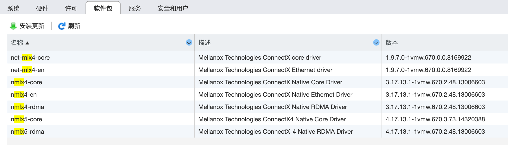
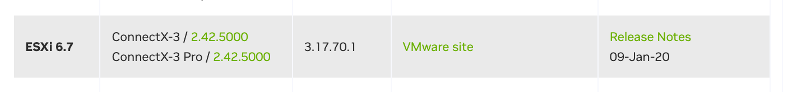

## 现有驱动

esxi 6.7 下默认带有 mlx4 驱动。

在软件包中搜索 mlx 可以看到：



也可以 ssh 之后通过命令查询：

```bash
$ esxcli software vib list | grep mlx
net-mlx4-core                  1.9.7.0-1vmw.670.0.0.8169922          VMW      VMwareCertified     2023-03-31
net-mlx4-en                    1.9.7.0-1vmw.670.0.0.8169922          VMW      VMwareCertified     2023-03-31
nmlx4-core                     3.17.13.1-1vmw.670.2.48.13006603      VMW      VMwareCertified     2023-03-31
nmlx4-en                       3.17.13.1-1vmw.670.2.48.13006603      VMW      VMwareCertified     2023-03-31
nmlx4-rdma                     3.17.13.1-1vmw.670.2.48.13006603      VMW      VMwareCertified     2023-03-31
nmlx5-core                     4.17.13.1-1vmw.670.3.73.14320388      VMW      VMwareCertified     2023-03-31
nmlx5-rdma                     4.17.13.1-1vmw.670.2.48.13006603      VMW      VMwareCertified     2023-03-31
```

可以看到当前版本为 `3.17.13.1-1vmw.670.2.48.13006603`


## 下载新驱动

### 官方下载

mellannox 网站的 exsi 驱动下载页面：

[ConnectX® Ethernet Driver for VMware® ESXi Server (nvidia.com)](https://network.nvidia.com/products/ethernet-drivers/vmware/esxi-server/)

找到 ESXi6.7 和 ConnectX-3 Pro：



在这里可以看到 ConnectX-3 Pro 最高只支持到 esxi 6.7,  **nmlx4_en **驱动最高版本为 3.17.70.1，下载地址为：

[Download VMware vCloud Suite - VMware Customer Connect](https://customerconnect.vmware.com/downloads/details?downloadGroup=DT-ESXI67-MELLANOX-NMLX4_EN-317701&productId=936)

### 怎么找到最新版本的驱动？

而 esxi 7.0.2 自带的 **nmlx4_en** 驱动版本为 3.19.16.8。

我在网上无意间看到的一个版本号是 3.19.70.1，然后靠这个版本号通过google才搜索到 mellannox 网站的下载链接。这个 3.19.70.1 版本是 2020-09-08 发布的。

> 所以，问题来了？还有没有更新的 nmlx4_en 版本？怎么找出来？
>
>  mellannox网站自带的搜索功能实在是太烂了。

下载地址：

[Download VMware vSphere - VMware Customer Connect](https://customerconnect.vmware.com/downloads/details?downloadGroup=DT-ESX67-MELLANOX-NMLX4_EN-319701&productId=742&download=true&fileId=ee9df28789363b662df9b48cc91ebf17&uuId=f171b085-30b6-4001-9b31-e6a6da0234c6) 

### 解压缩

下载下来的文件需要先解压缩，得到里面的 zip 文件，这个文件才可以用于后面的驱动更新，否则会报错。

注意文件名有 offline_bundle 字样：

- Mellanox-nmlx4_3.19.70.1-1OEM.670.0.0.8169922-offline_bundle-17262032.zip

## 更新驱动

通过esxi 的控制台，用数据存储浏览器将下载的文件上传到 datastore1 下。

ssh 登录，然后执行命令：

```bash
$ esxcli software vib update -d /vmfs/volumes/d
atastore1/upload/Mellanox-nmlx4_3.19.70.1-1OEM.670.0.0.8169922-offline_bundle-17262032.zip 
Installation Result
   Message: The update completed successfully, but the system needs to be rebooted for the changes to be effective.
   Reboot Required: true
   VIBs Installed: MEL_bootbank_nmlx4-core_3.19.70.1-1OEM.670.0.0.8169922, MEL_bootbank_nmlx4-en_3.19.70.1-1OEM.670.0.0.8169922, MEL_bootbank_nmlx4-rdma_3.19.70.1-1OEM.670.0.0.8169922
   VIBs Removed: VMW_bootbank_nmlx4-core_3.17.13.1-1vmw.670.2.48.13006603, VMW_bootbank_nmlx4-en_3.17.13.1-1vmw.670.2.48.13006603, VMW_bootbank_nmlx4-rdma_3.17.13.1-1vmw.670.2.48.13006603
   VIBs Skipped: 
```

提示需要重启才能生效。

特别注意：这里的文件路径必须是绝对路径，否则会报错说文件找到不到，错误提示如下：

```bash
$ cd /vmfs/volumes/datastore1/upload/
$ esxcli software vib update -d Mellanox-nmlx4_
3.19.70.1-1OEM.670.0.0.8169922-offline_bundle-17262032.zip 
 [MetadataDownloadError]
 Could not download from depot at zip:/var/log/vmware/Mellanox-nmlx4_3.19.70.1-1OEM.670.0.0.8169922-offline_bundle-17262032.zip?index.xml, skipping (('zip:/var/log/vmware/Mellanox-nmlx4_3.19.70.1-1OEM.670.0.0.8169922-offline_bundle-17262032.zip?index.xml', '', "Error extracting index.xml from /var/log/vmware/Mellanox-nmlx4_3.19.70.1-1OEM.670.0.0.8169922-offline_bundle-17262032.zip: [Errno 2] No such file or directory: '/var/log/vmware/Mellanox-nmlx4_3.19.70.1-1OEM.670.0.0.8169922-offline_bundle-17262032.zip'"))
        url = zip:/var/log/vmware/Mellanox-nmlx4_3.19.70.1-1OEM.670.0.0.8169922-offline_bundle-17262032.zip?index.xml
 Please refer to the log file for more details.
```

重启之后验证：

```bash
$ esxcli software vib list | grep mlx
nmlx4-core                     3.19.70.1-1OEM.670.0.0.8169922        MEL      VMwareCertified     2023-05-25
nmlx4-en                       3.19.70.1-1OEM.670.0.0.8169922        MEL      VMwareCertified     2023-05-25
nmlx4-rdma                     3.19.70.1-1OEM.670.0.0.8169922        MEL      VMwareCertified     2023-05-25
net-mlx4-core                  1.9.7.0-1vmw.670.0.0.8169922          VMW      VMwareCertified     2023-03-31
net-mlx4-en                    1.9.7.0-1vmw.670.0.0.8169922          VMW      VMwareCertified     2023-03-31
nmlx5-core                     4.17.13.1-1vmw.670.3.73.14320388      VMW      VMwareCertified     2023-03-31
nmlx5-rdma                     4.17.13.1-1vmw.670.2.48.13006603      VMW      VMwareCertified     2023-03-31
```

可以看到 nmlx4 驱动从 3.17.13.1 升级到了 3.19.70.1。
