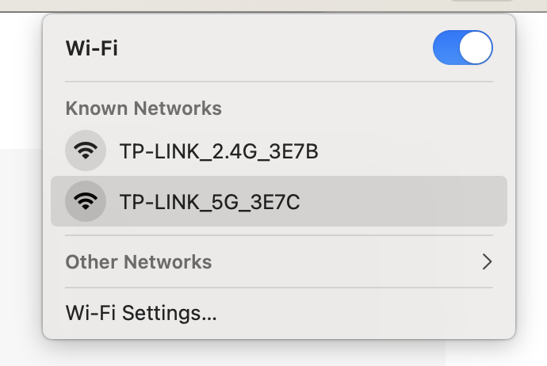
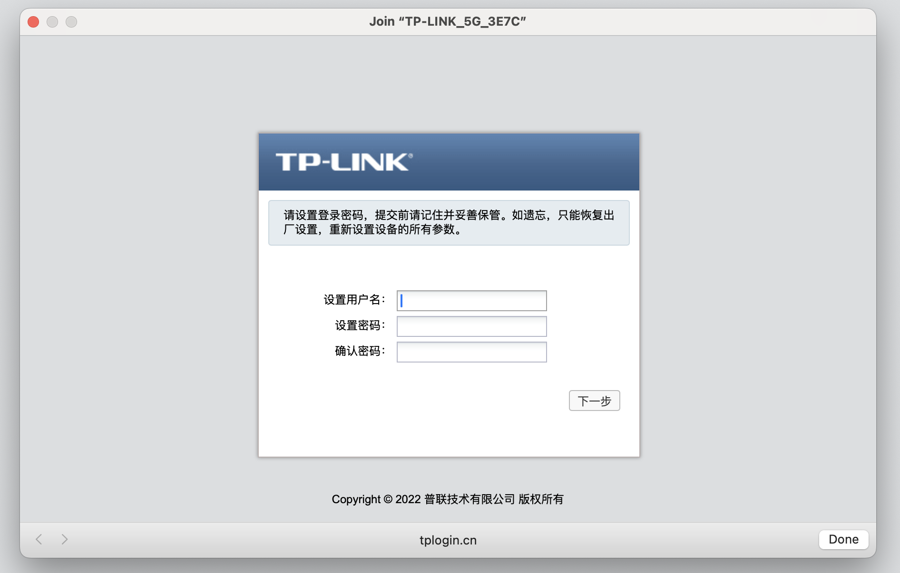

## 重置路由器

接通电源，按住 reset 按钮，几秒钟后看到指示灯闪烁三次放开。

稍等一分钟，无线连接看到类似这样的名字，就可以连接上去进行配置了：




自动弹出的这个界面容易出问题，设置后无法正常保存和调转到下一步。



比较妥善的方式是先通过 `ping tplogin.cn` 找到这个路由器的 ip 地址（我是作为 ap 挂在软路由上）:

```bash
ping tplogin.cn
PING tplogin.cn (192.168.20.124): 56 data bytes
64 bytes from 192.168.20.124: icmp_seq=0 ttl=64 time=5.336 ms
```

然后在浏览器中打开这个地址，就可以方便的设置了。理论上应该可以直接访问：

http://tplogin.cn/

但我这里有时会无法打开（后来发现原因是网址要适用 http，不能是 https ）。反正上面两个方法都可以试试。

"系统" -> "管理账号"，就可以修改密码了。这里我用户名设置为 `root` ，密码和主路由器保持一致。 

## 基本配置

### 配置静态IP地址

为了后续访问方便，配置为静态IP地址，加入浏览器收藏夹避免遗忘。

- 天河机器配置为：192.168.20.201 

### 配置作为AP

"系统" -> "工作模式"，选择 "AP模式"。

关闭云管理功能。

## 网络配置

### 无线配置

2.4g 无线网络名称修改 skynet

5g 无线网络名称修改为 skynet_5g

### 定时功能

"系统" -> "设备管理"，启用"定时功能"，选择"关闭LED/无线"。

## 特殊操作

### 手工重启

没有找到定时自动重启的功能，长期开机容易出问题。

只能定期（比如每周）连接上来，手工重启。

"系统" -> "配置管理" -> "重启设备"。
