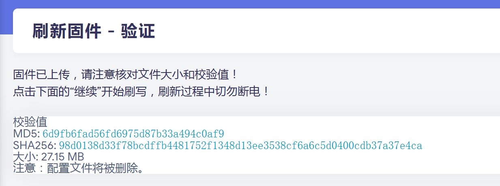
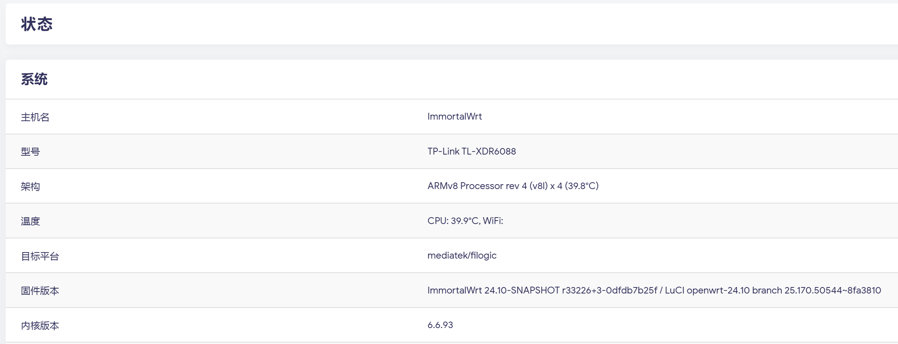

## 第一次刷机23.5版本

2023年，第一次刷机，从 tplink 官方固件刷到 openwrt 固件, 版本为 23.5。

### 准备工作

- 下载好需要的刷新工具和教程：
  - [TP-link路由器也能刷机了！XDR6088、6086、4288刷openWRT教程](https://www.youtube.com/watch?v=-Xu8zRr6xW4): 主要参考这个视频
  - [乌客的视频附件](https://docs.qq.com/doc/DS25QZ3dGV3JGQ0lB): 上个视频相关的文件和资料汇总，非常用心的 UP 主！

- 将 6088 路由器恢复出厂设置
- 准备一台 linux 电脑，连接 6088 路由器，两者都不需要能上网

### 刷机过程

参考视频教程，基本按照教程一步一步操作即可。

比较头疼的是，教程虽然说可以在其他 ubuntu 系统下进行，但是里面用到的软件都是 windows 版本的，也不想折腾去 ubuntu 下用类似的方式实现。所以最后还是找了一台 windows 机器严格按照教程操作，顺利刷机完成。

其他资料：

- https://www.right.com.cn/forum/thread-8290585-1-1.html

### 重置

#### 重置 openwrt

开机状态，用一个细长的尖锐物体按住Reset按钮约10秒钟，路由器开始灯光闪烁，放开Reset按钮。

这时接入网线，网卡设置为 `192.168.1.2`，网关设置为  `192.168.1.1`，子网掩码 `255.255.255.0`，用浏览器打开 `192.168.1.1` 地址就可以访问 openwrt 的界面。默认用户名 root，默认密码为 `password`。

效果等同于在 openwrt 界面内重置。

#### 重置到 u-boot

拔掉电源，将6088路由器关机，然后用一个细长的尖锐物体按住Reset按钮。再插入电源进行开机，并且保持按住Reset不动，等待大约10~20s之后，释放Reset按钮。

这时接入网线，网卡设置为 `192.168.1.2`，网关设置为  `192.168.1.1`，子网掩码 `255.255.255.0`，用浏览器打开 `192.168.1.1` 地址就可以访问道 u-boot 的界面。

## 升级到24.10版本

### 正确操作步骤

2025年11月，升级了版本，从 openwrt 23.05.1 升级到 openwrt 24.10 。

主要参考了这个帖子：

- [2024年刷XDR6088有感;——被低估的王者](https://www.right.com.cn/FORUM/forum.php?mod=viewthread&tid=8404193)

期间提到：

> 2024.11.2：
>   
> 1、关于硬件加速的固件；发现论坛237大佬已经有有基于 hanwckf 798X 源码 的闭源驱动，那么就更简单了 （目前已刷，正在使用）刷的不带Docker版； 刷机方法就是 前面三步做完之后、刷237大大官方分区版就可以；自己用的各项功能没问题
>
> 2、测试了基于237大大、 930官方分区的固件，无线有线均实现了硬件加速；妥妥的了；237大大 的固件是 ：https://www.right.com.cn/forum/thread-8364805-1-1.html

我就去找了这里提到的帖子里面找到了 24.10 版本的固件：

- [XDR6088官方分区版闭源驱动OP 源码/固件](https://www.right.com.cn/forum/thread-8364805-1-1.html)

> 基于hanwckf的源码修改而来，分区调整成了官方设置，底层无线fw替换为了华硕 天选ax6000提取的文件，添加了开启硬件加速时流控和双频优先等功能。
>
> 固件源码 ：
>
> https://github.com/padavanonly/immortalwrt-mt798x-24.10
>
> 默认ip： 192.168.6.1 
>
> 默认账号： admin/password
>
> debug固件刷好op后 再不保留配置升级刷入解压后的文件

下载地址：

https://sssddddff.lanzouo.com/iGLia2z9zlve

下载得到 immortalwrt-mediatek-filogic-tplink_tl-xdr6088-squashfs-sysupgrade.zip 文件，解压后得到 immortalwrt-mediatek-filogic-tplink_tl-xdr6088-squashfs-sysupgrade.bin 文件。

刷机过程就非常简单，登录到 openwrt 界面，点击 系统 -> 备份/升级，选择 上传 ，上传刚刚解压得到的 immortalwrt-mediatek-filogic-tplink_tl-xdr6088-squashfs-sysupgrade.bin 文件，点击 升级 ，等待升级完成即可。

刷机完成后 6088 会自动重启，重启完成后，访问 `192.168.6.1` 地址登录到 openwrt 界面，可以看到版本已经升级到 24.10 版本:

这个版本自带我最喜欢的 openclash 和 zerotier 插件，非常方便。

默认情况下，openwrt 逻辑网口和 6088 物理网口的对应关系如下：

| 物理网口         | 2.5g | 2.5g | 千兆 | 千兆 | 千兆 | 千兆 |
| ---------------- | ---- | ---- | ---- | ---- | ---- | ---- |
| openwrt 逻辑网口 | eth1 | lan5 | lan1 | lan2 | lan3 | lan4 |

> 备注：无法调节为使用千兆口作为 wan，我测试过，可以设置，也能正常工作，但重启之后整个6088路由器就无法访问，只能重置到初始状态。

> 备注2：这个固件有很多问题，有网口不可用，有网口插入网线之后路由器就不可用，待查证，待解决。

### 错误操作步骤

在上面的正确步骤之前，尝试过直接下载 openwrt 24.10 版本的固件，

https://firmware-selector.openwrt.org/?version=24.10.4&target=mediatek%2Ffilogic&id=tplink_tl-xdr6088

然后通过 openwrt 界面进行升级，期间警告：

强制升级后失败，系统崩溃， 应该是固件版本格式不对，要用 bin 格式。

好在没有直接变砖，路由器自动进入 u-boot 界面 （地址为 `192.168.1.1`）。

然后我在 u-boot 界面下，把上一次用的 23.5 固件刷新进去，才恢复正常。之后就按照前面说的正确步骤进行升级，顺利完成。

